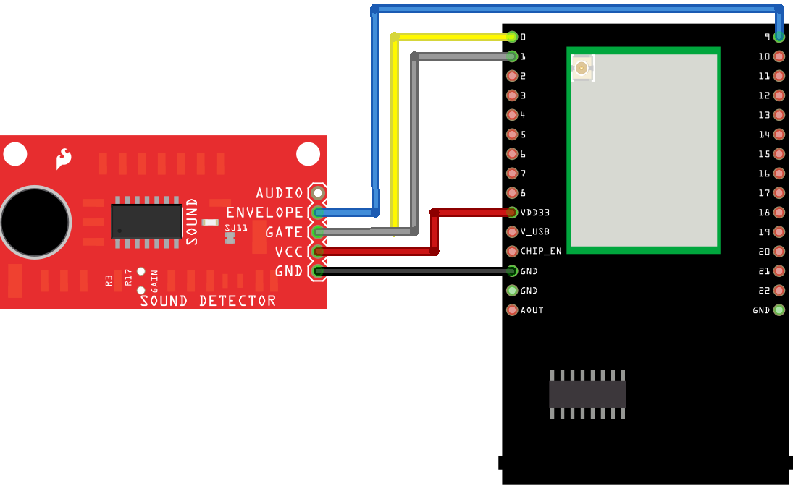
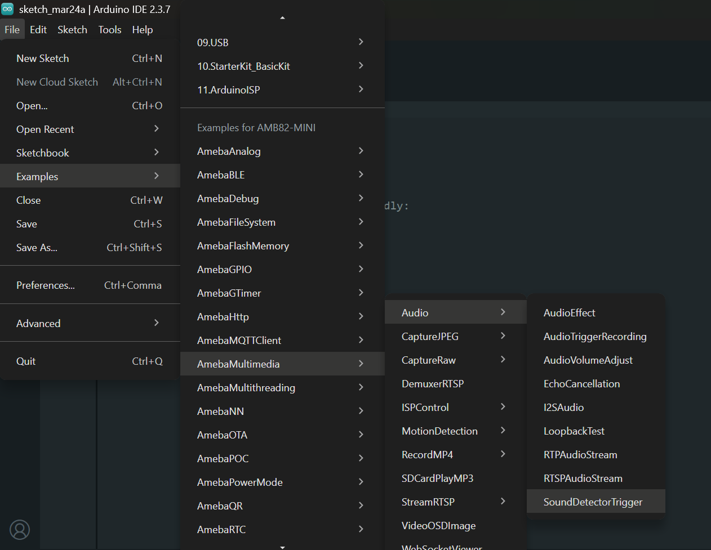
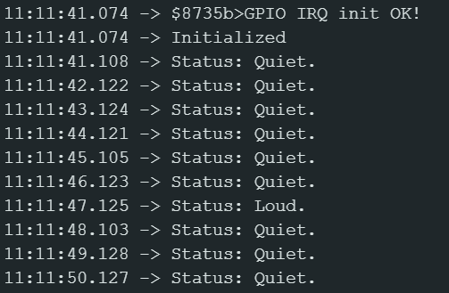
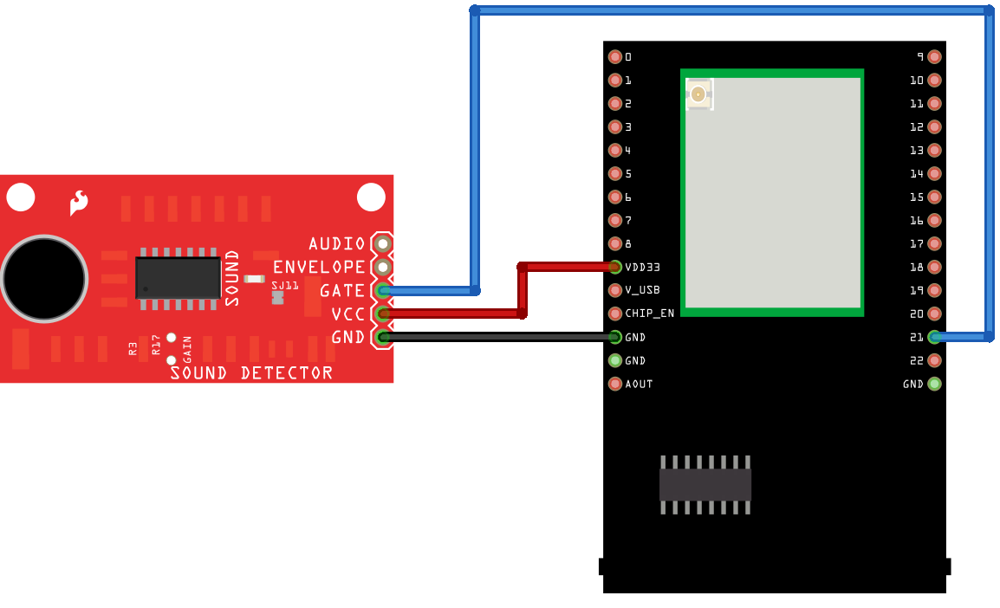
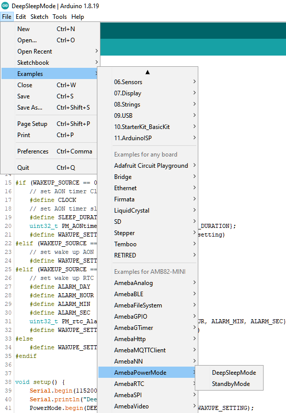

Sound Detector
==============

Materials
---------

- `AMB82-mini <https://www.amebaiot.com/en/where-to-buy-link/#buy_amb82_mini>`__ x 1
- SD card x 1

Example
-------

The following examples shows different use cases for SparkFun Sound Detector pairing with Ameba Pro2 development board (AMB82-mini).

1. SoundDetectorTrigger
2. DeepSleepMode

SoundDetectorTrigger
^^^^^^^^^^^^^^^^^^^^
In this example, we will be using the binary indicator (Gate) of SparkFun Sound Detector to trigger LED light up using interrupt service routine.

Connect the SparkFun Sound Detector to AMB82-mini according to the wiring diagram below.

|image01|

+--------------------+---------------------------+
| Sound Detector     | AMB82-mini                |
+====================+===========================+
| VCC                | 3v3 (VDD33)               |
+--------------------+---------------------------+
| GND                | GND                       |
+--------------------+---------------------------+
| GATE               | GPIOF_5 (0), GPIOF_6 (1)  |
+--------------------+---------------------------+
| ENVELOPE           | GPIOF_2 (9)               |
+--------------------+---------------------------+

Open the SoundDetectorTrigger example in :guilabel:`File -> Examples -> AmebaMultimedia -> Audio -> SoundDetectorTrigger`

|image02|

Compile the code and upload it to Ameba. After pressing the Reset button, you may clap near to the Sound Detector, the green LED on Ameba Pro 2 board will light up whenever sound is detected by the SparkFun Sound Detector.

The envelope value (an analog voltage to rises to indicate the amplitude of the sound) of the Sound Detector will be printed on the serial monitor.

|image03|

DeepSleepMode
^^^^^^^^^^^^^

In this example, we will be using the binary indicator (Gate) of SparkFun Sound Detector to trigger wake-up of AMB82-mini using AON GPIO.

Connect the SparkFun Sound Detector to AMB82-mini according to the wiring diagram below.

|image04|

+--------------------+---------------------------+
| Sound Detector     | AMB82-mini                |
+====================+===========================+
| VCC                | 3v3 (VDD33)               |
+--------------------+---------------------------+
| GND                | GND                       |
+--------------------+---------------------------+
| GATE               | GPIOA_2 (21)              |
+--------------------+---------------------------+

Open the DeepSleepMode example in :guilabel:`File -> Examples -> AmebaPowerMode -> DeepSleepMode`

|image05|

Change the value of ``WAKEUP_SOURCE`` to 1 (AON GPIO).

The default value of ``WAKUPE_SETTING`` is 21 (pin number).

Compile the code and upload it to Ameba.

After pressing the Reset button, AMB82-mini will enter deep sleep mode after 5 seconds. You may clap near to the Sound Detector to trigger it to wake up.

