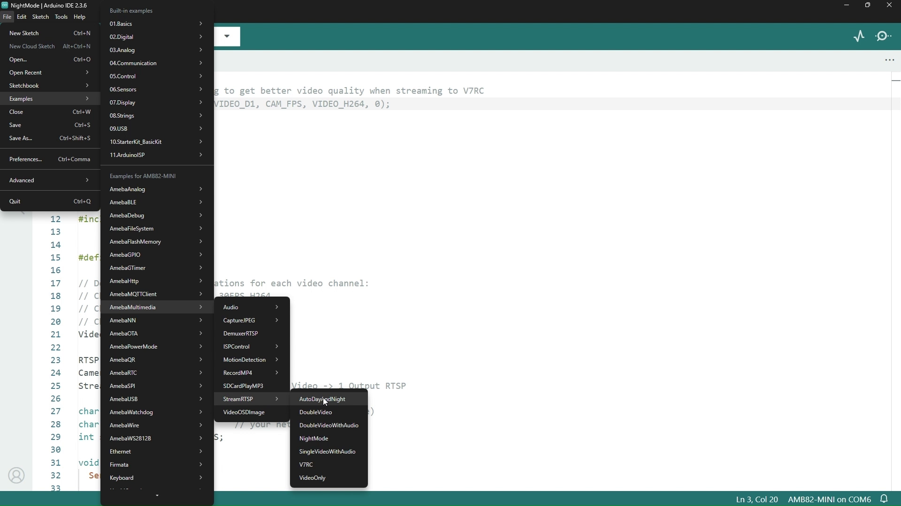
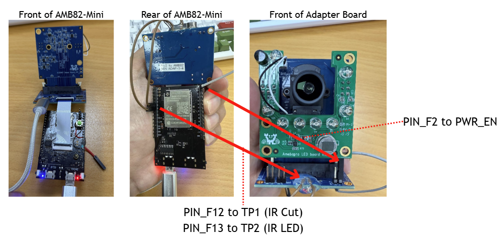
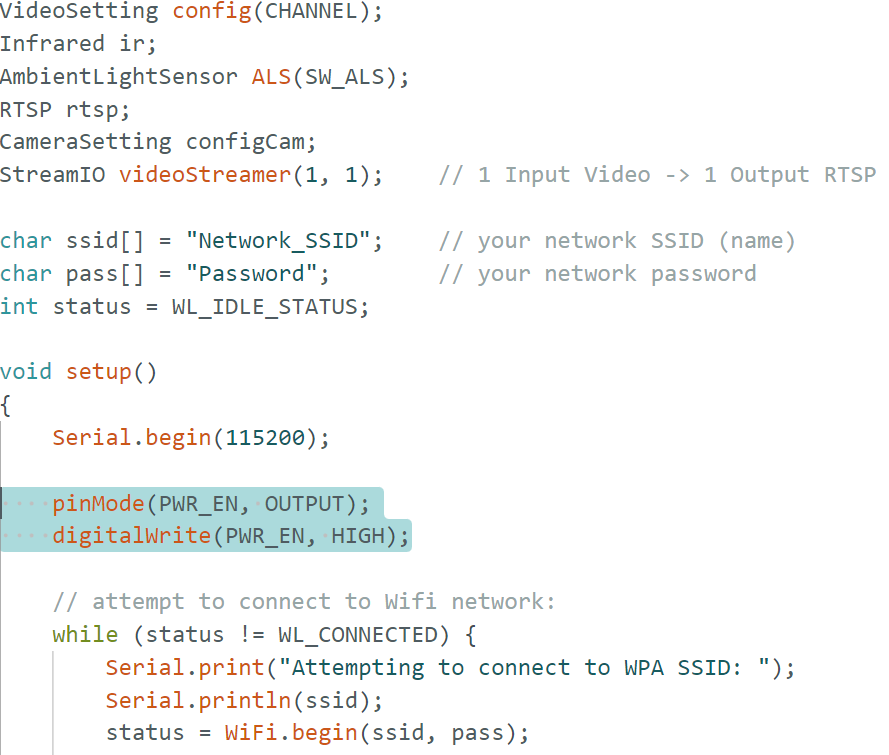
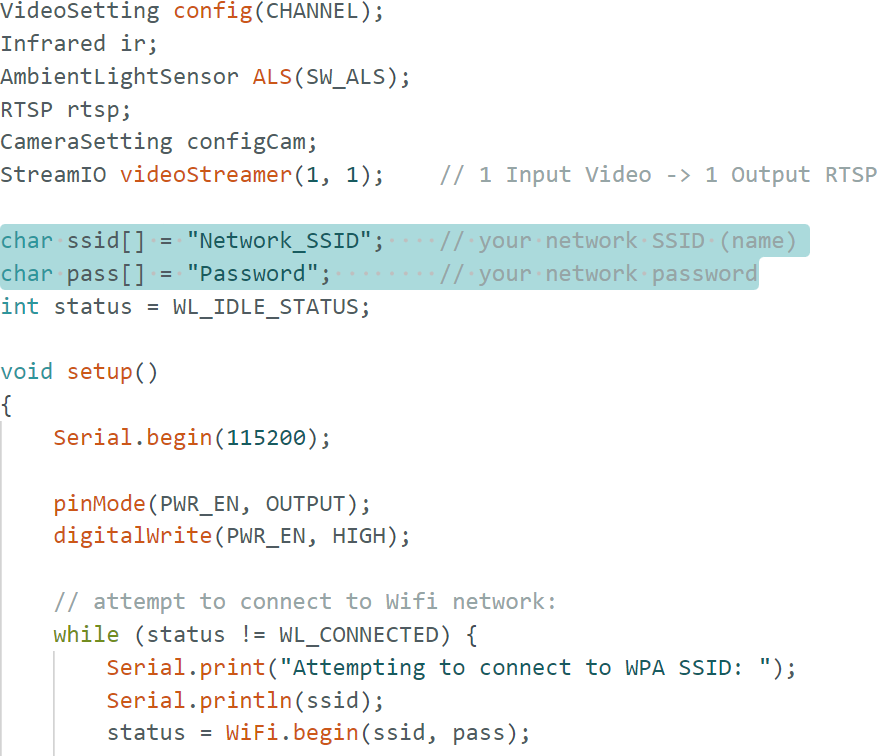
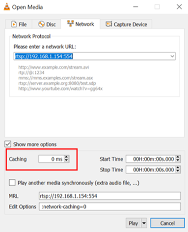
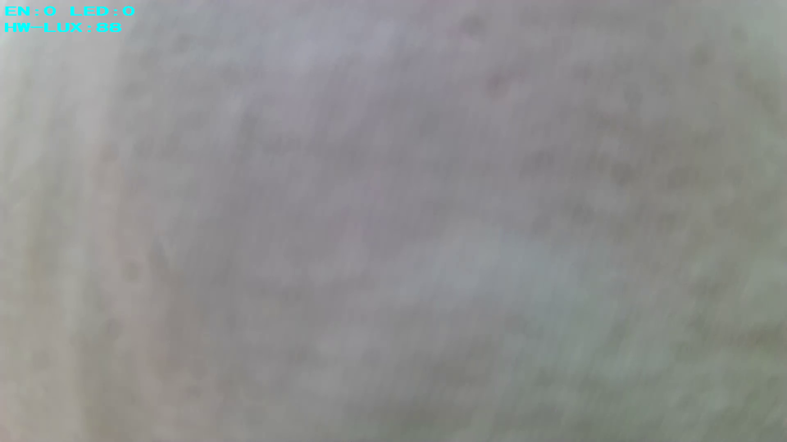
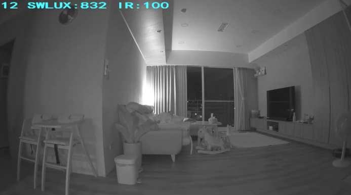
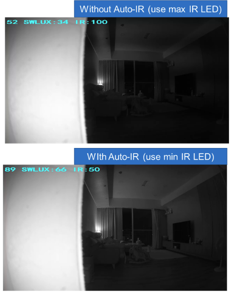

RTSP Streaming Auto Day and Night Mode
======================================

Materials
---------

- `AMB82-mini <https://www.amebaiot.com/en/where-to-buy-link/#buy_amb82_mini>`__ x 1
- Realtek Pro2 to AMB82 MINI sensor adapter board x 1
- Camera sensor with a switchable IR cut filter x 1
- Realtek Amebapro LED board x 1

Example
-------
In this example, we will use the Ameba board to stream video in both day and night modes. This capability requires a camera that has an IR cut filter that can be toggled on and off along with an IR LED light source (or any IR light source).
The adapter board used in this example is to solely connect our camera sensor to the Ameba board. You may ignore the adapter board requirement if you have alternatives to connect your IR-cut-equipped camera to the Ameba board.

Our Amebapro LED board has a built-in hardware Ambient Light Sensor (ALS) so if you are using your own IR LED light source, you will need to have your own hardware ALS for the HW ALS mode. Otherwise, you will have to default to using our implementation of software ALS which depends on the camera sensor's ISP parameters.

You can find this particular example under :guilabel:`Files -> Examples -> StreamRTSP -> AutoDayAndNight` from the top left corner of the ArduinoIDE.

|image01|

The adapter board has a power enable pin which we will be connecting with the GPIO Pin F2 on the AMB82-mini. The IR cut and LED will both be controlled by GPIO Pins F12 and F13 respectively. Pin F12 will connect to the pin TP1 and F13 will connect to pin TP2 on the adapter board.

+-----------------------------------------------------+
| **Hareware Connections**                            |
+===========================+=========================+
| **Adapter board pins**    | **Ameba board pins**    |
+---------------------------+-------------------------+
| power enable pin          | Pin 9 (PF2)             |
|                           |                         |
+---------------------------+-------------------------+
| pin TP1                   | Pin 5 (PF12)            |
|                           |                         |
+---------------------------+-------------------------+
| pin TP2                   | Pin 6 (PF13)            |
|                           |                         |
+---------------------------+-------------------------+

|image02|

|image03|

If you are using the adapter board ensure that this is in the example before running it.

.. code:: cpp

    #include "WiFi.h"
    #include "StreamIO.h"
    #include "VideoStream.h"
    #include "RTSP.h"
    #include "Infrared.h"
    #include "AmbientLightSensor.h"

    #define CHANNEL           0
    #define SW_ALS            0
    #define HW_ALS            1
    #define DEFAULT_THRESHOLD -1
    #define SWITCH_LOG        1
    #define ALL_DEBUG_LOG     2
    #define PWR_EN            9

|image04|

There are 2 ALS demos in this example. The default is using software ALS.

When using the hardware ALS, configure both the software and hardware as described below.

For software setup, initialize the ALS with `HW_ALS` instead of `SW_ALS`.

.. code:: cpp

   AmbientLightSensor ALS(HW_ALS);

For hardware setup, connect them to the AMB82-mini on GPIO Pin E4 for the SDA line and GPIO Pin E3 for the SCL line. If your HW ALS is mounted on the camera sensor module like the one above, you may follow the pin connections accordingly.

+-----------------------------------------------------+
| **Hareware Connections**                            |
+===========================+=========================+
| **Adapter board pins**    | **Ameba board pins**    |
+---------------------------+-------------------------+
| SDA                       | Pin 12 (PE4)            |
|                           |                         |
+---------------------------+-------------------------+
| SCL                       | Pin 13 (PE3)            |
|                           |                         |
+---------------------------+-------------------------+

|image05|

|image06|

In the highlighted code snippet, fill in the "ssid" with your WiFi network SSID and "pass" with the network password.

|image07|

Select the camera module that going to use from :guilabel:`Tools -> Camera Options`

.. note:: Please make sure the camera is supported otherwise system will returns "senesor ID error" or "VOE not init".

Compile the code and upload it to Ameba. After pressing the Reset button, wait for the Ameba board to connect to the WiFi network. The board's IP address and network port number for RTSP will be shown in the Serial Monitor.

You may download VLC media player from the `link <https://www.videolan.org/vlc/>`__

Upon the completion of the software installation, open VLC media player, and go to :guilabel:`Media -> Open Network Stream`

|image08|

Make sure your PC is connected to the same network as the Ameba Pro2 board for streaming. Since RTSP is used as the streaming protocol, key in ``rtsp://{IPaddress}:{port}`` as the Network URL in VLC media player, replacing {IPaddress} with the IP address of your Ameba Pro2 board, and {port} with the RTSP port shown in Serial Monitor ``e.g., rtsp://192.168.1.154:554`` The default RTSP port number is 554. In the case of two simultaneous RTSP streams, the second port number defaults to 555.

|image09|

You may choose to change the caching time in "Show more options". A lower cache time will result in reduced video latency but may introduce playback stuttering in the case of poor network conditions.

|image10|

Next, click "Play" to start RTSP streaming. The video stream from the camera will be shown in VLC media player. Meanwhile, in your Serial Monitor, the message "rtp started (UDP)" will appear.

|image11|

|image12|

Code Reference
--------------

The Infrared class controls all the manual IR features of the Ameba while the AmbientLightSensor class controls the software and hardware ALS for auto mode switching. You will need to the following lines before you can begin using any IR and ALS features.

.. code:: c

    #include "Infrared.h"
    #include "AmbientLightSensor.h"

    #define SW_ALS            0
    #define HW_ALS            1
    #define DEFAULT_THRESHOLD -1
    #define SWITCH_LOG        1
    #define ALL_DEBUG_LOG     2

    Infrared ir;
    AmbientLightSensor ALS(HW_ALS);

First, the IR cut and/or LED has to be initialized before you can use them. After initializing, you can toggle the IR cut using "IR.setCut()" and control the IR LED brightness using "IR.setLedBrightness()".

.. code:: cpp

    ir.cutInit();               // Initializes GPIO Pin F12
    ir.ledInit();               // Initializes GPIO Pin F13
    ir.setCut(1);               // 0 to disable, 1 to enable
    ir.setLedBrightness(0);     // Brightness input can be from 0 to 100, [0,100]

    // Ambient light sensor set up for automatic day and night modes switching
    // ALS.debugEnableOSD();
    // ALS.setDebugLog(ALL_DEBUG_LOG);
    // ALS.enableAutoPWM();
    ALS.setColorThreshold(DEFAULT_THRESHOLD);
    ALS.setGrayThreshold(DEFAULT_THRESHOLD);
    ALS.init();

You must have the IR cut and LED initialized before you can initialize the ALS, otherwise it will result in an error. If you have enabled the debug OSD, it will show up on the top left of the stream as text overlay. The EN shows whether the auto PWM is enabled, LED shows the current brightness of the IR LED and the HW/SW-LUX is the current luminance of the scene.

|image13|

This lux value is used to determine when to switch between day and night modes. It is important to note that HW and SW lux thresholds are disproportionately and inversely related. For example, the default HW threshold for day mode is at 30 lux and 15 lux for the night mode. Whereas for the SW ALS, the day mode threshold is 4000 lux and 12000 lux for the night mode.
You may wish to set these thresholds manually using the "ALS.setColorThreshold" and "ALS.setGrayThreshold", day and night respectively, after using the debug log or debug OSD to determine the lux range for your day and night scenes.

|image14|

If you are using the debug log, "SWITCH_LOG" will only log the mode switch, lux value during the switch and at what threshold is set for this mode. An example of the log is show below.

.. code:: none

    [SENSOR_SERVICE] RGB2IR:gray_mode(0), hw_lux(0.0) <= THR_COLOR_TO_GRAY(15)
    [SENSOR_SERVICE] IR2RGB:gray_mode(1), hw_lux(172.0) >= THR_GRAY_TO_COLOR(30)

However, if you are using "ALL_DEBUG_LOG", you will see the the current mode and lux level being logged regularly as well as the switch logs on switching modes.

.. code:: none

    [SENSOR_SERVICE] STABLE:gray_mode(0), hw_lux(149.0)
    [SENSOR_SERVICE] STABLE:gray_mode(0), hw_lux(147.0)
    [SENSOR_SERVICE] STABLE:gray_mode(0), hw_lux(147.0)
    [SENSOR_SERVICE] STABLE:gray_mode(0), hw_lux(149.0)
    [SENSOR_SERVICE] STABLE:gray_mode(0), hw_lux(151.0)
    [SENSOR_SERVICE] STABLE:gray_mode(0), hw_lux(145.0)
    [SENSOR_SERVICE] STABLE:gray_mode(0), hw_lux(140.0)
    [SENSOR_SERVICE] STABLE:gray_mode(0), hw_lux(147.0)
    [SENSOR_SERVICE] RGB2IR:gray_mode(0), hw_lux(0.0) <= THR_COLOR_TO_GRAY(15)
    [SENSOR_SERVICE] IR2RGB:gray_mode(1), hw_lux(172.0) >= THR_GRAY_TO_COLOR(30)

The "ALS.enableAutoPWM" is used to automatically vary the brightness of the IR LED according to the camera's night mode ISP parameters. This is to improve the clarity of the scene as much as possible, you can monitor how the LED's brightness changes over time by enabling the debug OSD.
The difference in detail can be seen after the LED's brightness is lowered in this particular scene.

|image15|

.. |image02| image::  ../../../../_static/amebapro2/Example_Guides/Multimedia/AutoDayAndNight/image02.jpg

.. |image05| image::  ../../../../_static/amebapro2/Example_Guides/Multimedia/AutoDayAndNight/image05.jpg
   :height:  600 px

.. |image06| image::  ../../../../_static/amebapro2/Example_Guides/Multimedia/AutoDayAndNight/image06.jpg
   :height:  600 px

.. |image08| image::  ../../../../_static/amebapro2/Example_Guides/Multimedia/AutoDayAndNight/image08.jpg
.. |image09| image::  ../../../../_static/amebapro2/Example_Guides/Multimedia/AutoDayAndNight/image09.jpg

.. |image11| image::  ../../../../_static/amebapro2/Example_Guides/Multimedia/AutoDayAndNight/image11.jpg

.. |image14| image::  ../../../../_static/amebapro2/Example_Guides/Multimedia/AutoDayAndNight/image14.jpg

