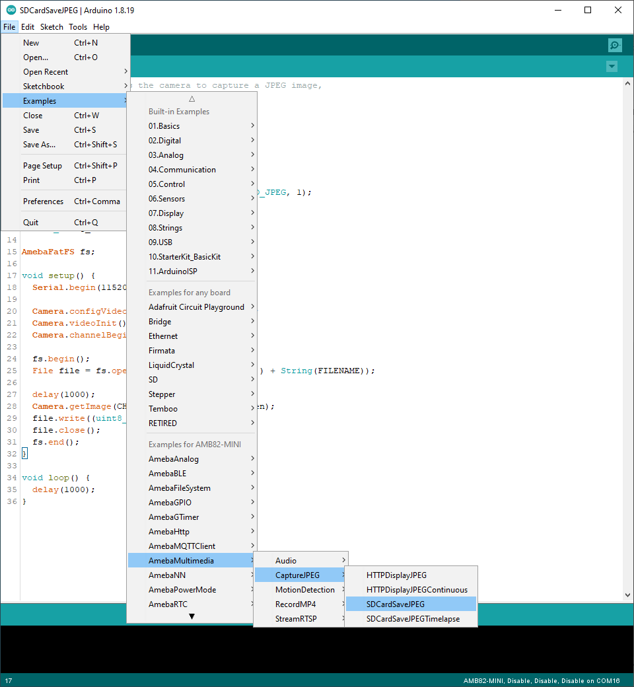

Capture JPEG Timelapse save to SD Card
======================================

Materials
---------

- `AMB82-mini <https://www.amebaiot.com/en/where-to-buy-link/#buy_amb82_mini>`__ x 1
- SD card x 1

Example
-------
In this example, we will be using Ameba Pro2 development board to capture a JPEG image from the on-board camera sensor (JX-F37P) and save it on the SD card.
The following examples shows different use cases for saving JPEG image to SD card.

1. SDCardSaveJPEGTimelapse
2. SDCardSaveJPEGTimelapseWithNTPClient

Open one of the CaptureJPEG examples in "File" -> "Examples" -> "AmebaMultimedia" -> "CaptureJPEG" -> "SDCardSaveJPEGTimelapse".

|image01|

Compile the code and upload it to Ameba. After pressing the Reset button, the Ameba Pro 2 board will start taking snapshot and save to SD card.

The **SDCardSaveJPEGTimelapse** example will take a snapshot every second and save them on the SD card with the filename "imageX.jpg", where X is a number incrementing with each image.

The **SDCardSaveJPEGTimelapseWithNTPClient** example is incorporated with NTPClient to be able to set the last modified time after images are saved to the SD Card.

Disconnect power from the Ameba Pro 2 board, remove the SD card and connect it to a computer to view the contents. Depending on which example code was uploaded, there will be either a single image or multiple images saved on the SD card.

