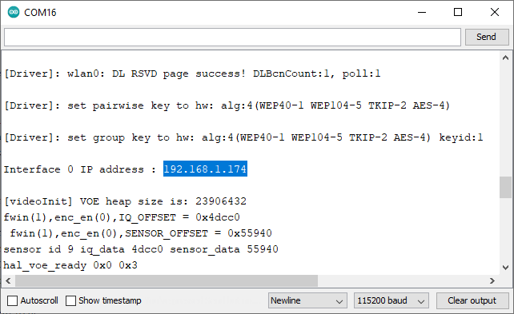
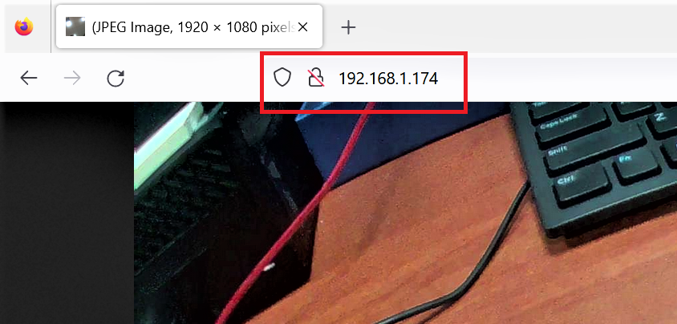

Capture JPEG display over HTTP Continuous
=========================================

.. contents::
  :local:
  :depth: 2

Materials
---------

- `AMB82-mini <https://www.amebaiot.com/en/where-to-buy-link/#buy_amb82_mini>`_ x 1

Example
-------

In this example, we will be using Ameba Pro2 development board to capture a JPEG image and send the image to a browser using HTTP.
The following examples shows different use cases of capturing JPEG images.

For both "HTTPDisplayJPEGContinuous" and "HTTPDisplayJPEGContinuousMultitask" example, use browser (e.g., Firefox) and key in the IP address of the board in browser address bar after the board is connected to the WiFi to view the image.

Open the example in "File" -> "Examples" -> "AmebaMultimedia" -> "CaptureJPEG" -> "HTTPDisplayJPEGContinuous".
Or open the example in "File" -> "Examples" -> "AmebaMultimedia" -> "CaptureJPEG" -> "HTTPDisplayJPEGContinuous".

|image01|

In the highlighted code snippet, fill in the "ssid" with your WiFi network SSID and "pass" with the network password.

|image02|

Compile the code and upload it to Ameba. After pressing the Reset button, wait for the Ameba Pro 2 board to connect to the WiFi network. The board’s IP address will be shown in the Serial Monitor.

|image03|

Next, using a computer or a cell phone in the same network domain, open a browser window and enter the IP address shown in the Serial Monitor.

|image04|

By running "HTTPDisplayJPEGContinuous" or "HTTPDisplayJPEGContinuousMultitask", image will be taken repeatedly, and the image will be sent to the browser using HTTP, creating the effect of a video.

Optimize Suggests
-----------------

Resolution
~~~~~~~~~~

**Common choices:**

- **320×240 (QVGA)** – lightweight for IoT or monitoring where detail isn’t critical.
- **640×480 (VGA)** – good balance between quality and bandwidth, widely supported.
- **1280×720 (HD/720p)** – higher clarity but significantly more bandwidth.
- **1920×1080 (Full HD/1080p)** – only if you have high network bandwidth and need detail.

**Rule of thumb:**

- For remote monitoring / IoT → **320×240** or **640×480**
- For security/cameras where details matter → **720p** or **1080p**

FPS
~~~

**Common choices:**

- **10–15 fps** → smooth enough for monitoring, reduces bandwidth.
- **20–25 fps** → good compromise for human viewing with motion.
- **30 fps** → “real-time feel,” but usually overkill for MJPEG, since compression is inefficient.

**Rule of thumb:**

- General monitoring → **10–15 fps**
- Security / interactive apps → **20–25 fps**
- High-motion applications (sports, robotics) → **30 fps** (only if bandwidth allows)

.. code-block:: c++

    #define STREAM_FPS 15
    VideoSetting config(VIDEO_VGA, STREAM_FPS, VIDEO_JPEG, 1);

Block vs Non-Block Mode
~~~~~~~~~~~~~~~~~~~~~~~

**Block mode:**

- The stream waits (blocks) until a full frame is available before continuing.
- Ensures every frame is delivered in sequence.
- Can introduce latency if network or processing is slow.
- Good for stable, controlled environments.

**Non-block mode:**

- The stream does not wait; it continues immediately if a frame isn’t ready.
- Reduces latency, but may skip frames under load.
- Useful for real-time monitoring where *freshness* is more important than completeness.
- Common in IoT/robotics where immediate feedback is critical.

.. code-block:: c++

    WiFiServer server(80, TCP_MODE, NON_BLOCKING_MODE);

Stack Size
~~~~~~~~~~

**General guidelines:**

- **4 KB – 8 KB** → Minimum for lightweight JPEG streaming tasks (small images, low FPS).
- **16 KB – 32 KB** → Recommended for stable streaming at VGA or 720p resolutions.
- **> 32 KB** → Needed for high resolutions (1080p) or if additional processing (e.g., AI, image filtering) is done in the same task.

**Considerations:**

- Larger stack sizes reduce the risk of overflow but consume more RAM.
- Monitor for stack overflow (watchdog resets, crashes, or corrupted images may indicate insufficient stack).
- Using FreeRTOS, allocate stack size per task based on resolution and JPEG buffer usage.

**Rule of thumb:**

- For IoT / low-resolution (QVGA, VGA) → **8 KB – 16 KB** stack per streaming task.
- For higher resolutions (720p, 1080p) → **32 KB or more**.

.. code-block:: c++

    xTaskCreate(streamTask, "StreamTask", (8 * 1024), NULL, 1, NULL);

.. note :: For the examples, Firefox browser has been tested to work best.

.. |image01| image:: ../../../../../_static/amebapro2/Example_Guides/Multimedia/Capture_JPEG_display_over_HTTP/image01.png
   :width:  756 px
   :height: 832 px

.. |image02| image:: ../../../../../_static/amebapro2/Example_Guides/Multimedia/Capture_JPEG_display_over_HTTP/image02.png
   :width:  756 px
   :height: 832 px

