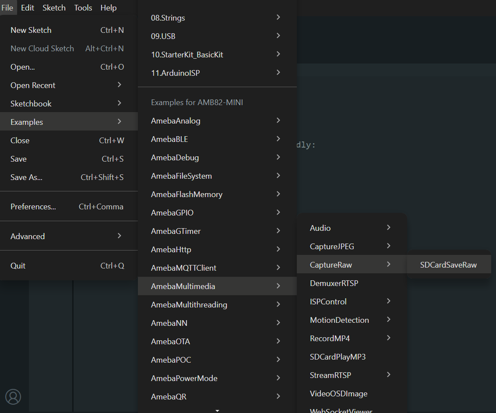

Capture Raw Image save to SD Card
=================================

Materials
---------

- `AMB82-mini <https://www.amebaiot.com/en/where-to-buy-link/#buy_amb82_mini>`__ x 1
- SD card x 1

Example
-------
In this example, we will be using Ameba Pro2 development board to capture a raw image in NV16 format using the on-board camera sensor (JX-F37P) and save it on the SD card.

Open the SDCardSaveRaw example in :guilabel:`File -> Examples -> AmebaMultimedia -> CaptureRaw -> SDCardSaveRaw`

|image01|

You may modify the filename of the raw image to be saved in SD card.

Compile the code and upload it to Ameba. After pressing the Reset button, the Ameba Pro 2 board will start taking raw snapshot and save to SD card.

Disconnect power from the Ameba Pro 2 board, remove the SD card and connect it to a computer to view the contents. You will find the raw images saved on the SD card.

