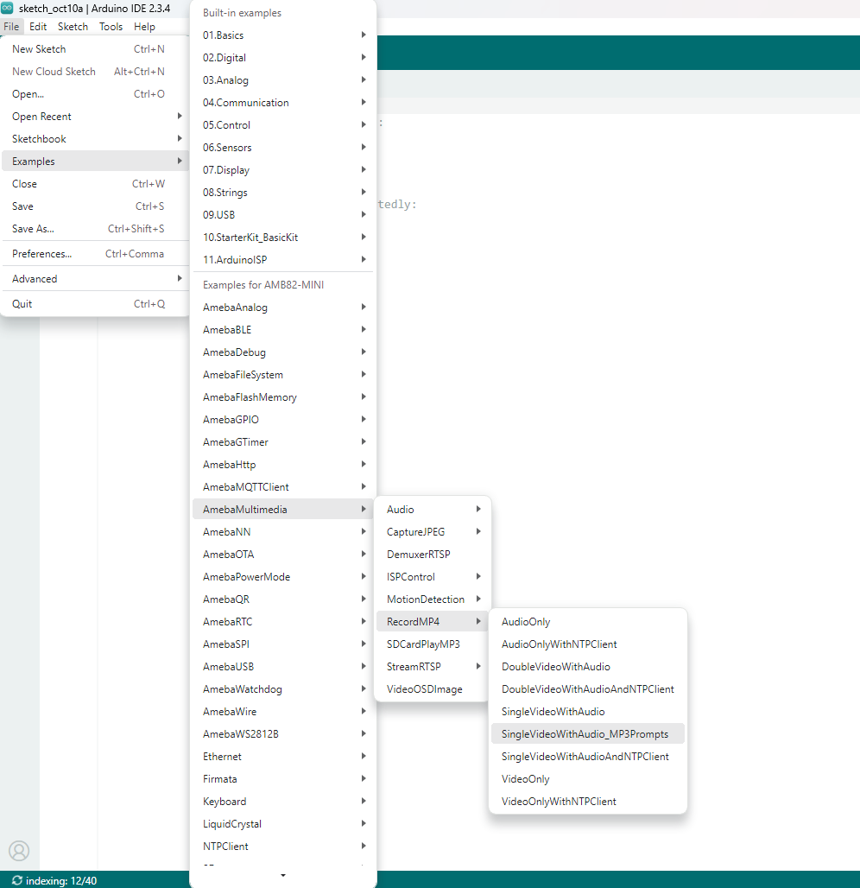
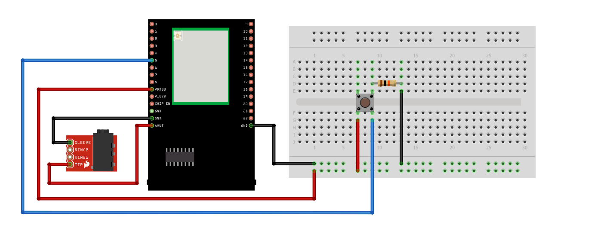
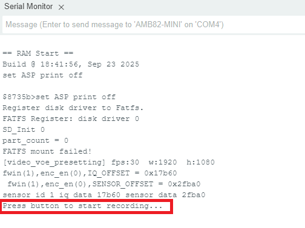

MP4 Recording with MP3 Prompts
===============================

Materials
---------

- `AMB82-mini <https://www.amebaiot.com/en/where-to-buy-link/#buy_amb82_mini>`__ x 1
- SD card x 1
- 3.5mm TRS/TRRS breakout x 1 (e.g., Adafruit 2791 / Sparkfun 11570)

Example
-------

In this example, we will use the Ameba Pro2 development board to record video and audio data from the on-board camera sensor (JX-F37P) and audio codec to an MP4 file on the SD card.

Additionally, MP3 prompts will be played before and after each recording session to indicate the start and end of recording.

Open example in "File" -> "Examples" -> "AmebaMultimedia"-> "RecordMP4" -> "SingleVideoWithAudio_MP3Prompts".

|image01|

Connect the audio jack and push button as shown in the diagram.

|image02|

Add the MP3 files you would like to play into the SD card. Take note to place the MP3 file in the root directory and not in any folder.

The "recording started" and "recording ended" MP3 sample files can be downloaded at https://github.com/ambiot/ambpro2_arduino/tree/dev/Ameba_misc/Example_Samples. Otherwise, you can customize it by using your own MP3 files.

Compile the code and upload it to Ameba. After pressing the Reset button, you will see "Press button to start recording...".

|image03|

Connect an earpiece or speaker to the audio jack.

When you press the button to start recording, you will hear "Recording started." After the recording ends, you will hear "Recording ended."

Disconnect power from the Ameba Pro 2 board, remove the SD card and connect it to a computer to view the contents.

