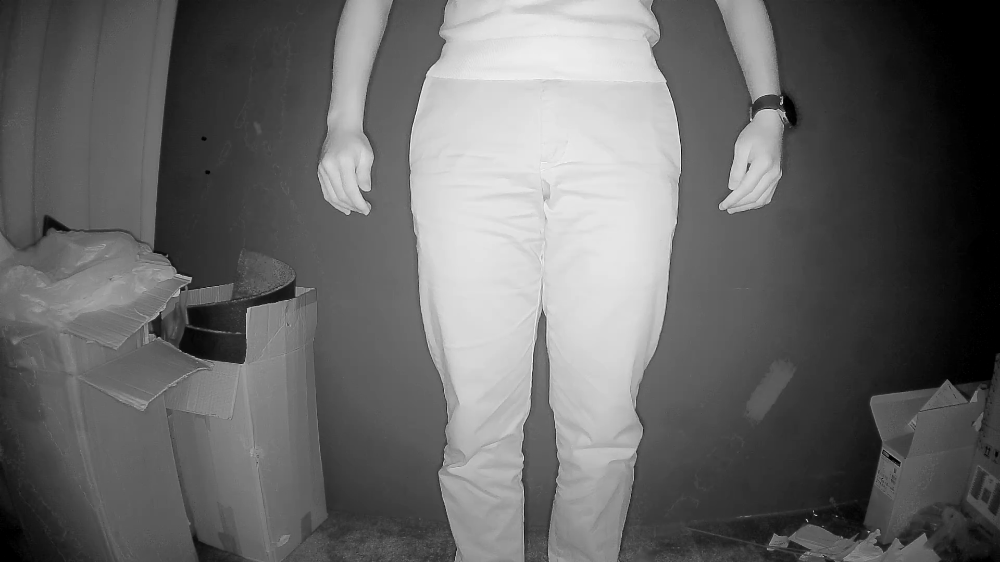

RTSP Streaming Night Mode
=========================

Materials
---------

- `AMB82-mini <https://www.amebaiot.com/en/where-to-buy-link/#buy_amb82_mini>`__ x 1
- Realtek Pro2 to AMB82 MINI sensor adapter board x 1
- Camera sensor with a switchable IR cut filter x 1
- Realtek Amebapro LED board x 1

Example
-------
This example is built on the `StreamRTSP -> VideoOnly <https://ameba-doc-arduino-sdk.readthedocs-hosted.com/en/latest/ameba_pro2/amb82-mini/Example_Guides/Multimedia/RTSP%20Streaming.html>`__ Please refer to the "VideoOnly" example for more information on how to set up an RTSP stream.

In this example, we will use the Ameba board to stream video in night mode. This capability requires a camera that has an IR cut filter that can be toggled on and off along with an IR LED light source (or any IR light source).
The adapter board used in this example is to solely connect our camera sensor to the Ameba board. You may ignore the adapter board requirement if you have alternatives to connect your IR-cut-equipped camera to the Ameba board.

.. note:: Amebapro LED board must connect to sensor adapter board, if there is no customize hardware for IR. 

You can find this particular example under :guilabel:`Files -> Examples -> StreamRTSP -> NightMode` from the top left corner of the ArduinoIDE.

|image01|

The adapter board has a power enable pin which we will be connecting with the GPIO Pin F2 on the AMB82-mini. The IR cut and LED will both be controlled by GPIO Pins F12 and F13 respectively. Pin F12 will connect to the pin TP1 and F13 will connect to pin TP2 on the adapter board.

+-----------------------------------------------------+
| **Hardware Connections**                            |
+===========================+=========================+
| **Adapter board pins**    | **Ameba board pins**    |
+---------------------------+-------------------------+
| power enable pin          | Pin 9 (PF2)             |
|                           |                         |
+---------------------------+-------------------------+
| pin TP1                   | Pin 5 (PF12)            |
|                           |                         |
+---------------------------+-------------------------+
| pin TP2                   | Pin 6 (PF13)            |
|                           |                         |
+---------------------------+-------------------------+

|image02|

|image03|

If you are using the adapter board ensure that this is in the example before running it.

.. code:: cpp

    #include "WiFi.h"
    #include "StreamIO.h"
    #include "VideoStream.h"
    #include "RTSP.h"
    #include "Infrared.h"

    #define CHANNEL 0
    #define PWR_EN  9

|image04|

In the highlighted code snippet, fill in the "ssid" with your WiFi network SSID and "pass" with the network password.

|image05|

Select the camera module that going to use from :guilabel:`Tools -> Camera Options`

.. note:: Please make sure the camera is supported otherwise system will returns "senesor ID error" or "VOE not init".

Compile the code and upload it to Ameba. After pressing the Reset button, wait for the Ameba board to connect to the WiFi network. The board's IP address and network port number for RTSP will be shown in the Serial Monitor.

You may download VLC media player from the `link <https://www.videolan.org/vlc/>`__

Upon the completion of the software installation, open VLC media player, and go to :guilabel:`Media -> Open Network Stream`

|image06|

Make sure your PC is connected to the same network as the Ameba Pro2 board for streaming. Since RTSP is used as the streaming protocol, key in `"rtsp://{IPaddress}:{port}"` as the Network URL in VLC media player, replacing {IPaddress} with the IP address of your Ameba Pro2 board, and {port} with the RTSP port shown in Serial Monitor `(e.g., "rtsp://192.168.1.154:554")`. The default RTSP port number is 554. In the case of two simultaneous RTSP streams, the second port number defaults to 555.

|image07|

You may choose to change the caching time in "Show more options". A lower cache time will result in reduced video latency but may introduce playback stuttering in the case of poor network conditions.

|image08|

Next, click "Play" to start RTSP streaming. The video stream from the camera will be shown in VLC media player. Meanwhile, in your Serial Monitor, the message "rtp started (UDP)" will appear.

|image09|

|image10|

Code Reference
--------------
The Infrared class controls all the manual IR features of the Ameba. You will need to the following lines before you can begin using any IR features.

.. code:: cpp

    #include "Infrared.h"

    Infrared ir;

First, the IR cut and/or LED has to be initialized before you can use them. After initializing, you can toggle the IR cut using "IR.setCut()" and control the IR LED brightness using "IR.setLedBrightness()".

.. code:: cpp

    ir.cutInit();               // Initializes GPIO Pin F12
    ir.ledInit();               // Initializes GPIO Pin F13
    ir.setCut(0);               // 0 to disable, 1 to enable
    ir.setLedBrightness(100);   // Brightness input can be from 0 to 100, [0,100]

It is also important to remember to set the camera to grayscale mode for better clarity and that the ISP auto-tuning has to be set to night mode. This can only be done after data stream has started by the following functions,

.. code:: cpp

    configCam.setGrayMode(1);       // 0 for RGB, 1 for Grayscale
    configCam.setDayNightMode(1);   // 0 for day mode ISP auto-tuning, 1 for night mode ISP auto-tuning

.. |image01| image::  ../../../../_static/amebapro2/Example_Guides/Multimedia/NightMode/image01.jpg
.. |image02| image::  ../../../../_static/amebapro2/Example_Guides/Multimedia/NightMode/image02.jpg
.. |image03| image::  ../../../../_static/amebapro2/Example_Guides/Multimedia/NightMode/image03.jpg
.. |image04| image::  ../../../../_static/amebapro2/Example_Guides/Multimedia/NightMode/image04.jpg
.. |image05| image::  ../../../../_static/amebapro2/Example_Guides/Multimedia/NightMode/image05.jpg
.. |image06| image::  ../../../../_static/amebapro2/Example_Guides/Multimedia/NightMode/image06.jpg
.. |image07| image::  ../../../../_static/amebapro2/Example_Guides/Multimedia/NightMode/image07.jpg
.. |image08| image::  ../../../../_static/amebapro2/Example_Guides/Multimedia/NightMode/image08.jpg
.. |image09| image::  ../../../../_static/amebapro2/Example_Guides/Multimedia/NightMode/image09.jpg

