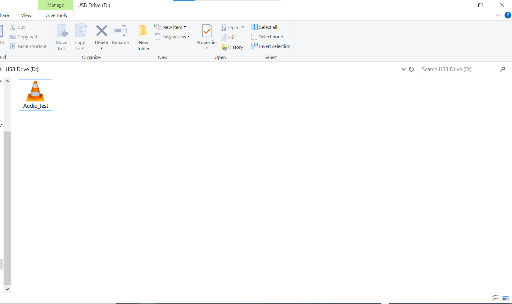
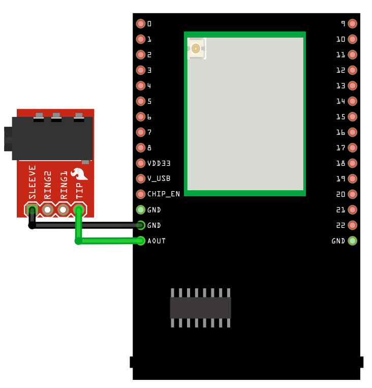
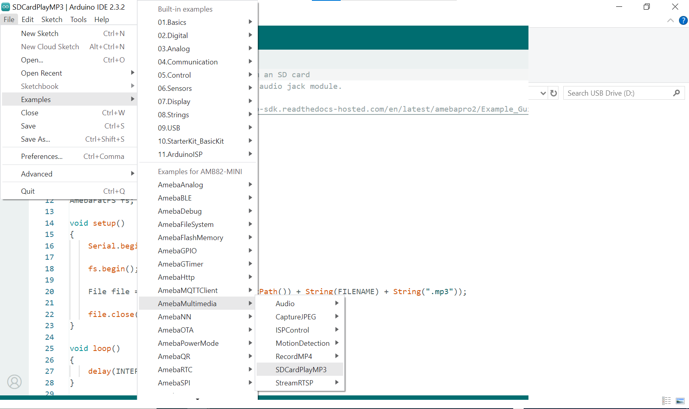
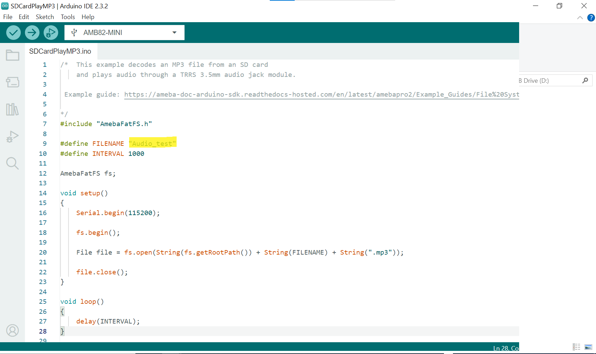

Play MP3 with SD card
=====================

Materials
---------

-  `AMB82-mini <https://www.amebaiot.com/en/where-to-buy-link/#buy_amb82_mini>`__ x 1

-  MicroSD card

- 3.5mm TRS/TRRS breakout x 1 (e.g., Adafruit 2791 / Sparkfun 11570)

Example
-------

In this example, we will use the Ameba Pro2 board to play MP3 audio from SD card.

Procedure
~~~~~~~~~

Using a card reader, connect the SD card to a computer and copy the MP3 file into the SD card. Take note to place the MP3 file in the root directory
and not in any folder. The MP3 sample file can be downloaded at https://github.com/ambiot/ambpro2_arduino/tree/dev/Ameba_misc/Example_Samples/Audio_test.mp3.

|image01|

Connect the audio jack to the Ameba board as shown in the diagram.

|image02|

Insert the MicroSD card into the SD card slot of the AMB82 MINI board.

Open the example in "File" -> "Examples" -> "AmebaMultimedia" -> "SDCardPlayMP3".

|image03|

In the highlighted code snippet, fill in the MP3 file name which was store on the MicroSD card.

|image04|

Plug in a pair of wired earbuds or a wired speaker into the audio jack. Upload the code and press the reset button on the board, now you can hear the MP3 audio through the earbuds.

