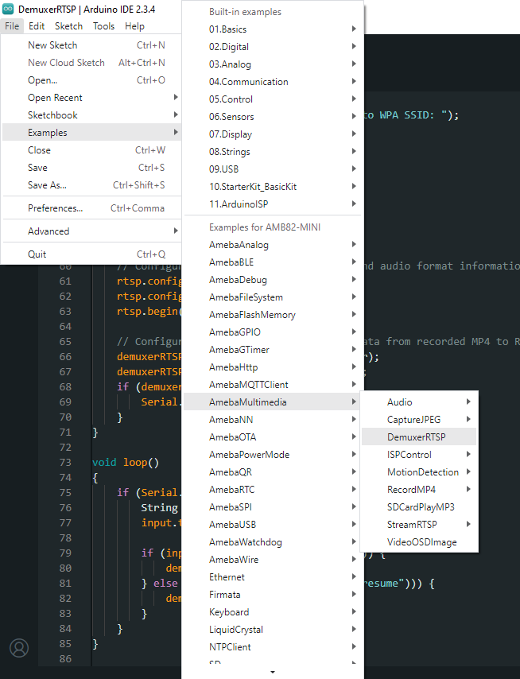
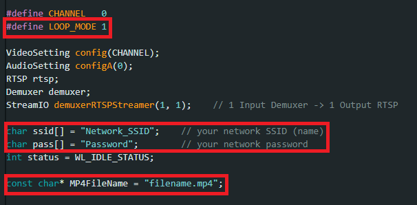
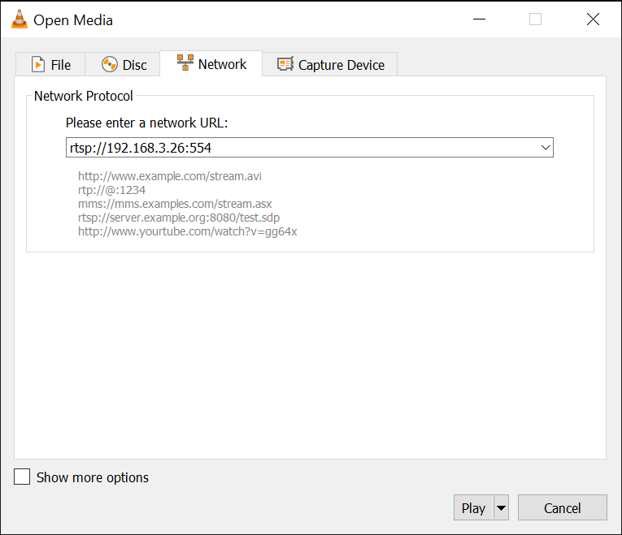
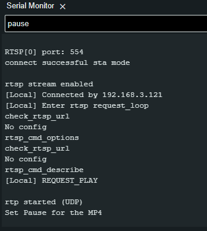
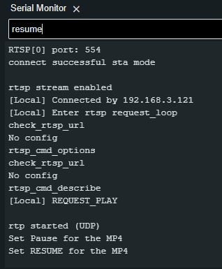

RTSP Demuxer
=============

Materials
---------

- `AMB82-mini <https://www.amebaiot.com/en/where-to-buy-link/#buy_amb82_mini>`__ x 1
- SD Card

Example
-------
This example demonstrates on how to use a demuxer on the AmebaPro2 board to process an MP4 file from an SD card and stream its content over RTSP (Real-Time Streaming Protocol).

Open the example in :guilabel:`File -> Examples -> AmebaMultimedia -> DemuxerRTSP`

|image01|

First, you can choose whether to loop the MP4 file during streaming. If looping is enabled, the stream will play continuously without stopping.

Next, fill in the "ssid" with your WiFi network SSID and "pass" with the network password.

Finally, specify the name of the MP4 file you want to stream via RTSP. It is recommended to use an MP4 file recorded with the AmebaPro2 board.

|image02|

Compile the code and upload it to Ameba.

After pressing the Reset button, wait for the Ameba Pro 2 board to connect to the WiFi network. The board's IP address and network port number for RTSP will be shown in the Serial Monitor.

On a computer connected to the same WiFi network, open VLC media player, and go to :guilabel:`Media -> Open Network Stream`

|image03|

Since RTSP is used as the streaming protocol, key in ``rtsp://{IPaddress}:{port}`` as the Network URL in VLC media player, replacing {IPaddress} with the IP address of your Ameba Pro2 board, and {port} with the RTSP port shown in Serial Monitor. The default RTSP port number is 554.

Next, click "Play" to start RTSP streaming.

|image04|

**To pause the streaming:**

Enter the command **"pause"** to pause the stream using Serial Monitor.

|image05|

**To resume the streaming:**

Enter the command **"resume"** to resume the stream using Serial Monitor.

|image06|

.. |image03| image:: ../../../../_static/amebapro2/Example_Guides/Multimedia/RTSP_Demuxer/image03.png
   :width:  432 px
   :height:  482 px

