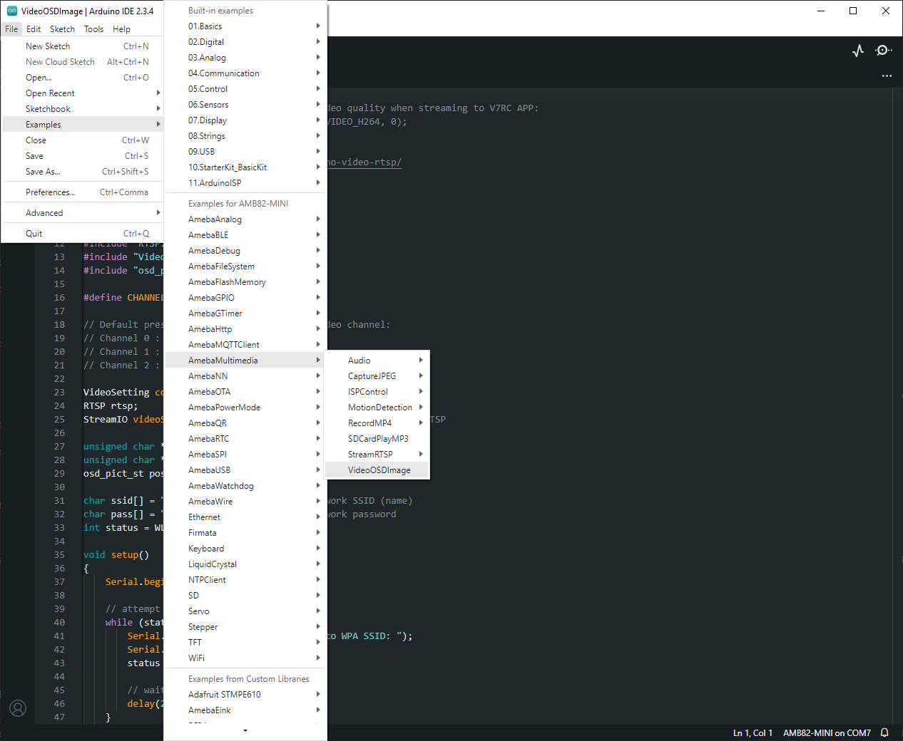
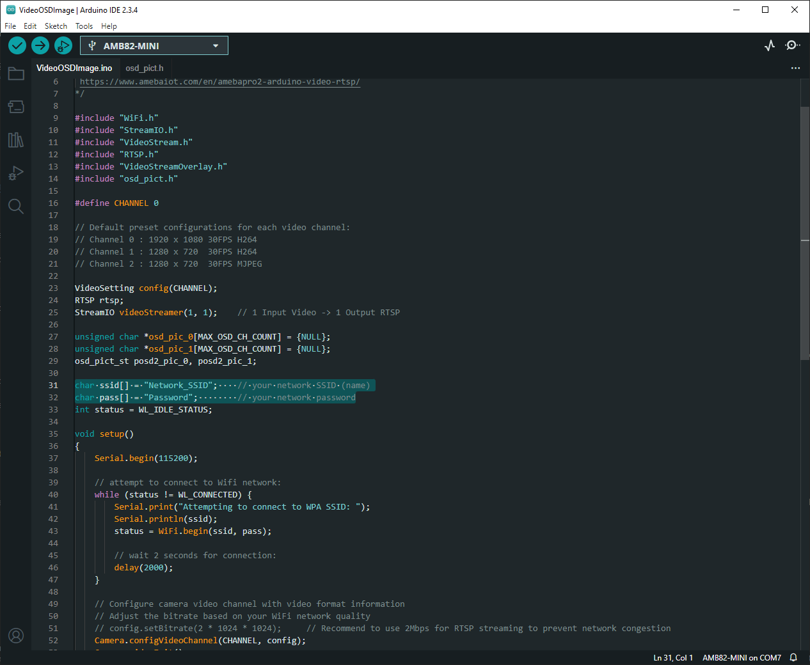
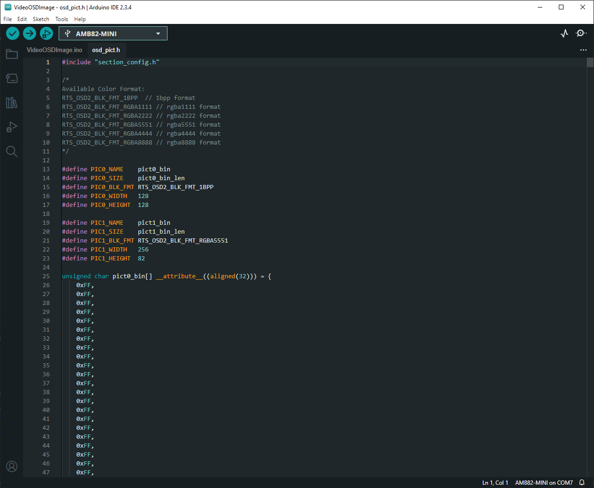
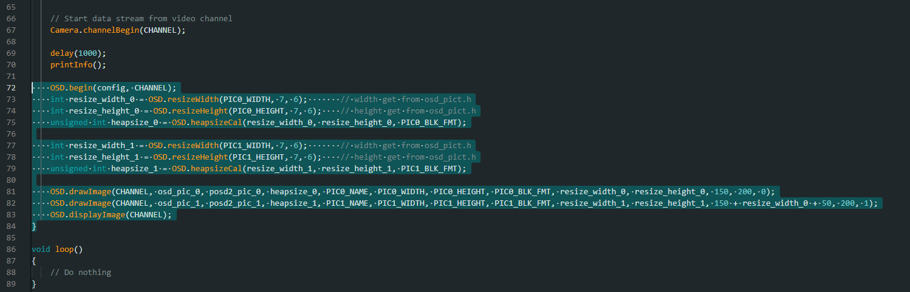
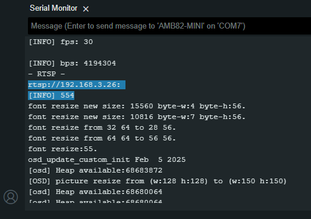
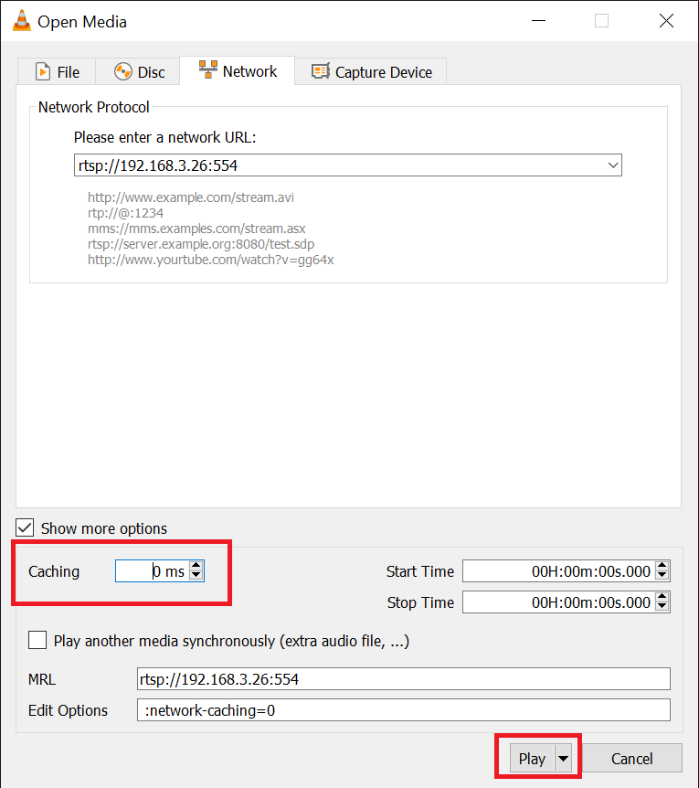
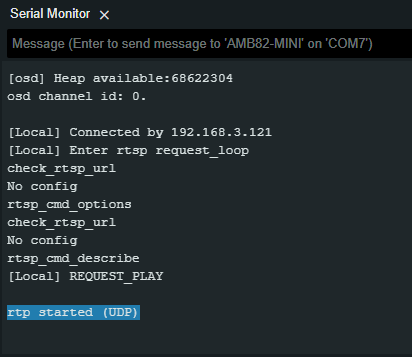
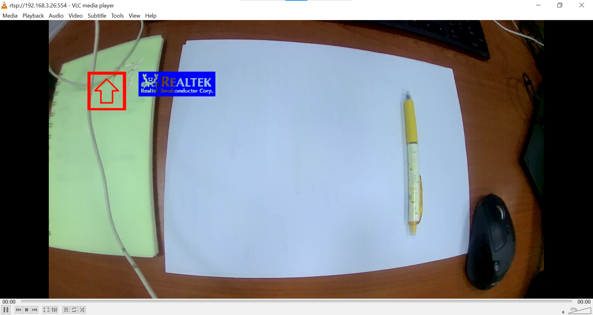
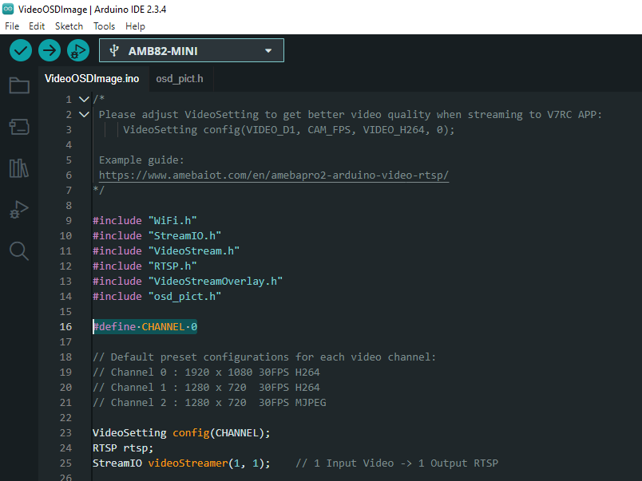
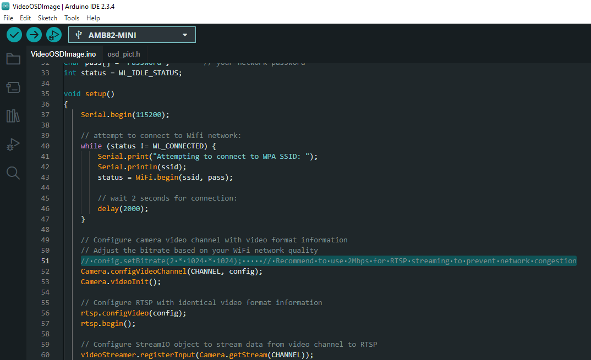

RTSP Streaming with OSD Image
=============================

.. contents::
  :local:
  :depth: 2

Materials
---------

- `AMB82-mini <https://www.amebaiot.com/en/where-to-buy-link/#buy_amb82_mini>`_ x 1

Example
-------
In this example, we will use the Ameba Pro2 board to stream video from the on-board camera sensor (JX-F37P) and overlay image OSD on the video stream.

Open the VideoOSDImage example in “File” -> “Examples” -> “AmebaMultimedia” -> “VideoOSDImage”.

|image01|

In the highlighted code snippet, fill in the “ssid” with your WiFi network SSID and “pass” with the network password.

|image02|

You can use this (`Python script <https://github.com/Ameba-AIoT/ameba-arduino-pro2>`_) to convert the image you want to overlay onto the video stream into an array and then save it in osd_pict.h.

|image03|

Refer to the highlighted section for codes on scaling images and displaying it on the video stream.

|image04|

Compile the code and upload it to Ameba. After pressing the Reset button, wait for the Ameba Pro 2 board to connect to the WiFi network. The board’s IP address and network port number for RTSP will be shown in the Serial Monitor.

You may download VLC media player from the link (`here <https://www.videolan.org/vlc/>`_).

Upon the completion of the software installation, open VLC media player, and go to “Media” -> “Open Network Stream”.

|image05|

Make sure your PC is connected to the same network as the Ameba Pro2 board for streaming. Since RTSP is used as the streaming protocol, key in `“rtsp://{IPaddress}:{port}”` as the Network URL in VLC media player, replacing {IPaddress} with the IP address of your Ameba Pro2 board, and {port} with the RTSP port shown in Serial Monitor `(e.g., “rtsp://192.168.3.26:554”)`. The default RTSP port number is 554. In the case of two simultaneous RTSP streams, the second port number defaults to 555.

|image06|

You may choose to change the caching time in “Show more options”. A lower cache time will result in reduced video latency but may introduce playback stuttering in the case of poor network conditions.

Next, click “Play” to start RTSP streaming. The video stream from the camera will be shown in VLC media player. Meanwhile, in your Serial Monitor, the message “rtp started (UDP)” will appear.

|image07|

|image08|

You can now see that the images are overlaid on the video stream.

|image09|

Code Reference
--------------
The camera can produce 3 simultaneous video stream channels, with the default configuration for each channel as shown. You may choose to edit the code to use a different video stream.

| Channel 0: 1920 x 1080, 30FPS, H264 format
| Channel 1: 1280 x 720, 30FPS, H264 format
| Channel 2: 1280 x 720, 30FPS, MJPEG format

|image10|

You may adjust the video bitrate based on your WiFi network quality, by uncommenting the highlighted code below.

|image11|

.. |image05| image:: ../../../../_static/amebapro2/Example_Guides/Multimedia/RTSP_Streaming_with_OSD_Image/image05.png
   :width:  432 px
   :height:  482 px

