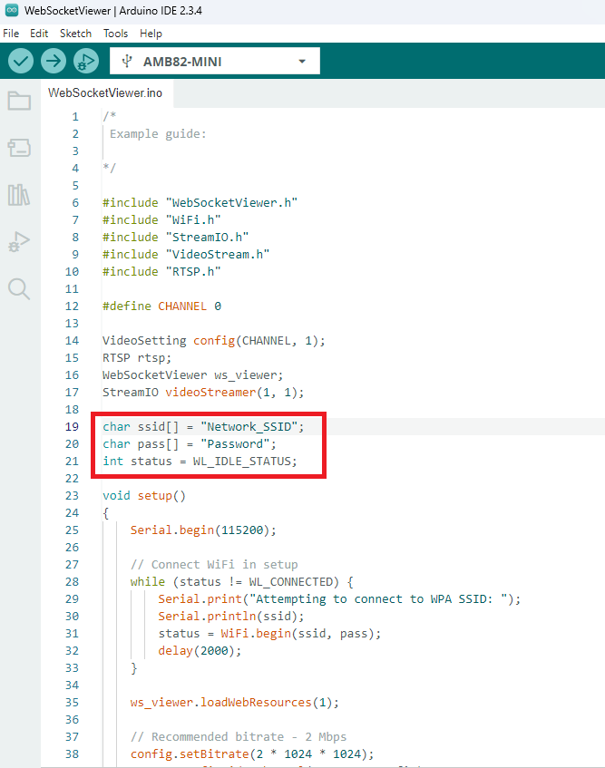
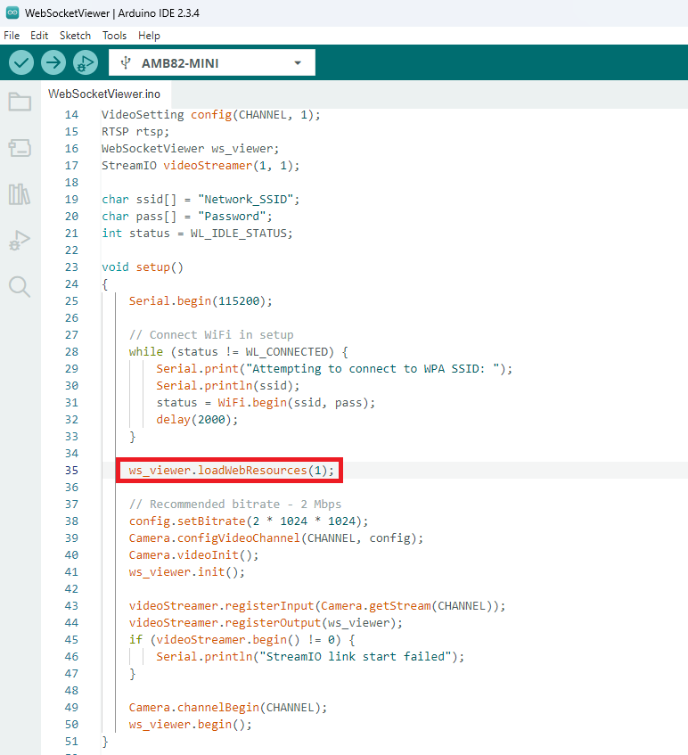
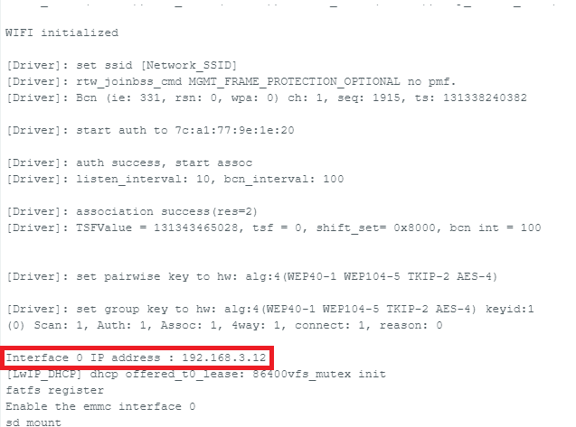
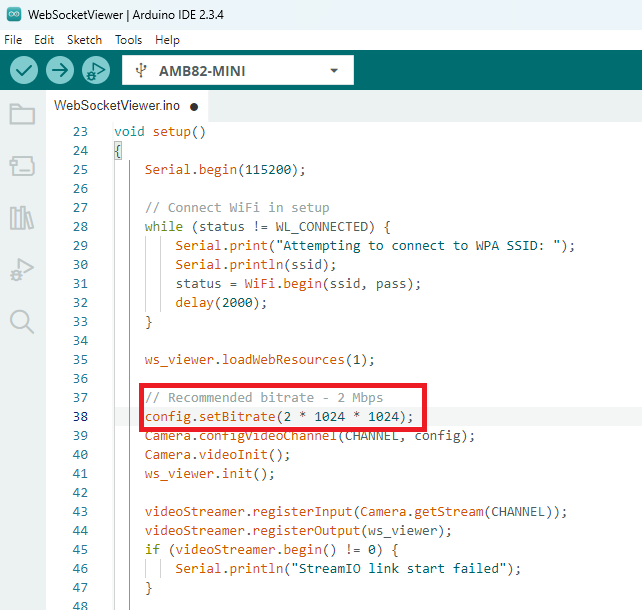

Websocket Viewer
==================

.. contents::
  :local:
  :depth: 2

Materials
---------

- `AMB82-mini <https://www.amebaiot.com/en/where-to-buy-link/#buy_amb82_mini>`_ x 1
- SD card x 1

Example
-------
This example demonstrates how the AMB82 Mini acts as a WebSocket server to stream live camera video to a web browser.

It provides a low-latency video streaming suitable for real-time applications.

In the highlighted code snippet, fill in the “ssid” with your WiFi network SSID and “pass” with the network password.

|image01|

By default, the WebSocket Viewer file is loaded from htdocs.h.

Alternatively, the file can be loaded from a SD card. To load it from the SD card,

1. Set this value to 1 to load the WebSocket Viewer file.

|image02|

2. Format the SD card as FAT32 using Windows OS.
3. Copy htdocs.bin to the root directory of the SD card.
4. Insert the SD card into the board.

Compile the code and upload it to Ameba. After pressing the Reset button, wait for the Ameba Pro 2 board to connect to the WiFi network. The board's IP address will be shown in the Serial Monitor.

|image03|

Open Google Chrome or any web browser of your choice and enter `http://{your_ip_address}/` to connect to the AmebaPro2 mini.

|image04|

Code Reference
--------------

You may adjust the video bitrate based on your WiFi network quality.

|image05| 

.. |image04| image:: ../../../../_static/amebapro2/Example_Guides/Multimedia/Websocket_Viewer/image04.png
   :width:  1918 px
   :height:  1009 px
   :scale: 40%

