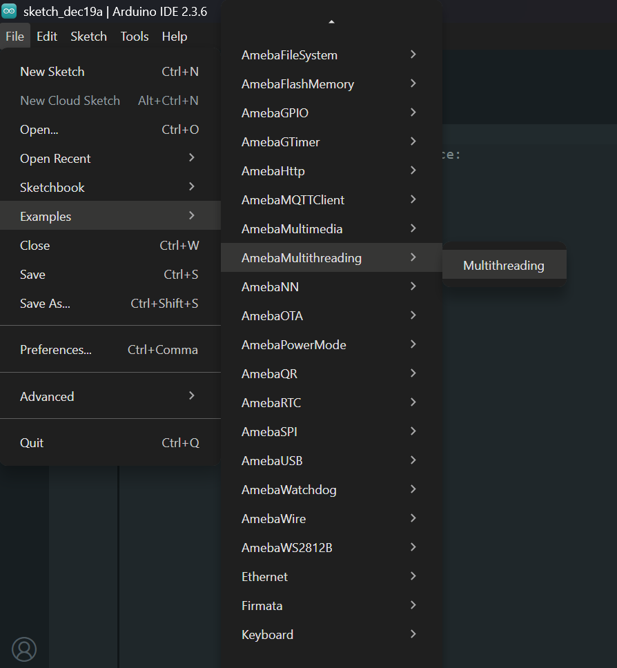
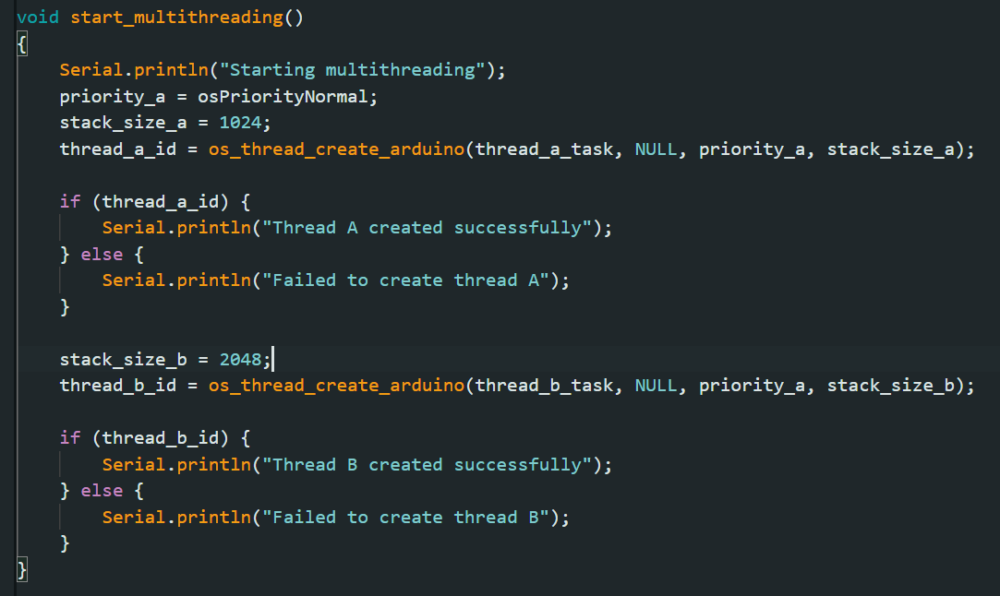
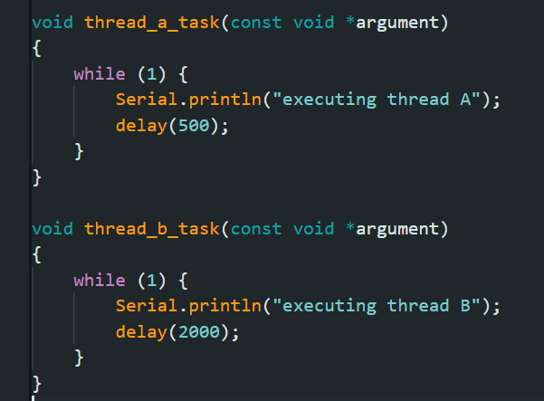
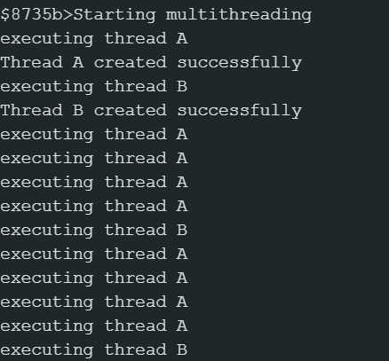

Multithreading
==============

Materials
---------

- `AMB82-mini <https://www.amebaiot.com/en/where-to-buy-link/#buy_amb82_mini>`__ x 1

Example
-------

This example illustrates the implementation of multithreading on AmebaPro2.

Open "File" -> "Examples" -> "AmebaMultithreading" -> "Multithreading".

|image01|

You may set the stack size for each task here.

|image02|

You may change the task execution here.

|image03|

Compile and run the code.

Once image is uploaded successfully, you will be able to see the multithreading behaviour for tasks a and b.

|image04|

