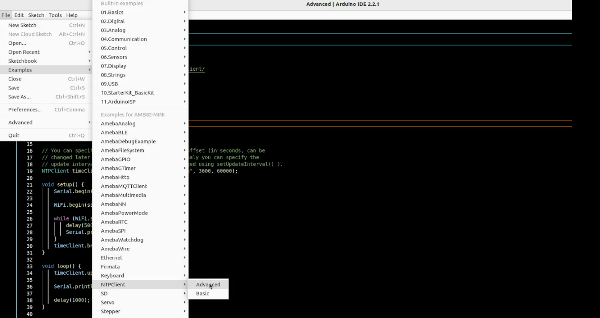
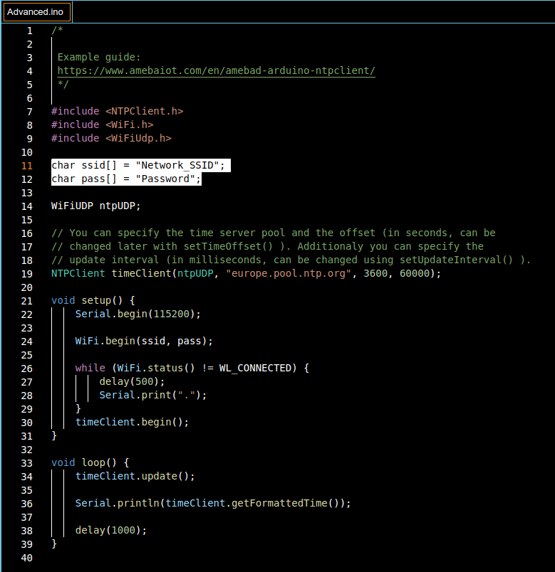
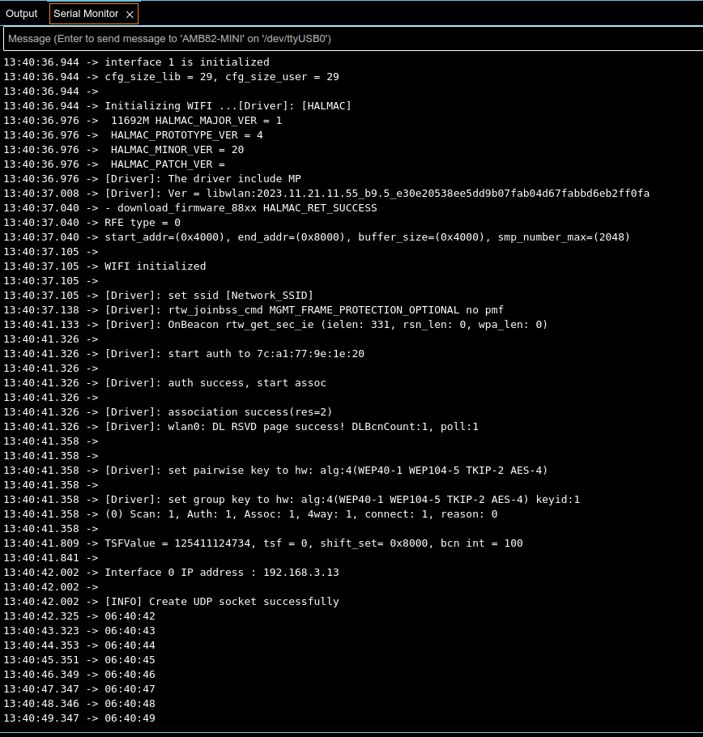

Retrieve Universal Time (UTC) by NTPClient library
==================================================

Materials
---------
- `AMB82-mini <https://www.amebaiot.com/en/where-to-buy-link/#buy_amb82_mini>`__ x 1

Example
-------

In this example, we use an NTP client to sync with NTP servers using UDP and keep track of time locally.Open the example. :guilabel:`File -> Examples -> NTPClient -> Advanced`

|image01|

Modify the highlighted code section (ssid, password) to connect to your WiFi network.

|image02|

Compile the code and upload it to Ameba. After pressing the Reset button, Ameba connects to WiFi, gets the UTC time from the NTP server, and prints out the current time with time zone offset to the serial monitor.

|image03|

Code Reference
--------------

| Configure NTP client:
| The NTPClient needs to use a UDP client for communications. A WiFiUDP client is declared and passed to the NTPClient constructor, along with an NTP server address, time zone offset in seconds, and update interval in milliseconds. If detailed configuration is not needed, just passing in the UDP client is also sufficient, refer to the :guilabel:`NTPClient -> Basic` example.

.. code-block:: c++

    WiFiUDP ntpUDP;
    NTPClient timeClient(ntpUDP, "europe.pool.ntp.org", 3600, 60000);

| Start NTP client:
| After connecting to WiFi, the NTPClient is started using the begin() function, which causes the client to sync with the NTP server and get the UTC time.

.. code-block:: c++

    WiFiUDP ntpUDP;
    timeClient.begin();

| Get local time:
| getFormattedTime() is used to format the received UTC time into the local time zone.
| update() is called every loop so that the NTPClient will sync with the NTP server once every update interval.

.. code-block:: c++

    timeClient.update();
    timeClient.getFormattedTime();

