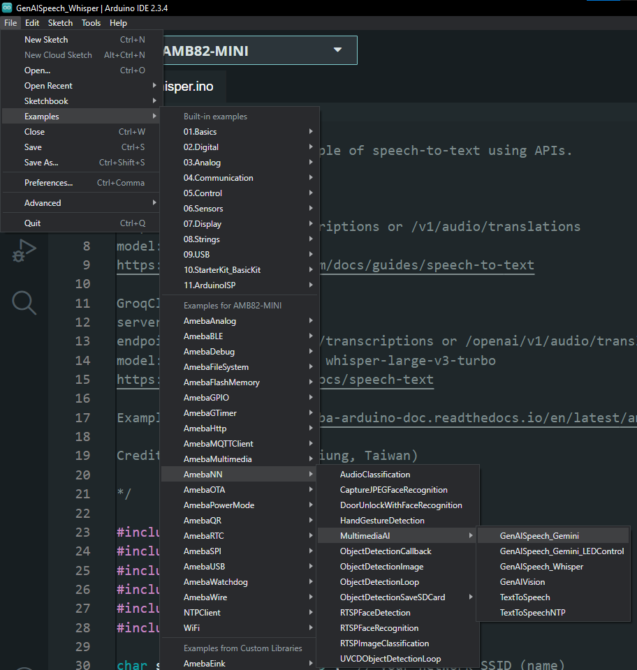
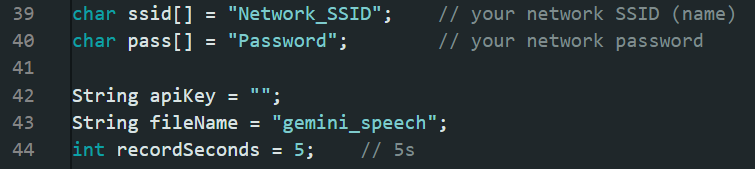
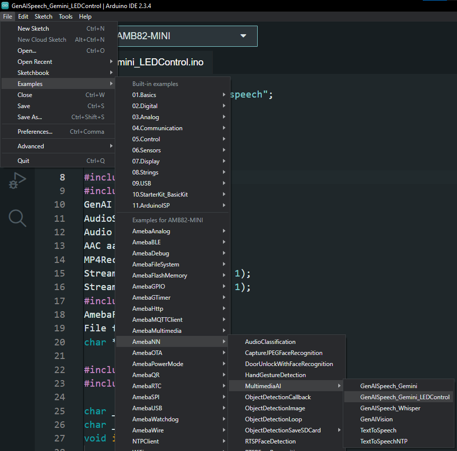
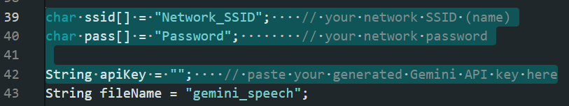

Generative AI Speech
====================

.. contents::
  :local:
  :depth: 2

.. note ::
   |image_3rd_party| "Generative AI Speech" is jointly developed by RTKSG SD3 and `ChungYi Fu (Kaohsiung, Taiwan) <https://github.com/fustyles>`_

   |image_ameba_iot| Special thanks and credits to the efforts and contributions for all developers.

Materials
---------

- `AMB82-mini <https://www.amebaiot.com/en/where-to-buy-link/#buy_amb82_mini>`_ x 1

- MicroSD card

- PushButton x1

- 220 ohm resistor x1

Example 
-------

GenAISpeech_Whisper
~~~~~~~~~~~~~~~~~~~

In this example, we will be using Ameba Pro2 development board to record and send audio recording to LLM server for voice transcription or translation.

Open Generative AI Speech Whisper example in "File" -> "Examples" -> "AmebaNN" -> "MultimediaAI" -> "GenAISpeech_Whisper".

|image01|

In the highlighted code snippet, fill in the "ssid" with your WiFi network SSID and "pass" with the network password.

|image02|

Choose your API server and and paste your API key accordingly.

Modify the ``api_path`` according to your server and tasks (transcription or translation).

Modify the ``audio_model`` to select the LLM model which suits your application needs.

|image03|

You may modify the filename and recording duration here.

|image04|

Connect the pushbutton and resistor to AMB82 Mini as shown below.

|image05|

Compile and run the example.

Open the serial monitor to view the logs.

Press button for 2s and wait for the green LED to light up, then speak into the microphone within the pre-defined recording duration.

Transcription or translation of the audio file will be printed out on serial monitor.

GenAISpeech_Gemini
~~~~~~~~~~~~~~~~~~

Open Generative AI Speech Gemini example in "File" -> "Examples" -> "AmebaNN" -> "MultimediaAI" -> "GenAISpeech_Gemini".

|image06|

| Fill in the "ssid" with your WiFi network SSID and "pass" with the network password.
| Then, fill in your Gemini api key.
| You may also modify the recording duration and filename.

|image07|

Connect the pushbutton and resistor to AMB82 Mini as shown below.

|image05|

Compile and run the example.

Open the serial monitor to view the logs.

Press button once, recording will start after 3 seconds of blue LED blinking, then speak into the microphone within the pre-defined recording duration.

Response from Gemini will be printed out on serial monitor.

GenAISpeech_Gemini_LEDControl
~~~~~~~~~~~~~~~~~~~~~~~~~~~~~

Open Generative AI Speech Gemini example in "File" -> "Examples" -> "AmebaNN" -> "MultimediaAI" -> "GenAISpeech_Gemini_LEDControl".

|image08|

| Fill in the "ssid" with your WiFi network SSID and "pass" with the network password.
| Then, fill in your Gemini api key.

|image09|

Connect the pushbutton and resistor to AMB82 Mini as shown below.

|image05|

Compile and run the example.

Open the serial monitor to view the logs.

Press button once, recording will start after 3 seconds of blue LED blinking, then speak "LED ON" into the microphone within the pre-defined recording duration.

The green LED will be on subsequently.

You may try the vice versa as well.

Online LLM Models
-----------------
Various online servers and LLM models featured in the SDK:

+------------------------------------+----------------------------------+----------------------------------+-----------------------------------------------+-----------------------------+---------------------------------+
| **Host**                           | **Transcription Endpoint**       | **Translation Endpoint**         | **Model**                                     | **Rate Limit**              | **Pricing**                     |
+====================================+==================================+==================================+===============================================+=============================+=================================+
| api.openai.com                     |  /v1/audio/transcriptions        |  /v1/audio/translations          | whisper-1                                     | 500 RPM                     | Chargeable (Tier 1)             |
+------------------------------------+----------------------------------+----------------------------------+-----------------------------------------------+-----------------------------+---------------------------------+
| api.groq.com                       |  /openai/v1/audio/transcriptions |  /openai/v1/audio/translations   | whisper-large-v3-turbo or whisper-large-v3    | 20 RPM                      | Free of charge                  |
+------------------------------------+----------------------------------+----------------------------------+-----------------------------------------------+-----------------------------+---------------------------------+
| generativelanguage.googleapis.com  |  /v1beta/models/<model>                                             | gemini-2.0-flash                              | 15 RPM                      | Free of charge                  |
+------------------------------------+----------------------------------+----------------------------------+-----------------------------------------------+-----------------------------+---------------------------------+

**Rate Limit References**

openAI: https://platform.openai.com/docs/guides/rate-limits?context=tier-one#usage-tiers

GroqCloud: https://console.groq.com/settings/limits

Google AI Studio: https://ai.google.dev/gemini-api/docs/rate-limits

Resources
---------

| openAI platform 
| https://platform.openai.com/docs/guides/speech-to-text

| GroqCloud 
| https://console.groq.com/docs/speech-text

| Google AI Studio
| https://ai.google.dev/gemini-api/docs/audio?lang=rest

.. |image_ameba_iot| image:: ../../../../_static/ameba_iot_logo.png
   :scale: 40%

