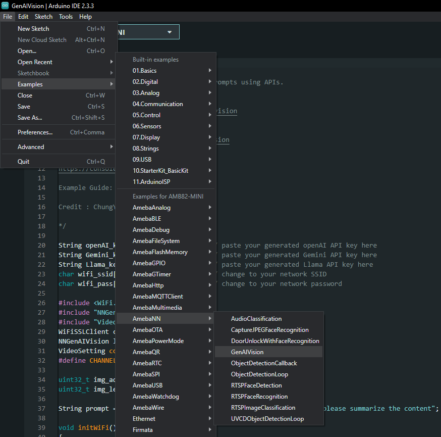
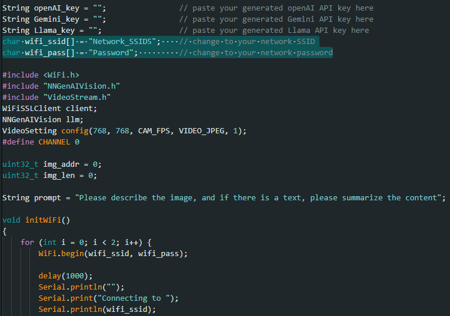
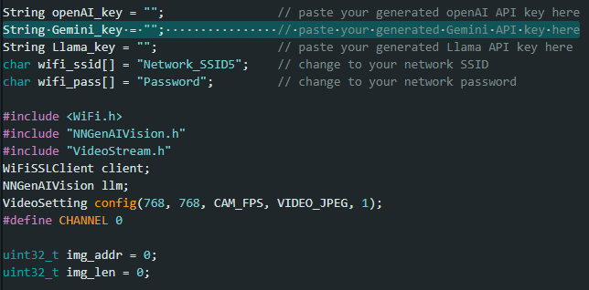
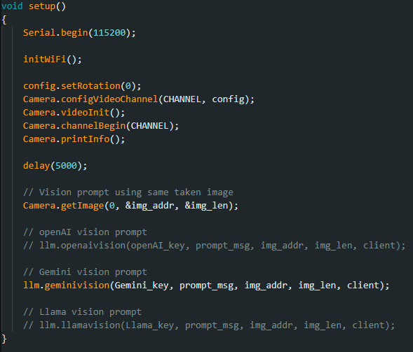
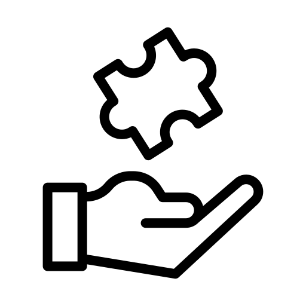

Generative AI Vision
====================

.. contents::
  :local:
  :depth: 2

.. note ::
   |image_3rd_party| "Generative AI Vision" is jointly developed by RTKSG SD3 and `ChungYi Fu (Kaohsiung, Taiwan) <https://github.com/fustyles>`_

   |image_ameba_iot| Special thanks and credits to the efforts and contributions for all developers.

Materials
---------

- `AMB82-mini <https://www.amebaiot.com/en/where-to-buy-link/#buy_amb82_mini>`_ x 1

Example 
-------

In this example, we will be using Ameba Pro2 development board to capture and send image to various LLM servers for visual analysis and understanding.

Open Generative AI Vision example in "File" -> "Examples" -> "AmebaNN" -> "MultimediaAI" -> "GenAIVision".

|image01|

In the highlighted code snippet, fill in the "wifi_ssid" with your WiFi network SSID and "wifi_pass" with the network password.

|image02|

In this documentation, we will be using Gemini API for demonstration. 

Create your own Gemini API key in `Google AI Studio <https://aistudio.google.com/apikey>`_.

Copy your API key and paste in ``Gemini_key`` section.

|image03|

Uncomment the function of gemini vision prompt for execution.

|image04|

Compile and upload the firmware to AMB82-mini. Open a serial monitor to view the response.

You may also modify the ``prompt_msg`` to suit your application needs.

Online LLM Models
-----------------
Various online servers and LLM models featured in the SDK:

+--------------------------------------+---------------------------------------+-----------------------------+---------------------------------+
| **Server**                           | **Model**                             | **Rate Limit**              | **Pricing**                     |
+======================================+=======================================+=============================+=================================+
| openAI platform                      | gpt-4o-mini                           | 500 RPM                     | Chargeable (Tier 1)             |
+--------------------------------------+---------------------------------------+-----------------------------+---------------------------------+
| Google AI Studio                     | gemini-2.0-flash                      | 15 RPM                      | Free of charge                  |
+--------------------------------------+---------------------------------------+-----------------------------+---------------------------------+
| GroqCloud                            | llama-3.2-90b-vision-preview          | 15 RPM                      | Free of charge                  |
+--------------------------------------+---------------------------------------+-----------------------------+---------------------------------+

**Rate Limit References**

openAI: https://platform.openai.com/docs/guides/rate-limits?context=tier-one#usage-tiers

Google AI Studio: https://ai.google.dev/pricing#1_5flash

GroqCloud: https://console.groq.com/settings/limits

Resources
---------

| openAI platform - openAI vision
| https://platform.openai.com/docs/guides/vision

| Google AI Studio - Gemini vision
| https://ai.google.dev/gemini-api/docs/vision

| GroqCloud - Llama vision
| https://console.groq.com/docs/overview

