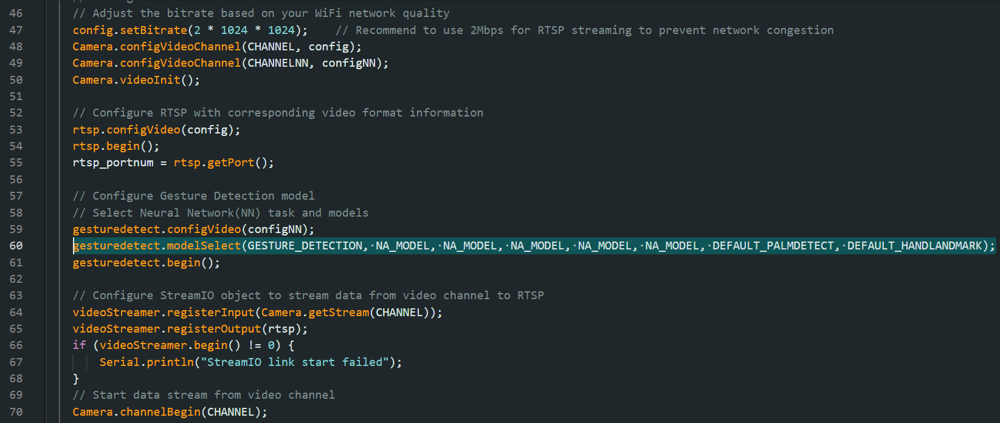

Hand Gesture Detection
======================

.. contents::
  :local:
  :depth: 2

Materials
---------

- `AMB82-mini <https://www.amebaiot.com/en/where-to-buy-link/#buy_amb82_mini>`_ x 1

Example 
-------

In this example, we will be using Ameba Pro2 development board to detect palm gestures.

Open hand gesture detection examples in “File” -> “Examples” -> “AmebaNN” -> “HandGestureDetection”.

|image01|

In the highlighted code snippet, fill in the “ssid” with your WiFi network SSID and “pass” with the network password.

|image02|

Select Neural Network (NN) task and models using modelSelect() function highlighted in yellow. This function takes 8 arguments: Neural Network task, Object Detection model, Face Detection model, Face Recognition model, Audio Classification model, Image Classification model, Palm Detection model and HandLandmark model. Replace with “NA_MODEL” if they are not necessary for your selected Neural Network task. Note that it is mandatory to call modelSelect() function before calling the begin() function.

| Valid Neural Network task: 
| OBJECT_DETECTION, FACE_DETECTION, FACE_RECOGNITION, AUDIO_CLASSIFICATION, IMAGE_CLASSIFICATION, GESTURE_DETECTION

* Valid Object Detection model:

    * YOLOv3 model: DEFAULT_YOLOV3TINY, CUSTOMIZED_YOLOV3TINY
    * YOLOv4 model: DEFAULT_YOLOV4TINY, CUSTOMIZED_YOLOV4TINY
    * YOLOv7 model: DEFAULT_YOLOV7TINY, CUSTOMIZED_YOLOV7TINY

* Valid Face Detection model: DEFAULT_SCRFD, CUSTOMIZED_SCRFD
* Valid Face Recognition model: DEFAULT_MOBILEFACENET, CUSTOMIZED_MOBILEFACENET
* Valid Audio Classification model: DEFAULT_YAMNET, CUSTOMIZED_YAMNET
* Valid Image Classification model: DEFAULT_IMGCLASS, CUSTOMIZED_IMGCLASS
* Valid Hand Gesture Detection model: DEFAULT_HANDLANDMARK, CUSTOMIZED_HANDLANDMARK

.. note :: Choose the customized option (e.g., CUSTOMIZED_YOLOV4TINY/ CUSTOMIZED_SCRFD/ CUSTOMIZED_MOBILEFACENET) if you would like to use your own NN model. To learn about the process of converting an AI model, refer to https://www.amebaiot.com/en/amebapro2-ai-convert-model/ . Additionally, refer to https://www.amebaiot.com/en/amebapro2-apply-ai-model-docs/ to understand how to install and use the converted model.

|image03|

Compile the code and upload it to Ameba. After pressing the Reset button, wait for the Ameba Pro 2 board to connect to the WiFi network. The board's IP address and network port number for RTSP will be shown in the Serial Monitor.

The result of detected objects can be validated using VLC. You may download VLC media player from the link `here <https://vlc-media-player.en.softonic.com/?utm_source=SEM&utm_medium=paid&utm_campaign=EN_UK_DSA&gclid=Cj0KCQjw1vSZBhDuARIsAKZlijTRUgX93pTAjakY9p0Vw6tr04-k-4K-OvoDdnPTl89ggsxDttC2JycaAoYhEALw_wcB>`_.

Upon the completion of the software installation, open VLC media player, and go to “Media” -> “Open Network Stream”.

|image04|

Make sure your PC is connected to the same network as the Ameba Pro2 board for streaming. Since RTSP is used as the streaming protocol, key in “rtsp://{IPaddress}:{port}” as the Network URL in VLC media player, replacing {IPaddress} with the IP address of your Ameba Pro2 board, and {port} with the RTSP port shown in Serial Monitor (e.g., “rtsp://192.168.1.154:554”). The default RTSP port number is 554.

|image05|

Next, click “Play” to start RTSP streaming to see the result. The video stream from the camera will be shown in VLC media player.

Code Reference
--------------

You may adjust the video bitrate based on your WiFi network quality, by uncommenting the highlighted code below.

|image06|

.. |image01| image:: ../../../../_static/amebapro2/Example_Guides/Neural_Network/Neural_Network_-_Hand_Gesture_Detection/image01.png
   :width:  856 px
   :height:  915 px

.. |image04| image:: ../../../../_static/amebapro2/Example_Guides/Neural_Network/Neural_Network_-_Hand_Gesture_Detection/image04.png
   :width:  432 px
   :height:  482 px

.. |image05| image:: ../../../../_static/amebapro2/Example_Guides/Neural_Network/Neural_Network_-_Hand_Gesture_Detection/image05.png
   :width:  633 px
   :height:  594 px

