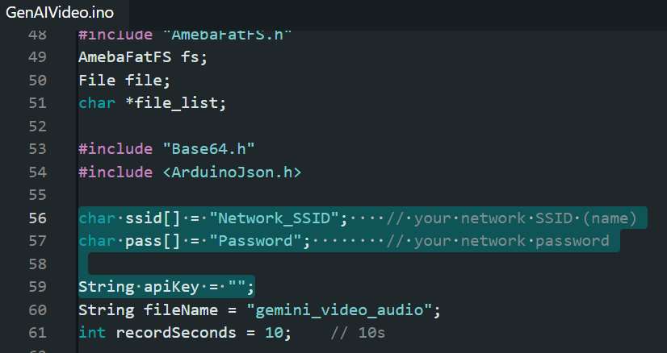
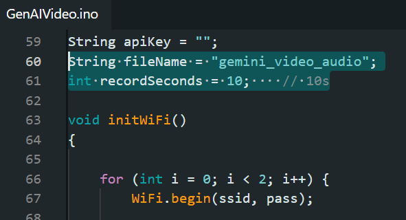

Generative AI Video
====================

.. note ::
   |image_3rd_party| "Generative AI Video" is jointly developed by RTKSG SD3 and `ChungYi Fu (Kaohsiung, Taiwan) <https://github.com/fustyles>`_

   |image_ameba_iot| Special thanks and credits to the efforts and contributions for all developers.

Materials
---------

- `AMB82-mini <https://www.amebaiot.com/en/where-to-buy-link/#buy_amb82_mini>`__ x 1

- MicroSD card

- PushButton x1

- 220 ohm resistor x1

Example
-------

GenAIVideo
~~~~~~~~~~

In this example, we will be using Ameba Pro2 development board to record and send video + audio recording to LLM server for analysis.

Open Generative AI Video example in "File" -> "Examples" -> "AmebaNN" -> "MultimediaAI" -> "GenAIVideo".

Fill in the "ssid" with your WiFi network SSID and "pass" with the network password.

|image01|

Then, fill in your Gemini api key.
You may also modify the recording duration and filename.

|image02|

Connect the pushbutton and resistor to AMB82 Mini as shown below.

|image03|

Compile and run the example.

Open the serial monitor to view the logs.

Press button once, recording will start after 3 seconds of blue LED blinking, you will record the background and sound of your surrounding within the pre-defined duration.

Once the recording is done, it will be saved as a MP4 and sent to online Gemini server.

Response from Gemini will be printed out on serial monitor.

Online LLM Models
-----------------
Various online servers and LLM models featured in the SDK:

+------------------------------------+----------------------------------+----------------------------------+-----------------------------------------------+-----------------------------+---------------------------------+
| **Host**                           | **Transcription Endpoint**       | **Translation Endpoint**         | **Model**                                     | **Rate Limit**              | **Pricing**                     |
+====================================+==================================+==================================+===============================================+=============================+=================================+
| generativelanguage.googleapis.com  |  /v1beta/models/<model>                                             | gemini-2.5-flash                              | 10 RPM                      | Free of charge                  |
+------------------------------------+----------------------------------+----------------------------------+-----------------------------------------------+-----------------------------+---------------------------------+

**Rate Limit References**

Google AI Studio: https://ai.google.dev/gemini-api/docs/rate-limits

Resources
---------

| Google AI Studio
| https://ai.google.dev/gemini-api/docs/audio?lang=rest

.. |image03| image:: ../../../../../_static/amebapro2/Example_Guides/Neural_Network/Neural_Network_-_Generative_AI_Speech/image05.png
   :width:  988 px
   :height:  802 px
   :scale: 80%

.. |image_ameba_iot| image:: ../../../../../_static/ameba_iot_logo.png
   :scale: 40%

.. |image_3rd_party| image:: ../../../../../_static/3rd_party_logo.png
   :scale: 10%
