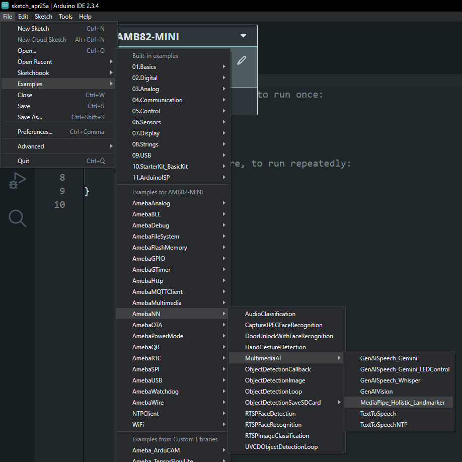
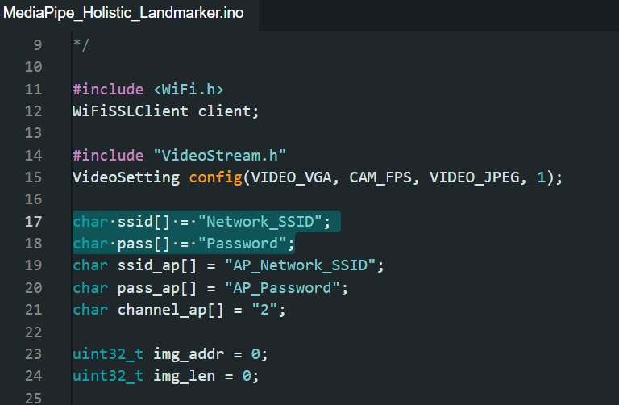
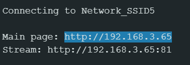

MediaPipe Holistic Landmarker
=============================

.. note ::
   |image_3rd_party| "Text-to-Speech" is jointly developed by RTKSG SD3 and `ChungYi Fu (Kaohsiung, Taiwan) <https://github.com/fustyles>`_

   |image_ameba_iot| Special thanks and credits to the efforts and contributions for all developers.

Materials
---------

- `AMB82-mini <https://www.amebaiot.com/en/where-to-buy-link/#buy_amb82_mini>`__ x 1

Example
-------

In this example, we will be using Ameba Pro2 development board to stream JPEG using HTTP and apply MediaPipe Holistic Landmarker on the streaming page.

Open MediaPipe Holistic Landmarker example in :guilabel:`File -> Examples -> AmebaNN -> MultimediaAI -> MediaPipe_Holistic_Landmarker`

|image01|

In the highlighted code snippet fill in the "ssid" with your WiFi network SSID and "pass" with the network password.

|image02|

Compile and upload the example.

Open the serial monitor to view the logs.

|image03|

Please copy the IP address for "Main page" printed on the log and paste it on your browser to view the stream.

Resources
---------

| MediaPipe Holistic Overview
| https://github.com/google-ai-edge/mediapipe/blob/master/docs/solutions/holistic.md

| MediaPipe Tasks Vision Package
| https://www.jsdelivr.com/package/npm/@mediapipe/tasks-vision

.. |image_ameba_iot| image:: ../../../../../_static/ameba_iot_logo.png
   :scale: 40%

.. |image_3rd_party| image:: ../../../../../_static/3rd_party_logo.png
   :scale: 10%
