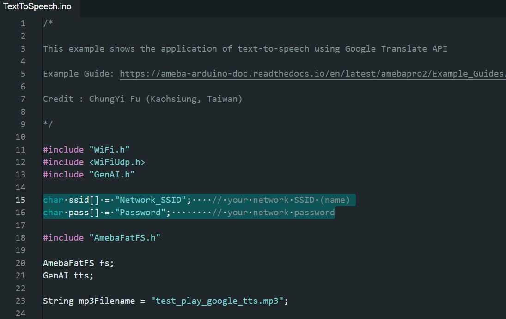

Text-to-Speech
==============

.. contents::
  :local:
  :depth: 2

.. note ::
   |image_3rd_party| "Text-to-Speech" is jointly developed by RTKSG SD3 and `ChungYi Fu (Kaohsiung, Taiwan) <https://github.com/fustyles>`_

   |image_ameba_iot| Special thanks and credits to the efforts and contributions for all developers.

Materials
---------

- `AMB82-mini <https://www.amebaiot.com/en/where-to-buy-link/#buy_amb82_mini>`_ x 1

Example 
-------

In this example, we will be using Ameba Pro2 development board to demonstrate text-to-speech application via Google Translate API.

Open Text-to-Speech example in "File" -> "Examples" -> "AmebaNN" -> "MultimediaAI" -> "Text-to-Speech".

|image01|

In the highlighted code snippet, fill in the "ssid" with your WiFi network SSID and "pass" with the network password.

|image02|

Please replace ``message`` with your speech text. You may also change the audio language accordingly. Please refer to the table below for language codes.

|image03|

**Language Codes**

+--------------------------------------+---------------+
| **Language**                         | **Code**      |
+======================================+===============+
| English (US)                         | en            |
+--------------------------------------+---------------+
| English (UK)                         | en-GB         |
+--------------------------------------+---------------+
| Chinese (Taiwan)                     | zh-TW         |
+--------------------------------------+---------------+
| Chinese (PRC)                        | zh-CN         |
+--------------------------------------+---------------+
| Japanese                             | ja            |
+--------------------------------------+---------------+
| Korean                               | ko            |
+--------------------------------------+---------------+
| French                               | fr            |
+--------------------------------------+---------------+
| German                               | de            |
+--------------------------------------+---------------+
| Italian                              | it            |
+--------------------------------------+---------------+
| Russian                              | ru            |
+--------------------------------------+---------------+
| Spanish                              | es            |
+--------------------------------------+---------------+

Resources
---------

| Google Language Codes
| https://developers.google.com/admin-sdk/directory/v1/languages

.. |image_ameba_iot| image:: ../../../../../_static/ameba_iot_logo.png
   :scale: 40%

.. |image_3rd_party| image:: ../../../../../_static/3rd_party_logo.png
   :scale: 10%

