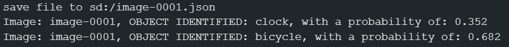

Object Detection Image
======================

Materials
---------

- `AMB82-mini <https://www.amebaiot.com/en/where-to-buy-link/#buy_amb82_mini>`__ x 1

- SD Card x 1

Example
-------

In this example, we will be using Ameba Pro2 development board to detect 80 different kinds of objects such as person, bicycle, car, laptop on a single image saved on external SD card.

Open Object Detection Image example in "File" -> "Examples" -> "AmebaNN" -> "ObjectDetectionImage".

|image01|

Select Neural Network (NN) task and models using modelSelect() function highlighted in yellow. This function takes 4 arguments: Neural Network task, Object Detection model, Face Detection model and Face Recognition model. Replace with "NA_MODEL" if they are not necessary for your selected Neural Network task. Note that it is mandatory to call modelSelect() function before calling the begin() function.

Valid Neural Network task: ``OBJECT_DETECTION``

| Valid Object Detection model:
| YOLOv3 model: ``DEFAULT_YOLOV3TINY``, ``CUSTOMIZED_YOLOV3TINY``
| YOLOv4 model: ``DEFAULT_YOLOV4TINY``, ``CUSTOMIZED_YOLOV4TINY``
| YOLOv7 model: ``DEFAULT_YOLOV7TINY``, ``CUSTOMIZED_YOLOV7TINY``

Choose the customized option (e.g., ``CUSTOMIZED_YOLOV4TINY``/ ``CUSTOMIZED_YOLOV7TINY``) if you would like to use your own NN model. To learn about the process of converting an AI model, refer to https://www.amebaiot.com/en/amebapro2-ai-convert-model/ .

Additionally, refer to https://www.amebaiot.com/en/amebapro2-apply-ai-model-docs/ to understand how to install and use the converted model.

.. note ::
  For Yolov7 object detection training from pytorch, you will need to perform an additional step for reparameterization.

  For this reparameterization step, Realtek has provided two scripts in the folder Yolov7_reparam_scripts,
  under ~/NeuralNetwork/Yolov7_reparam_scripts.

  Command to run is:
  ``python reparam_yolov7-tiny.py -weights weights/best.pt -custom_yaml custom/yolov7-tiny-deploy.yaml -output best_reparam.pt``

Next, create a text file named "image_list.txt" or rename it as you wish.

|image02|

List down the image(s) to be processed in the text file created.

Compile and upload the code to AMB82-mini. Open a serial monitor to view the response.

The NN detection result will be saved as JSON file with the same name as the image. You may also view the result on serial monitor (example as shown below).

|image03|

The pretrained model can recognise 80 different types of objects in total. The index number for each object is fixed and should not be changed.

Kindly refer to the list of objects below recognized by the default YOLO model, the index of the object corresponds to the "category_id" value in JSON file.

    ``{0,  "person"         },
    {1,  "bicycle"        },
    {2,  "car"            },
    {3,  "motorbike"      },
    {4,  "aeroplane"      },
    {5,  "bus"            },
    {6,  "train"          },
    {7,  "truck"          },
    {8,  "boat"           },
    {9,  "traffic light"  },
    {10, "fire hydrant"   },
    {11, "stop sign"      },
    {12, "parking meter"  },
    {13, "bench"          },
    {14, "bird"           },
    {15, "cat"            },
    {16, "dog"            },
    {17, "horse"          },
    {18, "sheep"          },
    {19, "cow"            },
    {20, "elephant"       },
    {21, "bear"           },
    {22, "zebra"          },
    {23, "giraffe"        },
    {24, "backpack"       },
    {25, "umbrella"       },
    {26, "handbag"        },
    {27, "tie"            },
    {28, "suitcase"       },
    {29, "frisbee"        },
    {30, "skis"           },
    {31, "snowboard"      },
    {32, "sports ball"    },
    {33, "kite"           },
    {34, "baseball bat"   },
    {35, "baseball glove" },
    {36, "skateboard"     },
    {37, "surfboard"      },
    {38, "tennis racket"  },
    {39, "bottle"         },
    {40, "wine glass"     },
    {41, "cup"            },
    {42, "fork"           },
    {43, "knife"          },
    {44, "spoon"          },
    {45, "bowl"           },
    {46, "banana"         },
    {47, "apple"          },
    {48, "sandwich"       },
    {49, "orange"         },
    {50, "broccoli"       },
    {51, "carrot"         },
    {52, "hot dog"        },
    {53, "pizza"          },
    {54, "donut"          },
    {55, "cake"           },
    {56, "chair"          },
    {57, "sofa"           },
    {58, "pottedplant"    },
    {59, "bed"            },
    {60, "diningtable"    },
    {61, "toilet"         },
    {62, "tvmonitor"      },
    {63, "laptop"         },
    {64, "mouse"          },
    {65, "remote"         },
    {66, "keyboard"       },
    {67, "cell phone"     },
    {68, "microwave"      },
    {69, "oven"           },
    {70, "toaster"        },
    {71, "sink"           },
    {72, "refrigerator"   },
    {73, "book"           },
    {74, "clock"          },
    {75, "vase"           },
    {76, "scissors"       },
    {77, "teddy bear"     },
    {78, "hair dryer"     },
    {79, "toothbrush"     }``

