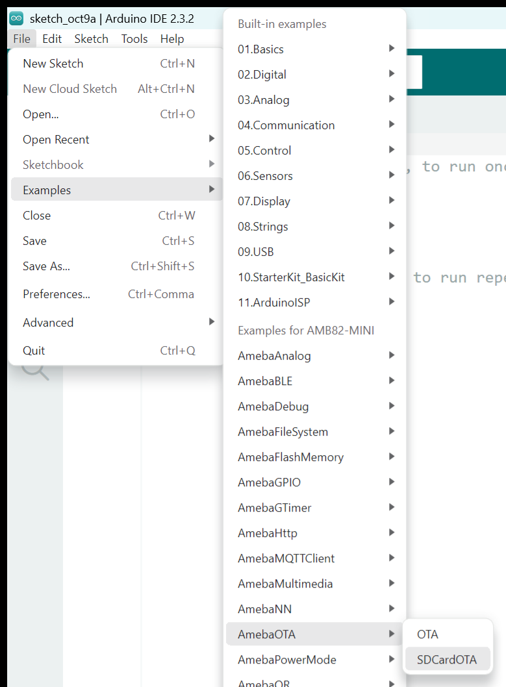
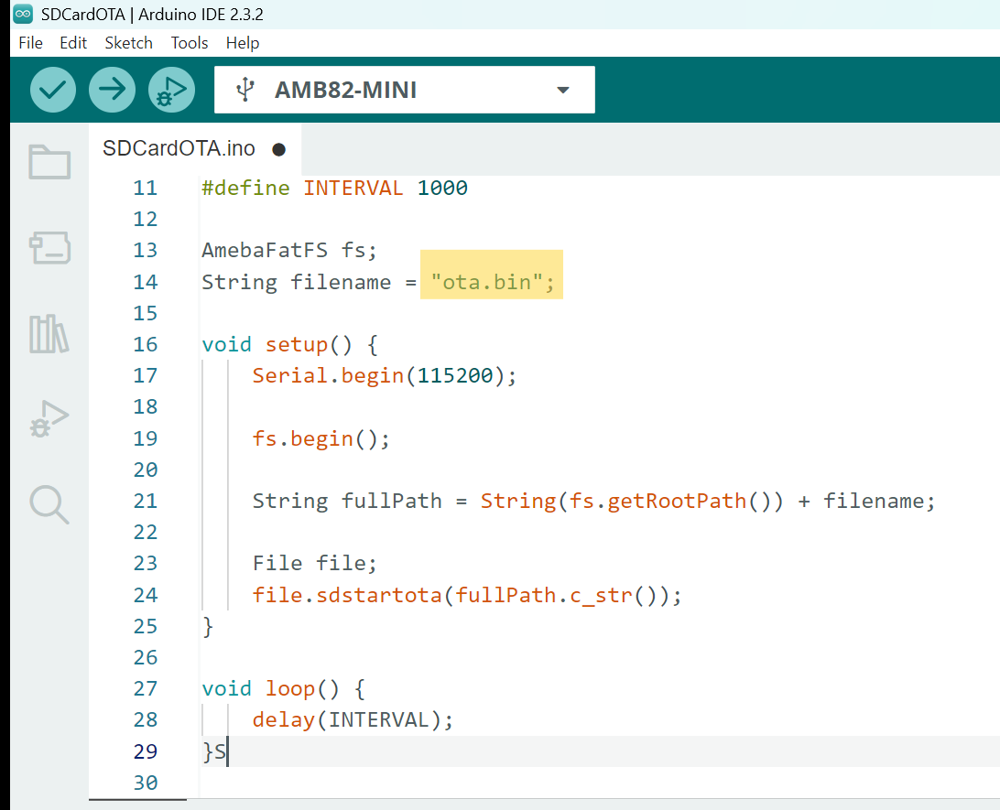
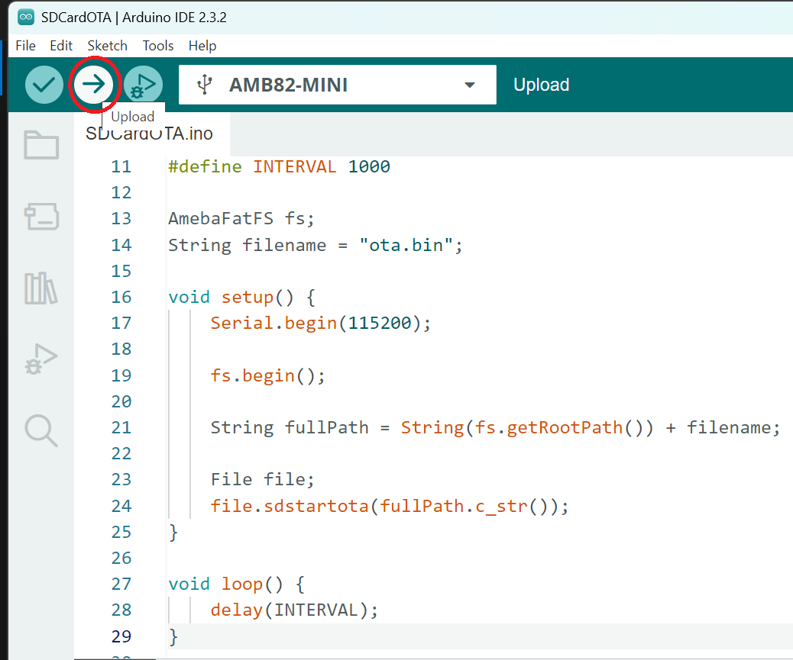
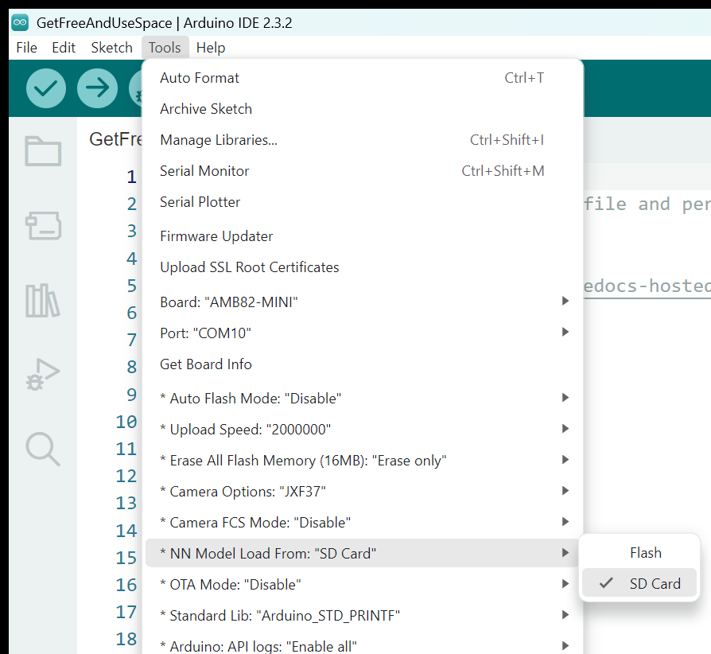
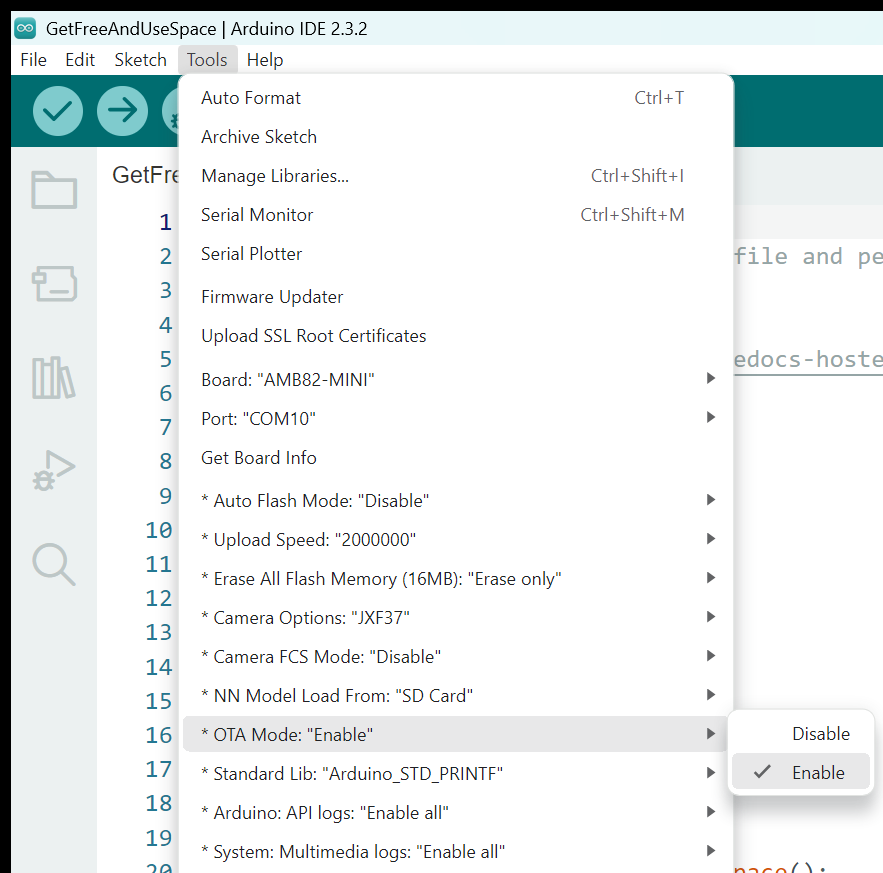
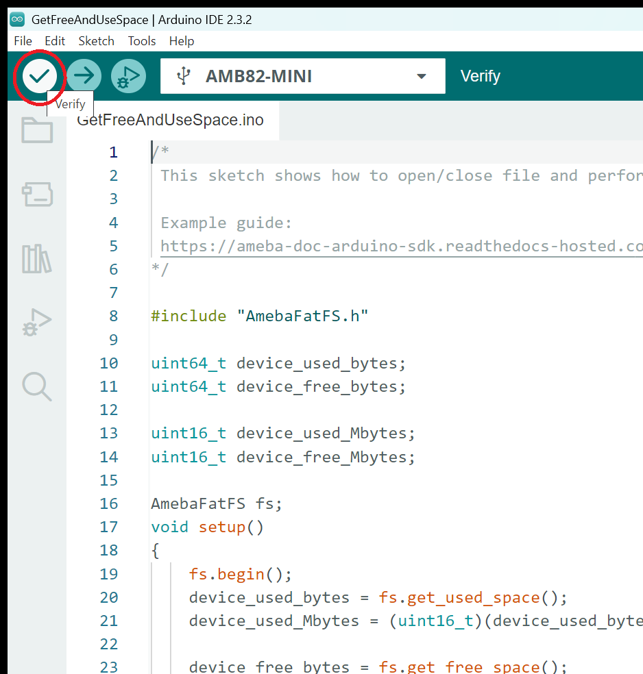
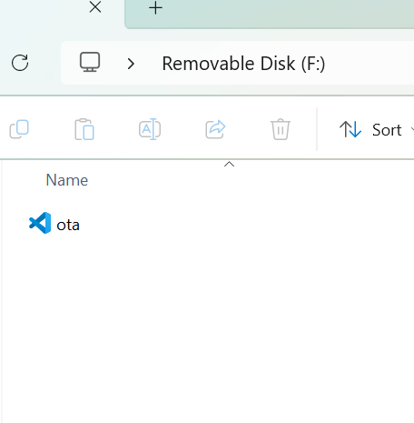
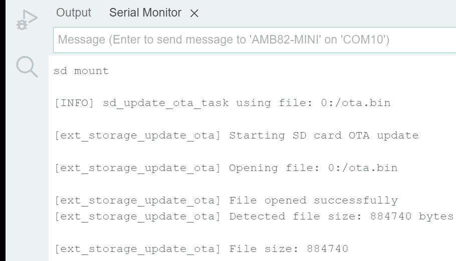
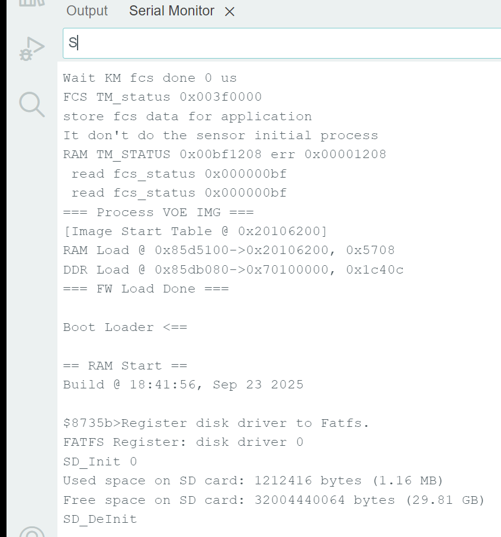

Ameba SDCard OTA Firmware Update
================================

Materials
---------

- `AMB82-mini <https://www.amebaiot.com/en/where-to-buy-link/#buy_amb82_mini>`__ x 1
-  MicroSD card

Example
-------

In this example, we will use the Ameba Pro2 board to update OTA firmware from SD card.

Procedure
~~~~~~~~~

To begin, open the OTA example in Arduino IDE. :guilabel:`File -> Examples -> AmebaOTA -> SDCardOTA`

|image01|

Before verifying and uploading the example, please complete the following steps:

1. Set NN Model Load From SD Card. :guilabel:`Tools -> NN Model Load From -> SD Card`

|image04|

2. Enable the OTA mode. :guilabel:`Tools -> OTA Mode -> Enable`

|image05|

.. note:: Partition Notice: Arduino IDE will only upload successfully when both Step 1 and Step 2 above are selected. All NN examples that integrate with OTA must load the model from the SD card.

In the highlighted code snippet, fill in the OTA file name.

|image02|

Now, compile and upload this example.

|image03|

In this tutorial, we will be uploading a GetFreeAndUseSpace sketch via OTA.  Open the GetFreeAndUseSpace example. :guilabel:`File -> Examples -> AmebaFileSystem -> GetFreeAndUseSpace`

Before verify the example, please complete the following steps:

1. Set NN Model Load From SD Card. :guilabel:`Tools -> NN Model Load From -> SD Card`

|image04|

2. Enable the OTA mode. :guilabel:`Tools -> OTA Mode -> Enable`

|image05|

3. Now, verify this example. **DO NOT** upload after compilation.

|image06|

.. note :: Priority matters:  Kindly take note that AMB82 Mini will only boot with the latest compiled firmware.

Once compilation is done, look for ``ota.bin`` file in C:\\Users\\<username>\\AppData\\Local\\Arduino15\\packages\\realtek\\tools\\ameba_pro2_tools\\x.x.x

Using a card reader, connect the SD card to a computer and copy the ``ota.bin`` file into the SD card. Take note to place the ``ota.bin`` file in the root directory
and not in any folder.

|image07|

Now insert the MicroSD card into the SD card slot of the AMB82 MINI board and press reset button.

You will see the board automatically read ota.bin from the SD card and perform the update, as shown in the figure below.

|image08|

The board will automatically reboot once download progress is completed.

You will see the output generated on serial monitor after reboot.

|image09|

