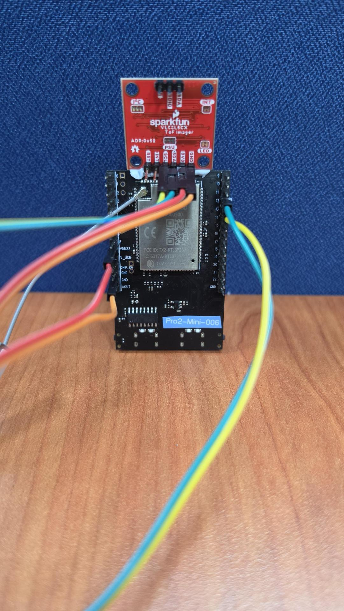
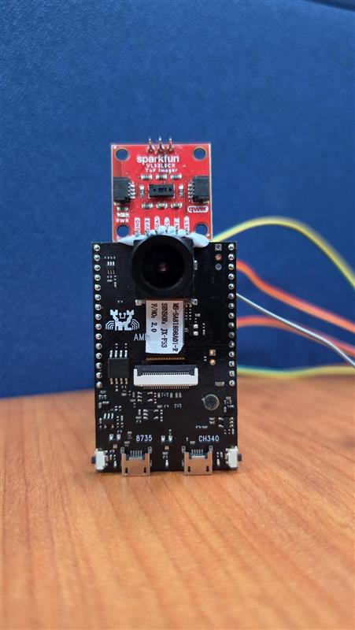
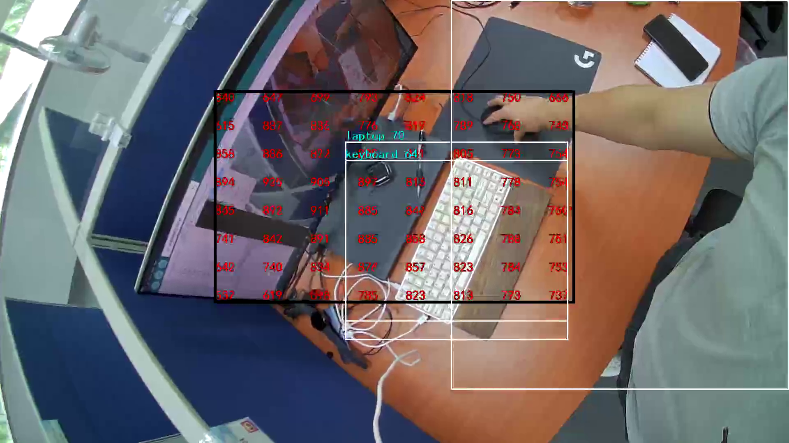

Anti-Collision
==============

.. contents::
  :local:
  :depth: 2

Materials
---------
- `AMB82-mini <https://www.amebaiot.com/en/where-to-buy-link/#buy_amb82_mini>`_ x 1
- Camera Module (eg. Jx-F37) x 1
- SparkFun VL53L5CX ToF Sensor x 1
- Female-to-Female Jumper Wires x 4

Introduction
------------

This proof of concept example is meant to demonstrate the first steps toward avoiding collisions while navigating with an autonomous vehicle. It combines the use of a distance sensor like the Time-of-Flight sensor along with an
object detection model to identify potential obstacles in its path. The example is developed as a general use demonstration and will require further development to realise its full potential in actual applications.

How it Works
------------
The AMB82-Mini will poll the ToF sensor for data multiple times a second while also running the object detection model to identify the obstacles before the device. In lieu of an actual vehicle navigating a path, this example will
use text overlay to display the ToF sensor's resolution relative to the camera module along with the distance measured within its resolution. The distance texts will change colors based on the proximity measured between the device
and the object in front of it to simulate how a vehicle may respond when reading the sensor's data. 

Getting Started
---------------
- Find the POC example under "Files" -> "Examples" -> "AmebaPOC" -> "AntiCollision" from the top left corner of the ArduinoIDE.

|image01|

- Edit the WiFi network ID and Password in the following sections. Your viewing device will have to be connected to the same WiFi network to watch the stream later.

|image02| 

- Select the camera module that going to use from `Tools -> Camera Options`

.. note:: Please make sure the camera is supported otherwise system will returns "senesor ID error" or "VOE not init".

- Take two jumper wires to connect the VDD33 and GND pins on the AMB82-Mini to the 3V3 and GND pins of the ToF sensor. The other two jumper wires will connect from pin 12 to SDA and pin 13 to SCL as shown below.

|image03|

- Mount the ToF sensor directly above the AMB82-Mini, centered with the camera module.

|image04|

- Compile and upload the code into AMB82-Mini and reset the board to start running the POC example. After pressing the Reset button, wait for the Ameba board to connect to the WiFi network. The board's IP address and network port number for RTSP will be shown in the Serial Monitor. 

|image05|

- Make sure your PC is connected to the same network as the Ameba Pro2 board for streaming. Since RTSP is used as the streaming protocol, key in `"rtsp://{IPaddress}:{port}"` as the Network URL in VLC media player, replacing {IPaddress} with the IP address of your Ameba Pro2 board, and {port} with the RTSP port shown in Serial Monitor `(e.g., "rtsp://192.168.1.154:554")`. The default RTSP port number is 554. In the case of two simultaneous RTSP streams, the second port number defaults to 555.

|image06|

- You may choose to change the caching time in "Show more options". A lower cache time will result in reduced video latency but may introduce playback stuttering in the case of poor network conditions.

|image07|

- Next, click "Play" to start RTSP streaming. The video stream from the camera will be shown in VLC media player. Meanwhile, in your Serial Monitor, the message "rtp started (UDP)" will appear.

|image08|

|image09|

-  After you are able see the RTSP stream, it is highly recommended to calibrate your ToF sensor's resolution relative to the camera's resolution by editing the following parts in the code.

|image10|

|image11|

Optional
--------
- You may change the proximity thresholds along with the distance texts' colors in lines 161-164

|image12|

.. |image01| image::  ../../../../_static/amebapro2/Example_Guides/POC/AntiCollision/image01.jpg
.. |image02| image::  ../../../../_static/amebapro2/Example_Guides/POC/AntiCollision/image02.jpg

.. |image05| image::  ../../../../_static/amebapro2/Example_Guides/POC/AntiCollision/image05.jpg
.. |image06| image::  ../../../../_static/amebapro2/Example_Guides/POC/AntiCollision/image06.jpg
.. |image07| image::  ../../../../_static/amebapro2/Example_Guides/POC/AntiCollision/image07.jpg
.. |image08| image::  ../../../../_static/amebapro2/Example_Guides/POC/AntiCollision/image08.jpg

.. |image10| image::  ../../../../_static/amebapro2/Example_Guides/POC/AntiCollision/image10.jpg
.. |image11| image::  ../../../../_static/amebapro2/Example_Guides/POC/AntiCollision/image11.jpg
.. |image12| image::  ../../../../_static/amebapro2/Example_Guides/POC/AntiCollision/image12.jpg

