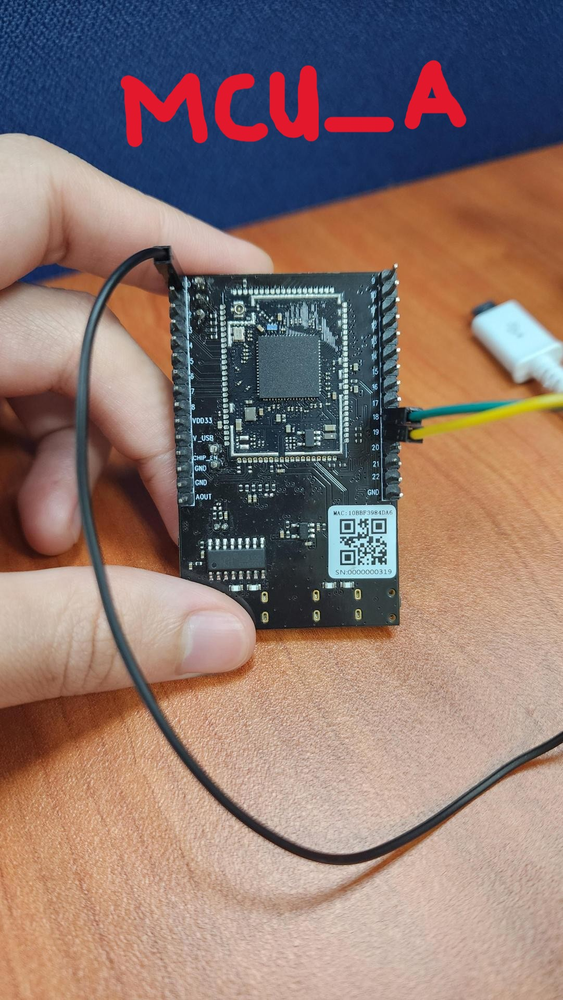
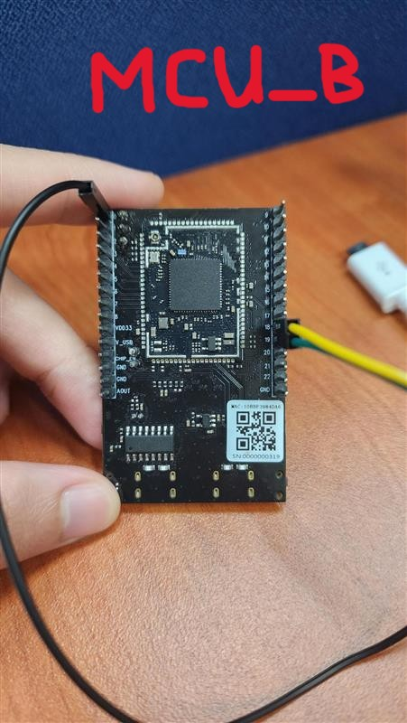

Battery-PoweredCamera
======================

.. contents::
  :local:
  :depth: 3

Materials
---------
- `AMB82-mini <https://www.amebaiot.com/en/where-to-buy-link/#buy_amb82_mini>`_ x 2
- Camera Module (eg. Jx-F37) x 2
- Female-to-Female Jumper Wires x 3

Introduction
------------

This proof of concept example is focused on implementing a low-power solution for Battery-PoweredCameras especially in the context of remote surveillance. The idea is to have an external device passively sensing
for a defined situation before triggering athe AMB82-Mini to wake up from its standby mode and begin recording the area under surveillance. After a short period of inactivity, the AMB82-Mini will return to its power-saving
standby mode.

How it Works
------------
The Battery-PoweredCamera example uses two AMB82-Mini to realise this example for testing. One of the AMB82-Mini will be used as a replacement for the motion detection sensor by running motion detection through its
camera. This motion detection sensor AMB82-Mini will always be on for the purpose of this example only. The second AMB82-Mini is meant to be the main microcontroller with power-saving features and it is set to only begin
recording a video upon being woken up by the first AMB82-Mini. After a few seconds of inactivity, the second AMB82-Mini will enter standby mode. During application, the devices will communicate via UART and the first AMB82-Mini uses
a GPIO pin to wake up the second AMB82-Mini.

Getting Started (MCU_A)
-----------------------

- Find the POC example under "Files" -> "Examples" -> "POC" -> "Battery-PoweredCamera -> MCU_A" from the top left corner of the ArduinoIDE. This is the code for the AMB82-Mini running motion detection.

|image01|

- Connect the two jumper wires from MCU_A's pin 18 to MCU_B's pin 19 and MCU_A's pin 19 to MCU_B's pin 18 for UART communication. Then one jumper wire to connect MCU_A's pin 0 to MCU_B's pin 0, this is for GPIO wake up on MCU_B.

|image02|

|image03|

- The AMB82-Mini will read from its UART periodically to receive updates on whether MCU_B is currently recording or in standby mode. 'R' = Recording and 'S' = Standby Mode.

|image04| 

- The motion detection algorithm will be set up and there is no RTSP stream to run or connect to for viewing. Whenever motion is detected it will run the section of code as shown below. User may edit to include more functions
based on their own use case. When at least one part of the scene is detected to be moving, the MCU_A will send a character 'D' = Detected and output HIGH from its GPIO Pin 0. Otherwise when there is no activity, it will send 
a character 'N' = Nothing.

|image05|

- Compile and upload the code into AMB82-Mini and reset the board to start running the POC example. Next set up MCU_B.

Getting Started (MCU_B)
-----------------------

- Find the POC example under "Files" -> "Examples" -> "POC" -> "Battery-PoweredCamera -> MCU_B" from the top left corner of the ArduinoIDE. This is the code for the main AMB82-Mini used for video recording and power-save.

|image06|

- Connect the two jumper wires from MCU_B's pin 18 to MCU_A's pin 19 and MCU_B's pin 19 to MCU_A's pin 18 for UART communication. Then one jumper wire to connect MCU_B's pin 0 to MCU_A's pin 0, this is for GPIO wake up on MCU_B.

|image02|

|image03|

- The AMB82-Mini will read from its UART periodically to receive updates on whether MCU_A has detected any activity. 'D' = Detected and 'N' = Nothing.

|image07| 

- When MCU_B is awake and has received the character 'D', it will begin recording for up to 1 hour. If activity persists, it will continue recording in another file. This means each video recording mp4 file is only up to 1 hour of video but
the MCU_B may continue recording for as long as possible.

- After a brief period of no activity, the MCU_B will stop any recording and send a character 'S' to tell MCU_A that it is entering standby mode. The default delay before recording is stopped is approximately 5 seconds, you may change
this delay by adjusting the value as highlighted. It is in multiples of 100ms.

|image08|

- Users may change the file naming format in the following highlighted sections to suit their needs.

|image09|

- Compile and upload the code into AMB82-Mini and reset the board to start running the POC example. Both MCU_A and MCU_B should be running at this stage for the POC example to run properly.

.. |image01| image::  ../../../../_static/amebapro2/Example_Guides/POC/Battery-PoweredCamera/image01.jpg

.. |image04| image::  ../../../../_static/amebapro2/Example_Guides/POC/Battery-PoweredCamera/image04.jpg
.. |image05| image::  ../../../../_static/amebapro2/Example_Guides/POC/Battery-PoweredCamera/image05.jpg
.. |image06| image::  ../../../../_static/amebapro2/Example_Guides/POC/Battery-PoweredCamera/image06.jpg
.. |image07| image::  ../../../../_static/amebapro2/Example_Guides/POC/Battery-PoweredCamera/image07.jpg
.. |image08| image::  ../../../../_static/amebapro2/Example_Guides/POC/Battery-PoweredCamera/image08.jpg
.. |image09| image::  ../../../../_static/amebapro2/Example_Guides/POC/Battery-PoweredCamera/image09.jpg
