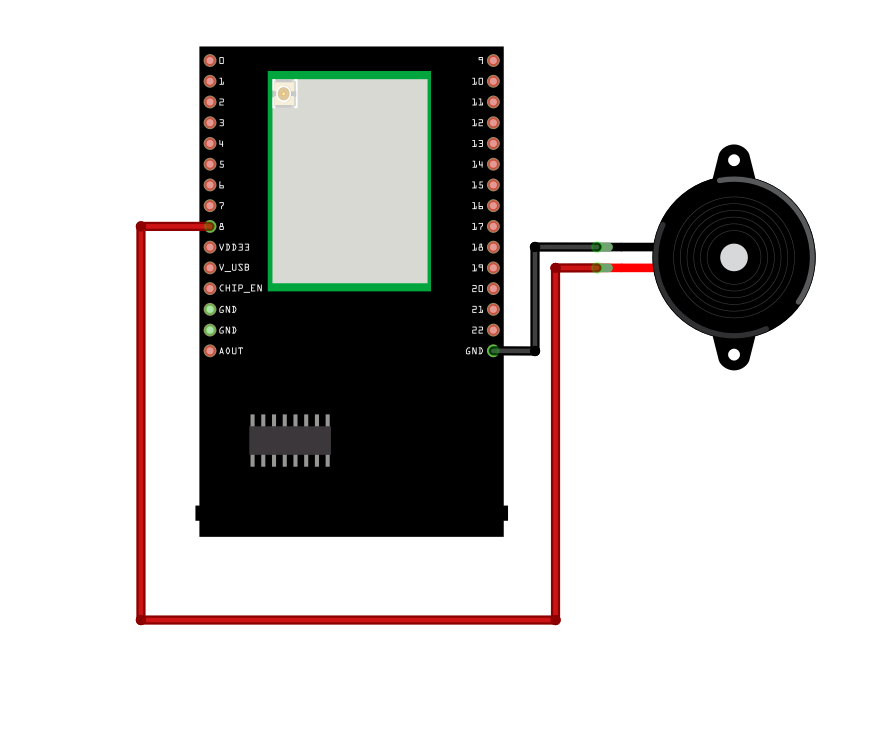

Buzzer Play Melody
==================

Materials
---------

- `AMB82-mini <https://www.amebaiot.com/en/where-to-buy-link/#buy_amb82_mini>`__ x 1

- Buzzer x 1

Example
-------

A sound is composed of volume, tone and timbre. Volume is determined by the amplitude of the sound wave. Tone is determined by the frequency of the sound wave. Timbre is determined by the waveform of the sound wave.

In this example, we use PWM to control the buzzer to emit sound with desired tone. As PWM outputs square wave, if we wish to emit tone C4 (frequency=262Hz), we have to make PWM to output square wave with wavelength 1/262 = 3.8ms:

|image01|

| We use PWM to output sound wave with different frequency, so as to play music by the buzzer.
| Connect the buzzer to the PWM output pin shown in the following diagrams.

**AMB82 MINI** wiring diagram:

|image02|

| Open the example code in "Examples" -> "AmebaAnalog" -> "PWM_BuzzerPlayMelody"
| Compile and upload to Ameba, press the reset button. Then you can hear the buzzer playing music.

Code Reference
--------------

| Ameba implement the tone() and noTone() API of Arduino:
| https://www.arduino.cc/en/Reference/Tone
| https://www.arduino.cc/en/Reference/NoTone
| In the sample code, we initiate a melody array, which stores the tones to make. Another array, noteDurations, contains the length of each tone, 4 represents quarter note (equals to 3000ms/4 = 750ms, and plus an extra 30% time pause), 8 represents eighth note.

.. |image01| image:: ../../../../_static/amebapro2/Example_Guides/PWM/Buzzer_Play_Melody/image01.png
   :width:  710 px
   :height:  184 px

