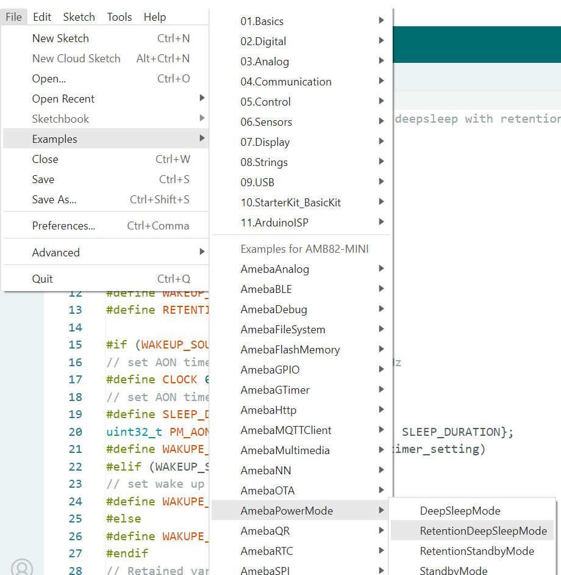
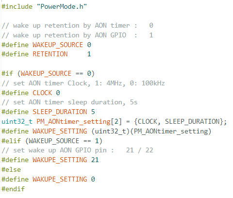
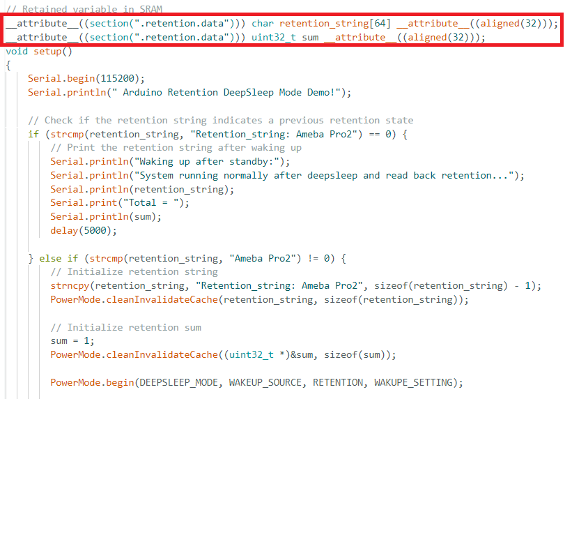
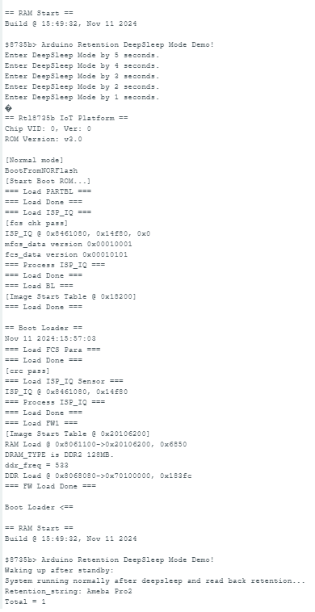

Retention DeepSleep Mode
========================

Materials
---------

- `AMB82-mini <https://www.amebaiot.com/en/where-to-buy-link/#buy_amb82_mini>`__ x 1

-  Optional: Push button x 1

-  Optional: Register 220 ohms x 1

Example
-------

In this example, the development board will demo the retention Deep Sleep Mode for power save. There are 2 wake-up retention sources for Deep Sleep Mode which are: AON Timer, and AON GPIO. The system will count down 5s then go to Deep Sleep mode. Upon the wake-up source being triggered, the system will be reboot and wake up again without losing the retention value.

The module and board power consumption report under Deep Sleep mode are listed in these two tables below.

**RTL8735B module power consumption test results**

+------------+---------------------------------------------------------+
| **Wake-up  | **Module power consumption                              |
| source**   | (uA)**                                                  |
+============+=========================================================+
|            | Deep Sleep Mode (measure at 3V3)                        |
+------------+---------------------------------------------------------+
| AON timer  | 32.78                                                   |
+------------+---------------------------------------------------------+
| AON GPIO   | 40.98                                                   |
+------------+---------------------------------------------------------+

**AMB82 MINI board Power Consumption**

+------------+----------------------------+----------------------------+
| **Wake-up  | **Development board power  |                            |
| source**   | consumption Approximate    |                            |
|            | measurement                |                            |
|            | (mA)**                     |                            |
+============+============================+============================+
|            | Normal Mode                | Standby Mode               |
+------------+----------------------------+----------------------------+
| AON timer  | 53.01                      | 4.59                       |
+------------+----------------------------+----------------------------+
| AON GPIO   | 52.97                      | 4.74                       |
+------------+----------------------------+----------------------------+

Open example in :guilabel:`File -> Examples -> AmebaPowerMode -> RetentionDeepSleepMode`

|image01|

| Next is setting up the system and entering the power mode. Please refer to the following steps for entering Deep Sleep mode.
| Step 1. Ensure RETENTION is "#define RETENTION 1" in this example.
| Step 2. Set up the "WAKEUP_SOURCE", AON timer: 0; AON GPIO: 1.
| Step 3. Set up the wake-up source setting. There are 2 wake-up sources, each one has its own settings.
| For AON timer, at section "#if (WAKEUP_SOURCE == 0)", set value to "CLOCK" and "SLEEP_DURATION". "CLOCK" can be 4MHz or 100kHz. "SLEEP_DURATION" unit is in seconds.
| For AON GPIO, at section "#elif (WAKEUP_SOURCE == 1)", set value to "WAKUPE_SETTING". "WAKUPE_SETTING" in this case is the Pin number, that can be 21 or 22. The GPIO pin is set to active high, please refer to the following connection.

|image02|

| Step 4. Start the Deep Sleep mode. There is only 1 optional setting for this step.

|image03|

| Step 5. Define retention variables.

|image04|

| To wake up, all timers will automatically wake up when the duration is finished, all GPIO pins must active high by pressing the push button.
| The correct boot, enter deep sleep, reboot cycle, and printed retention data will be same as following picture.

|image05|

.. |image02| image:: ../../../../_static/amebapro2/Example_Guides/PowerMode/Retention_DeepSleep_Mode/image02.png
   :width:  621 px
   :height:  517 px

