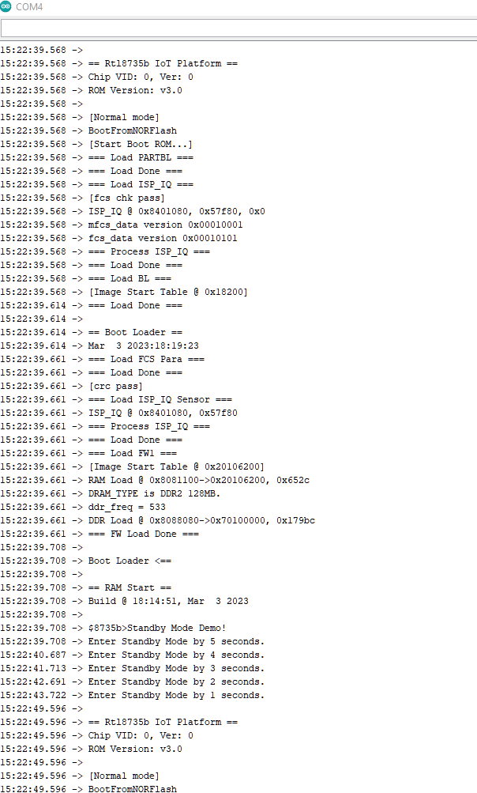

Standby Mode
============

Materials
---------

- `AMB82-mini <https://www.amebaiot.com/en/where-to-buy-link/#buy_amb82_mini>`__ x 1

-  Optional: Push button x 1

-  Optional: Register 220 ohms x 1

-  Optional: USB to ttl serial cable x 1

Example
-------

In this example, the development board will demo the non retention Standby Mode for power save. There are 6 wake-up sources. The system will count down 5s then go to Stand By mode. Upon the wake-up source being triggered, the system will be reboot and wake up again.

The module and board power consumption report under Standby mode are listed in these two tables below.

**RTL8735B module power consumption test results**

+-----------------------+----------------------------------------------+
| **Wake-up source**    | **Module power consumption**                 |
|                       |                                              |
|                       | **(uA)**                                     |
+=======================+==============================================+
|                       | Stand By Mode (measure at 3V3)               |
+-----------------------+----------------------------------------------+
| AON timer             | 41.22                                        |
+-----------------------+----------------------------------------------+
| AON GPIO              | 41.28                                        |
+-----------------------+----------------------------------------------+
| RTC                   | 41.46                                        |
+-----------------------+----------------------------------------------+
| PON GPIO              | 41.07                                        |
+-----------------------+----------------------------------------------+
| UART/Serial1          | 41.32                                        |
+-----------------------+----------------------------------------------+
| Gtimer0               | 41.48                                        |
+-----------------------+----------------------------------------------+

**AMB82-MINI board Power Consumption**

+-----------------------+-----------------------+----------------------+----------------------------------------------+----------------------------------------------+-----------------------+----------------------+
| **Wake-up source**    | **Development board                          | **Development board                          | **Development board                          | **Development board                          |
|                       | power consumption**                          | power consumption**                          | power consumption**                          | power consumption**                          |
|                       |                                              |                                              |                                              |                                              |
|                       | **Approximate                                | **Approximate                                | **Approximate                                | **Approximate                                |
|                       | measurement (mA)                             | measurement (mA)                             | measurement (mA)                             | measurement (mA)                             |
|                       | Voltage source : V_USB(5V)**                 | Voltage source : V_USB(3V)**                 | Voltage source : USB CH340(MicroUSB)**       | Voltage source : USB OTG**                   |
+=======================+=======================+======================+=======================+======================+=======================+======================+=======================+======================+
|                       | Normal Mode           | Standby Mode         | Normal Mode           | Standby Mode         | Normal Mode           | Standby Mode         | Normal Mode           | Standby Mode         |
+-----------------------+-----------------------+----------------------+-----------------------+----------------------+-----------------------+----------------------+-----------------------+----------------------+
| AON timer             | 57.56                 | 3.46                 | 83.81                 | 5.26                 | 60.32                 | 5.67                 | 57.56                 | 3.46                 |
+-----------------------+-----------------------+----------------------+-----------------------+----------------------+-----------------------+----------------------+-----------------------+----------------------+
| AON GPIO              | 57.56                 | 3.46                 | 83.81                 | 5.26                 | 60.32                 | 5.67                 | 57.56                 | 3.46                 |
+-----------------------+-----------------------+----------------------+-----------------------+----------------------+-----------------------+----------------------+-----------------------+----------------------+
| RTC                   | 57.56                 | 3.46                 | 83.81                 | 5.26                 | 60.32                 | 5.67                 | 57.56                 | 3.46                 |
+-----------------------+-----------------------+----------------------+-----------------------+----------------------+-----------------------+----------------------+-----------------------+----------------------+
| PON GPIO              | 57.56                 | 3.46                 | 83.81                 | 5.26                 | 60.32                 | 5.67                 | 57.56                 | 3.46                 |
+-----------------------+-----------------------+----------------------+-----------------------+----------------------+-----------------------+----------------------+-----------------------+----------------------+
| UART/Serial1          | 57.56                 | 3.46                 | 83.81                 | 5.26                 | 60.32                 | 5.67                 | 57.56                 | 3.46                 |
+-----------------------+-----------------------+----------------------+-----------------------+----------------------+-----------------------+----------------------+-----------------------+----------------------+
| Gtimer0               | 57.56                 | 3.46                 | 83.81                 | 5.26                 | 60.32                 | 5.67                 | 57.56                 | 3.46                 |
+-----------------------+-----------------------+----------------------+-----------------------+----------------------+-----------------------+----------------------+-----------------------+----------------------+

Open example in :guilabel:`File -> Examples -> AmebaPowerMode -> StandbyMode`

|Image01|

| Next is setting up the system and entering the power mode. Please refer to the following steps for entering Standby mode.
| Step 1. Ensure RETENTION is "#define RETENTION 0" in this example.
| Step 2. Set up the "WAKEUP_SOURCE", AON timer: 0; AON GPIO: 1; RTC: 2, PON GPIO: 3, UART/Serial1: 4, Gtimer0: 5.
| Step 3. Set up the wake-up source setting. There are 6 wake-up sources, each one has its own settings.
| For AON timer, at section "#if (WAKEUP_SOURCE == 0)", set value to "CLOCK" and "SLEEP_DURATION". "CLOCK" can be 4MHz or 100kHz. "SLEEP_DURATION" unit is in seconds.
| For AON GPIO, at section "#elif (WAKEUP_SOURCE == 1)", set value to "WAKUPE_SETTING". "WAKUPE_SETTING" in this case is the Pin number, that can be 21 or 22. The GPIO pin is set to active high, please refer to the following connection.

|image02|

| For RTC, at section "#elif (WAKEUP_SOURCE == 2)", set value to "ALARM_DAY", "ALARM_HOUR", "ALARM_MIN", or "ALARM_SEC". All alarm values set the duration of RTC wake-up. The range is "1day, 0h, 0m, 0s" to "365day, 23h, 59min, 59s".
| For PON GPIO, at section "#elif (WAKEUP_SOURCE == 3)", set value to "WAKUPE_SETTING". "WAKUPE_SETTING" in this case is the Pin number, that can be 0 to 11. The GPIO pin is set to active high, please refer to the following connection.

|image03|

For UART/Serial1, there is no setting required. However, USB to ttl serial cable Tx(green) and Rx(white) pin needs to connect to Serial1 Rx and Tx pin. Refer to the following connection. (Power 5V/3.3V Red, Ground Black)

|image04|

| For Gtimer0, at section "#elif (WAKEUP_SOURCE == 5)", set value to "SLEEP_DURATION". "SLEEP_DURATION" is the timer sleep duration in seconds.
| Step 3. Start the Standby mode. There is only 1 optional setting for this step. When the wake-up source is set to RTC, use "PowerMode.start(1970, 1, 1, 0, 0, 0);" to replace "PowerMode.start();" for setting the start time. (Default is 1970.1.1 00:00:00).

|image05|

| To wake up, all timers will automatically wake up when the duration is finished, all GPIO pins must active high by pressing the push button, UART needs to give input by Serial1 though USB-ttl cable.
| The correct boot, enter Standby, and reboot cycle will be same as following picture.

|image06|

