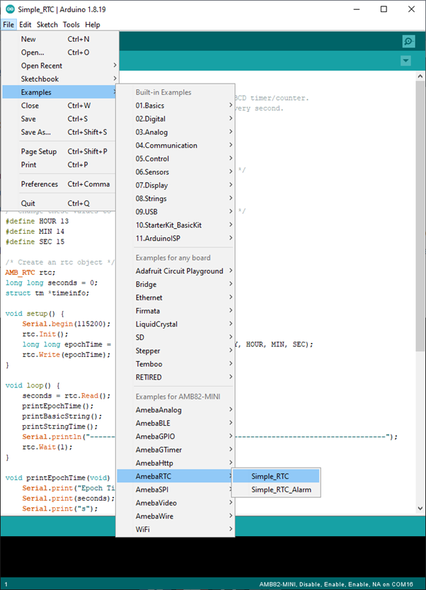
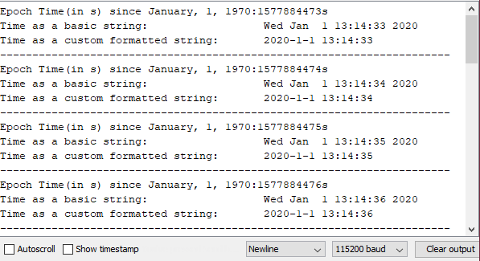

Simple RTC
==========

Materials
---------

- `AMB82-mini <https://www.amebaiot.com/en/where-to-buy-link/#buy_amb82_mini>`__ x 1

Example
-------

This example demonstrates how to use the RTC library methods. This function describes how to use the RTC API. The RTC function is implemented by an independent BCD timer/counter.

Select the correct Ameba development board from the Arduino IDE: "Tools" -> "Board".

Then open the "RTC" example from: "File" -> "Examples" -> "AmebaRTC" -> "Simple_RTC":

|image01|

Upon successfully upload the sample code and press the reset button, this example will print out time information since the user initialized time every second in the Serial Monitor.

|image02|

Code Reference
--------------

| [1] Simple RTC example from Arduino Tutorials:
| https://www.arduino.cc/en/Tutorial/SimpleRTC

