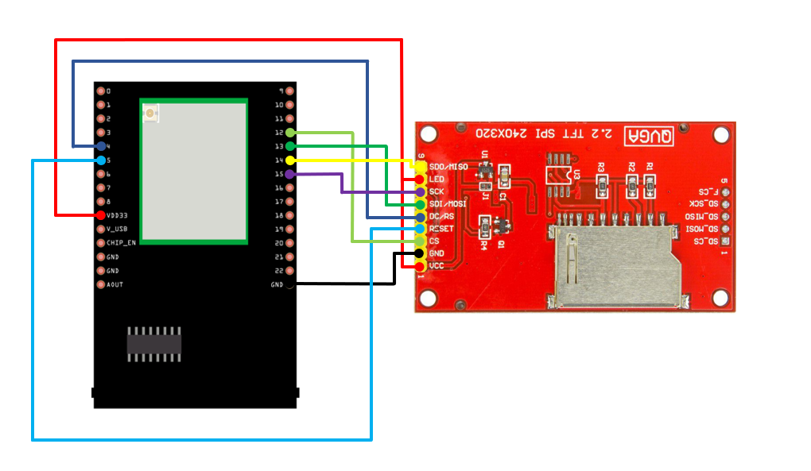
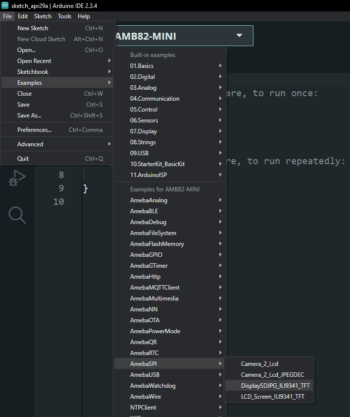
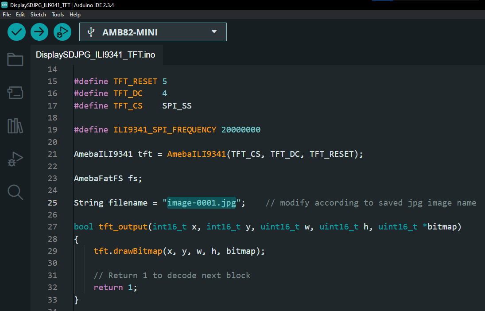

Display SD JPG ILI9341 TFT
==========================

If you are not familiar with SPI, please read `Introduction to SPI <https://www.amebaiot.com/spi-intro/>`__ first.

Materials
---------

- `AMB82-mini <https://www.amebaiot.com/en/where-to-buy-link/#buy_amb82_mini>`__ x 1

- ILI9341 TFT LCD with SPI interface x 1

- microSD card x 1

Example
-------

- QVGA 2.2″ TFT LCD

    - http://www.lcdwiki.com/2.2inch_SPI_Module_ILI9341_SKU:MSP2202

Common pins in ILI9341 TFT LCD with SPI interface:

- MOSI: Standard SPI Pin

- MISO: Standard SPI Pin

- SLK: Standard SPI Pin

- CS: Standard SPI Pin

- RESET: Used to reboot LCD.

- D/C: Data/Command. When it is at LOW, the signal transmitted are commands, otherwise the data transmitted are data.

- LED (or BL): Adapt the screen backlight. Can be controlled by PWM or connected to VCC for 100% backlight.

- VCC: Connected to 3V or 5V, depends on its spec.

- GND: Connected to GND.

**AMB82 MINI and QVGA TFT LCD Wiring Diagram:**

|image01|

.. note ::
   Before compilation, kindly install TJpg_Decoder library via Arduino IDE library manager.
   After installing the TJpg_Decoder library, in the library's configuration file, User_Config.h, comment out line 5 which reads: #define TJPGD_LOAD_SD_LIBRARY to avoid compilation error.

Open the example, "File" -> "Examples" -> "AmebaSPI" -> "DisplaySDJPG_ILI9341_TFT"

|image02|

Modify the file name according to the image saved name.

|image03|

Compile and upload to Ameba, then press the reset button.

Then, you can see the image displayed on the LCD screen.

