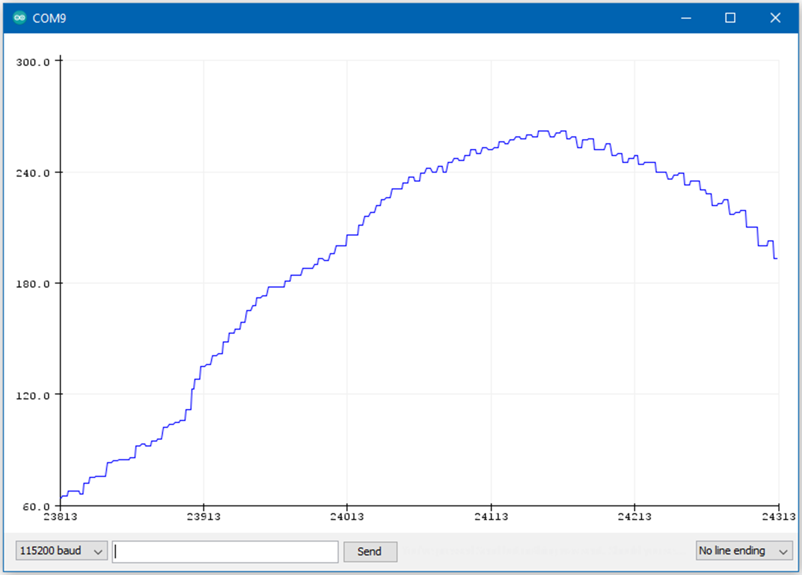

TensorFlow Lite - Hello World
=============================

Materials
---------

- `AMB82-mini <https://www.amebaiot.com/en/where-to-buy-link/#buy_amb82_mini>`__ x 1

Example
-------

Open the example, :guilabel:`Files -> Examples -> AmebaTensorFlowLite -> hello_world`

| Upload the code and press the reset button on Ameba once the upload is finished.
| LED is set to LED_BUILTIN blue. You should see the LED fade in and out rapidly.
| In the Arduino serial plotter, you can see the output value of the Tensorflow model plotted as a graph, it should resemble a sine wave.

|image03|

Code Reference
--------------

More information on TensorFlow Lite for Microcontrollers can be found at: https://www.tensorflow.org/lite/microcontrollers

