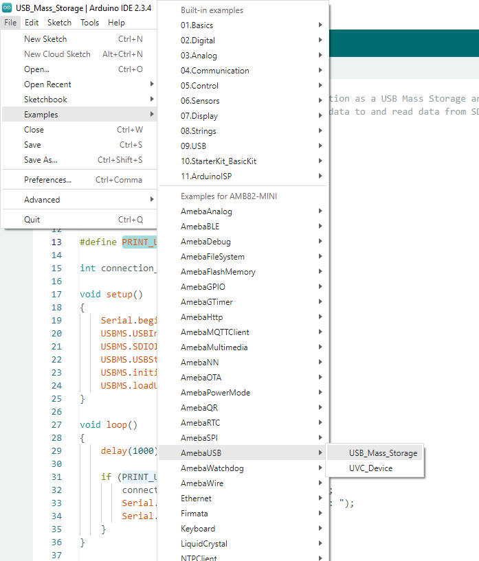
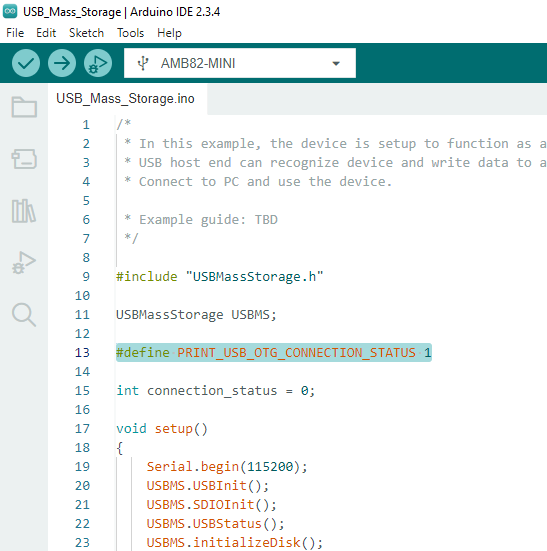
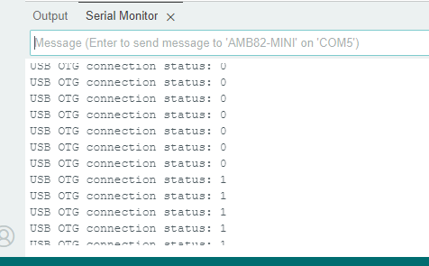

USB Mass Storage
================

Materials
---------

- `AMB82-mini <https://www.amebaiot.com/en/where-to-buy-link/#buy_amb82_mini>`__ x 1
- SD Card x 1

Example
-------

In this example, the device is setup to function as a USB Mass Storage and uses SD card as its physical memory medium.
USB host end can recognize device and write data to and read data from SD card via USB interface.

Open the example in :guilabel:`File -> Examples -> AmebaUSB -> USB_Mass_Storage` Compile and upload to Ameba, then press the reset button.

|image01|

Connect the "USB OTG" via micro-USB cable to the target device such as PC, then use the Ameba device as a mass storage.

Set "PRINT_USB_OTG_CONNECTION_STATUS" to 1 to enable printing of attached status in Serial Monitor.

|image02|

|image03|

