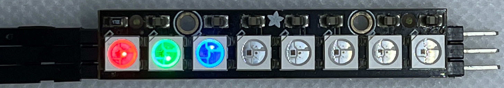

WS2812B - Basics
================

Materials
---------

- `AMB82-mini <https://www.amebaiot.com/en/where-to-buy-link/#buy_amb82_mini>`__ x 1
- WS2812B LED Strip / Ring / Stick / Board x1

Example
-------

**Introduction**
~~~~~~~~~~~~~~~~

This example controls the WS2812B RGB LED, using the SPI peripheral to create the waveform necessary for the LEDs.

WS2812B basics controls a single LED with a color or fill all the LED with the same color.

Procedure
---------

Connect the WS2812B to the Ameba board as shown in the following diagrams.

Wiring Diagram:

|image01|

To light up individual LED or multiple LEDs with the same color,

Open the example in :guilabel:`File -> Example -> AmebaWS2812B -> WS2812B_Basics`

Modify **TOTAL_NUM_OF_LEDS** to be the total number of LEDs on the WS2812B module, and modify **NUM_OF_LEDS** to be the number of LEDs that has connected.

Next, compile and upload, then press the reset button. The first 3 LEDs light up with red, green, and blue color and after a while all the LED will be filled with 1 color.

|image02|

|image03|

Code Reference
--------------

`WS2812B Datasheet <https://cdn-shop.adafruit.com/datasheets/WS2812B.pdf>`_

.. |image03| image:: ../../../../_static/amebapro2/Example_Guides/WS2812B/WS2812B_Basics/image03.png
   :width: 2908
   :height: 516
   :scale: 30%
