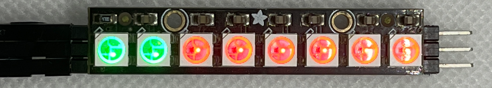

WS2812B - Patterns
==================

.. contents::
  :local:
  :depth: 2

Materials
---------

- `AMB82-mini <https://www.amebaiot.com/en/where-to-buy-link/#buy_amb82_mini>`_ x 1
- WS2812B LED Strip / Ring / Stick / Board x1

Example
-------

**Introduction**
~~~~~~~~~~~~~~~~

This example controls the WS2812B RGB LED, using the SPI peripheral to create the waveform necessary for the LEDs.

WS2812B patterns controls LED (Strip / Ring / Stick / Board) with different colors with different LED patterns.

Procedure
---------

Connect the WS2812B to the Ameba board as shown in the following diagrams.

Wiring Diagram:

|image01|

To create different light patterns with many different colors,

Open the example in ``"File" -> "Example" -> "AmebaWS2812B" -> "WS2812B_Patterns"``

Modify **TOTAL_NUM_OF_LEDS** to be the total number of LEDs on the WS2812B module, and modify **NUM_OF_LEDS** to be the number of LEDs that has connected.

Next, compile and upload, then press the reset button. The WS2812B displaying a color wipe, theater chase, rainbow, and theater chase rainbow light patterns in loop.

|image02|

|image03|

|image04|

|image05|

Code Reference
--------------

`WS2812B Datasheet <https://cdn-shop.adafruit.com/datasheets/WS2812B.pdf>`_

.. |image01| image:: ../../../../_static/amebapro2/Example_Guides/WS2812B/WS2812B_Patterns/image01.png
   :width: 1356
   :height: 699
   :scale: 70%

.. |image03| image:: ../../../../_static/amebapro2/Example_Guides/WS2812B/WS2812B_Patterns/image03.png
   :width: 2724
   :height: 536
   :scale: 30%
.. |image04| image:: ../../../../_static/amebapro2/Example_Guides/WS2812B/WS2812B_Patterns/image04.png
   :width: 2300
   :height: 528
   :scale: 30%
.. |image05| image:: ../../../../_static/amebapro2/Example_Guides/WS2812B/WS2812B_Patterns/image05.png
   :width: 2888
   :height: 592
   :scale: 30%
