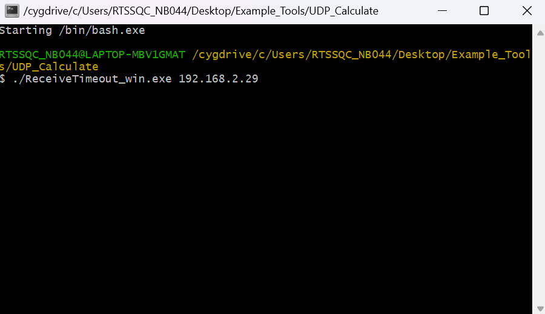
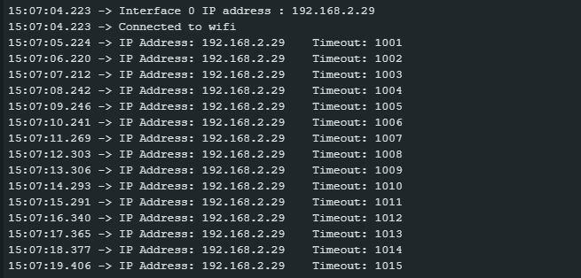
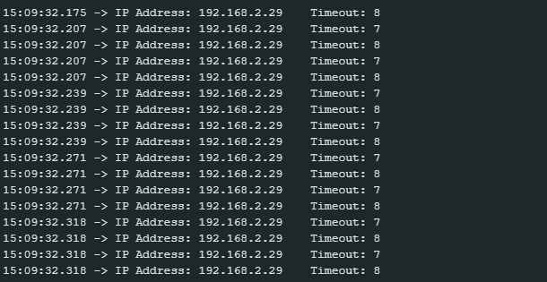

Calculate UDP Receive Timeout
=============================

Materials
---------

-  `AMB82-mini <https://www.amebaiot.com/en/where-to-buy-link/#buy_amb82_mini>`__ x 1

-  Computer that connected to same network

Example
-------

This example uses Ameba to receive UDP packets from a computer and
calculates the allowed UDP receive timeout setting.

**Ameba Side**

-  Open the example in :guilabel:`File -> Examples -> WiFi -> UDPCalculation -> ReceiveTimeout`

-  Modify the ssid, password and key index (optional). Compile and
   upload the code from the Arduino IDE to Ameba and press the reset
   button when the upload is complete. Ameba should connect to the same
   network as the computer.

-  Open the serial monitor in Arduino IDE and record the IP address
   assigned to Ameba as the client IP address.

**Computer Side**

-  Connect the computer to the network.

-  Download the "ReceiveTimeout_win.exe" from
   https://github.com/ambiot/ambpro2_arduino
   "Ameba_misc/Example_Tools/UDP_Calculate".

-  Open terminal.

-  Run command "./ReceiveTimeout_win.exe <the client IP address>".

|image01|

-  The computer will begin to send packets continuously to Ameba. The
   timeout value is set to 1000ms initially. For each packet received
   successfully, Ameba decreases the timeout value. The next packet must
   be received within the timeout period, otherwise Ameba registers a
   failed packet and increases the timeout value. Open the serial
   monitor and observe the timeout value converge to a minimum value.

|image02|

|image03|

