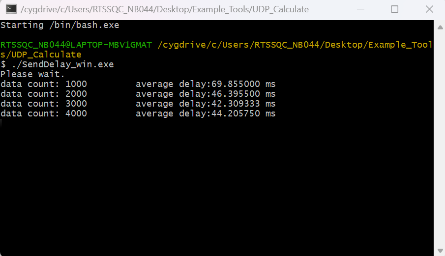

Calculate UDP Sending Delay
===========================

Materials
---------

-  `AMB82-mini <https://www.amebaiot.com/en/where-to-buy-link/#buy_amb82_mini>`__ x 1

-  Computer that connected to same network

Example
-------

This example uses Ameba to send UDP packets to a computer and calculates
the UDP sending delay.

**Computer Side**

-  Connect the computer to the network.

-  Download the "SendDelay_win.exe" from `link <https://github.com/Ameba-AIoT/ameba-arduino-pro2/>`_
   "Ameba_misc/Example_Tools/UDP_Calculate".

-  Open terminal.

-  Run command "ipconfig". Record the IPv4 address as the client IP
   address.

-  Run command "./SendDelay_win.exe". The computer begins to listen for
   packets from Ameba.

|image01|

**Ameba Side**

-  Open the example in :guilabel:`File -> Examples -> WiFi -> UDPCalculation -> SendDelay`

-  Modify the ssid, password and key index (optional). Compile and
   upload the code from the Arduino IDE to Ameba and press the reset
   button when the upload is complete. Ameba should connect to the same
   network as the computer.

-  Enter the recorded client IP address into serial monitor.

|image02|

-  The Ameba will begin to send UDP packets to the computer. Once 1000
   packets have been received, the computer will calculate the average
   delay and print out the result.

|image03|

.. |image02| image:: ../../../../_static/amebapro2/Example_Guides/WiFi/Calculate_UDP_Sending_Delay/image02.png
   :width: 1027 px
   :height: 571 px
   :scale: 70%

