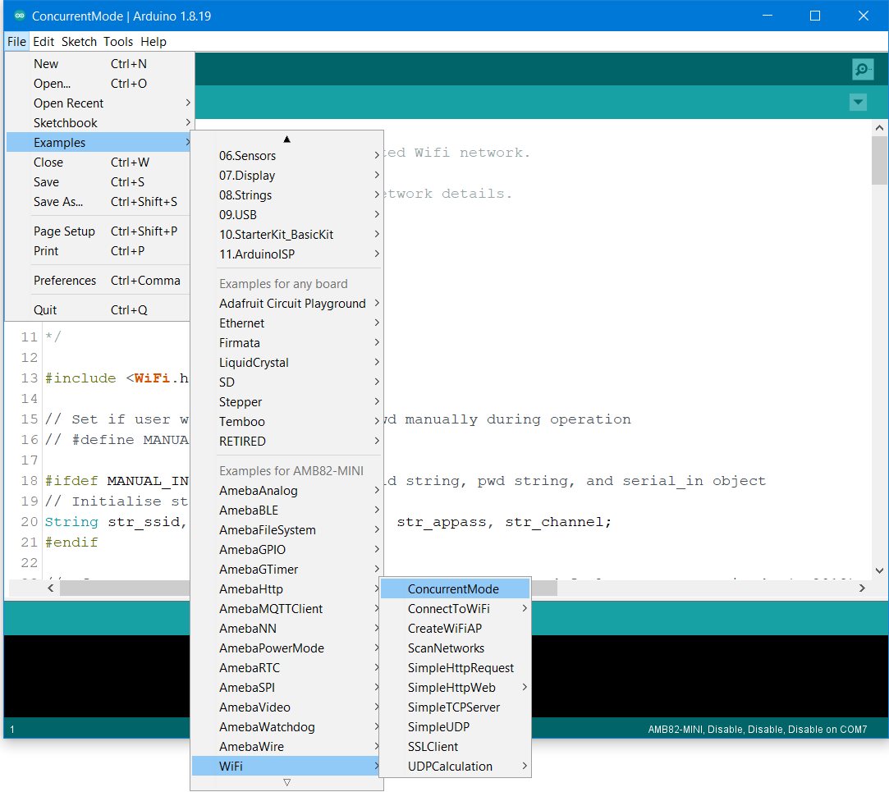
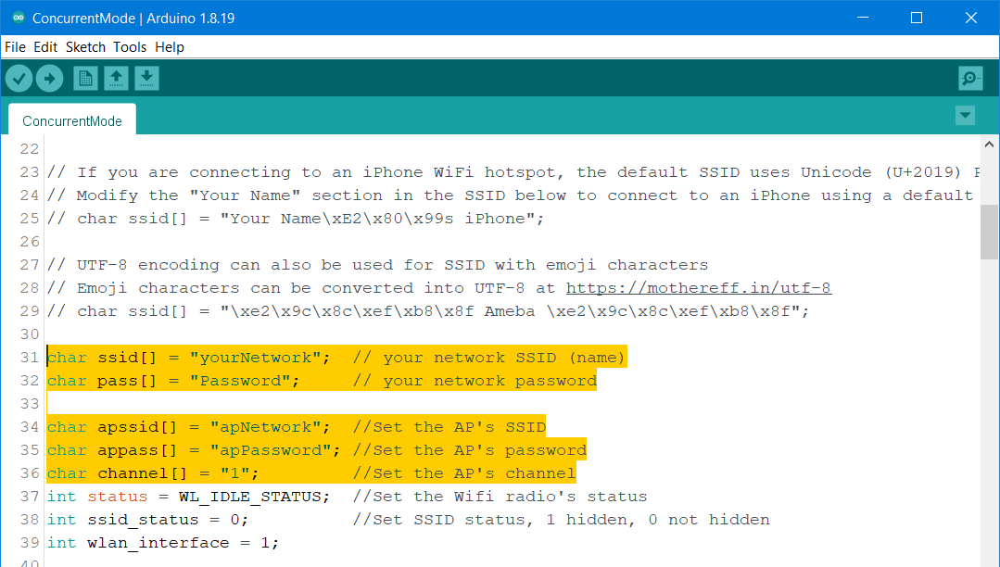
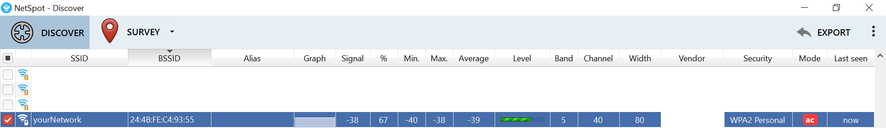
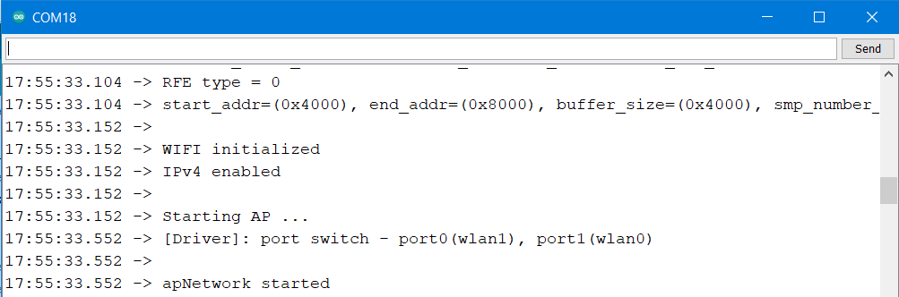
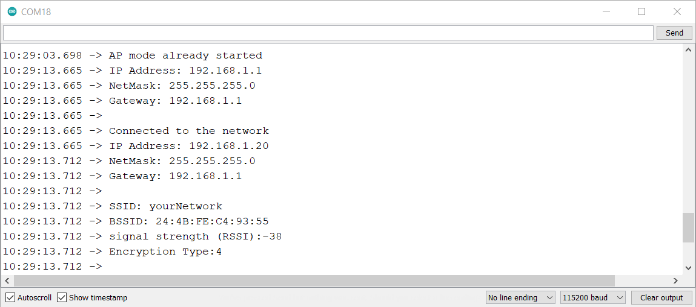
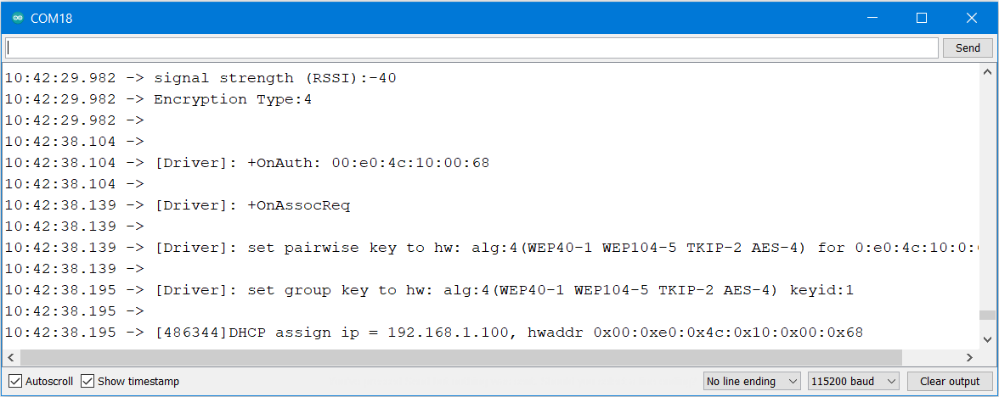

Concurrent Mode
===============

.. contents::
  :local:
  :depth: 2

Materials
---------

-  `AMB82-mini <https://www.amebaiot.com/en/where-to-buy-link/#buy_amb82_mini>`_ x 1

Example
-------

Introduction
~~~~~~~~~~~~

WiFi concurrent mode, also known as AP + Station mode, is a feature that
allows devices to operate simultaneously as an Access point and a
Station. In this example, the Ameba board can connect to an existing
wireless network while providing wireless connectivity to other devices.

Procedure
~~~~~~~~~

First, open the example in "File" → "Examples" → "WiFi" → "ConcurrentMode".

|image01|

In the sample code, fill in your SSID, PASSWORD, AP SSID, AP PASSWORD
and CHANNEL.

|image02|

If you prefer to enter all the information in the Serial monitor while
the program is running, uncomment ``#define MANUAL_INPUT``

.. note :: If you enabled MANUAL_INPUT, after uploading the sample code and 
   pressing the reset button on Ameba, input your SSID, Password, AP SSID, 
   AP Password and channel. The AP mode should start first.

For Ameba boards, there is a limitation that the AP mode must be the
same channel as the WiFi station mode. To see the channel, you may
download NetSpot software : https://www.netspotapp.com/download-win.html

|image03|

Next upload the sample code and press the reset button on Ameba. You
will be able to see AP mode start first.

|image04|

The code by default turn on the AP mode in security mode. If you want to
turn on the AP mode in open mode, please modify the code to ``status =
WiFi.apbegin(ssid, channel);``

|image05|

Next, you will see the information of the AP mode shown, and after that
you will see a message "Connected to the network", and the information
of this WiFi connection is printed in the serial monitor every 10
seconds.

In the figure below, this message will appear in the serial monitor when
a device is connected to the AP:

|image06|

Comparison with Arduino
-----------------------

| In the Arduino platform, we need to add an extra WiFi shield to be the
  WiFi module to realize the WiFi connection. And we must ``#include`` to
  use SPI to communicate with WiFi module.

| However, Ameba is already equipped with WiFi module. Therefore, ``#include`` is not needed.

