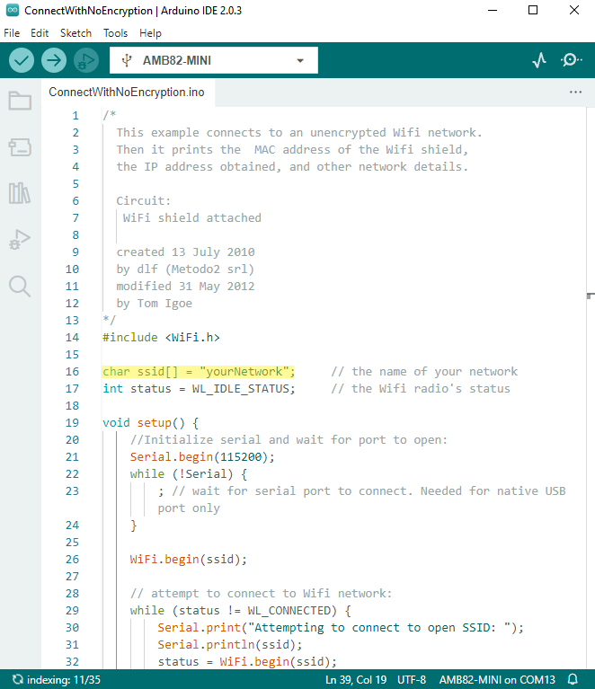
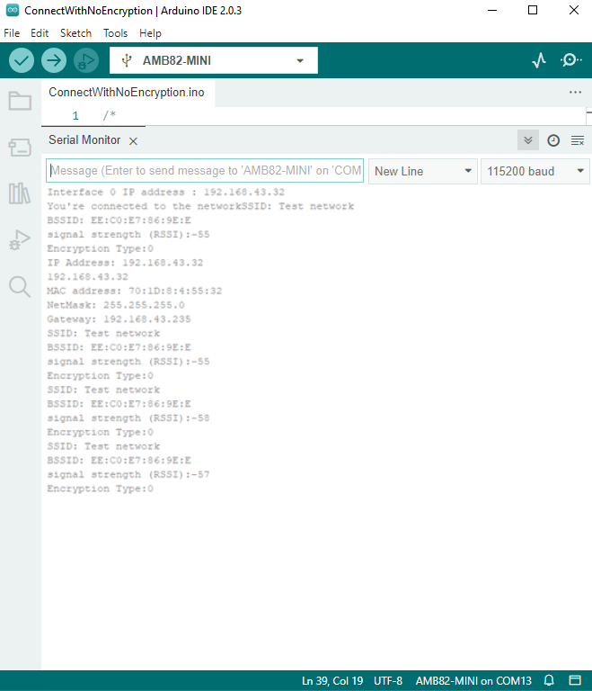
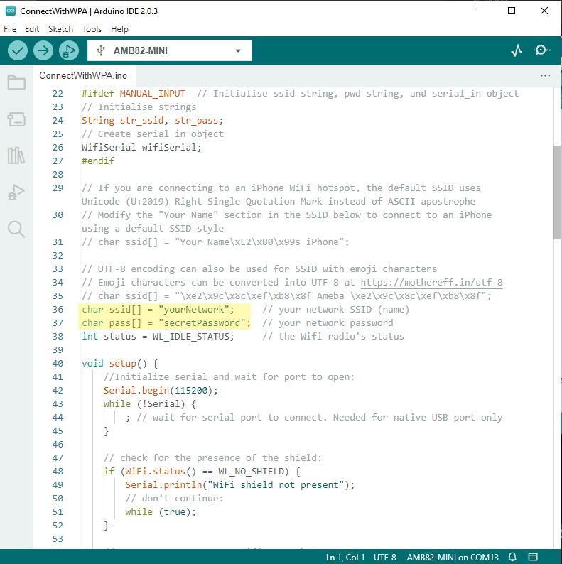
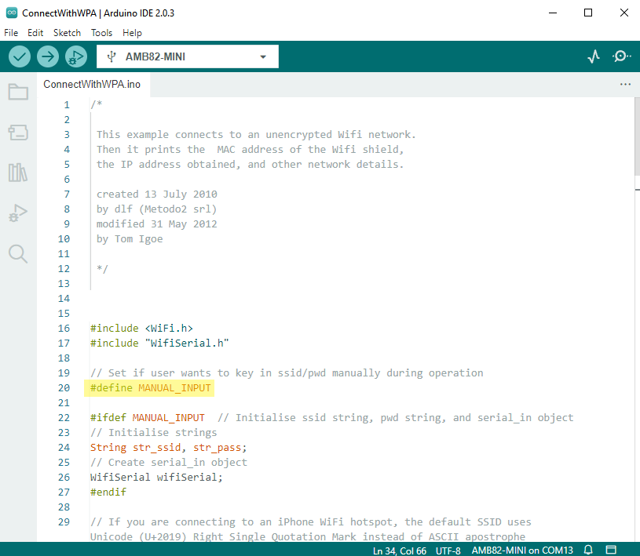
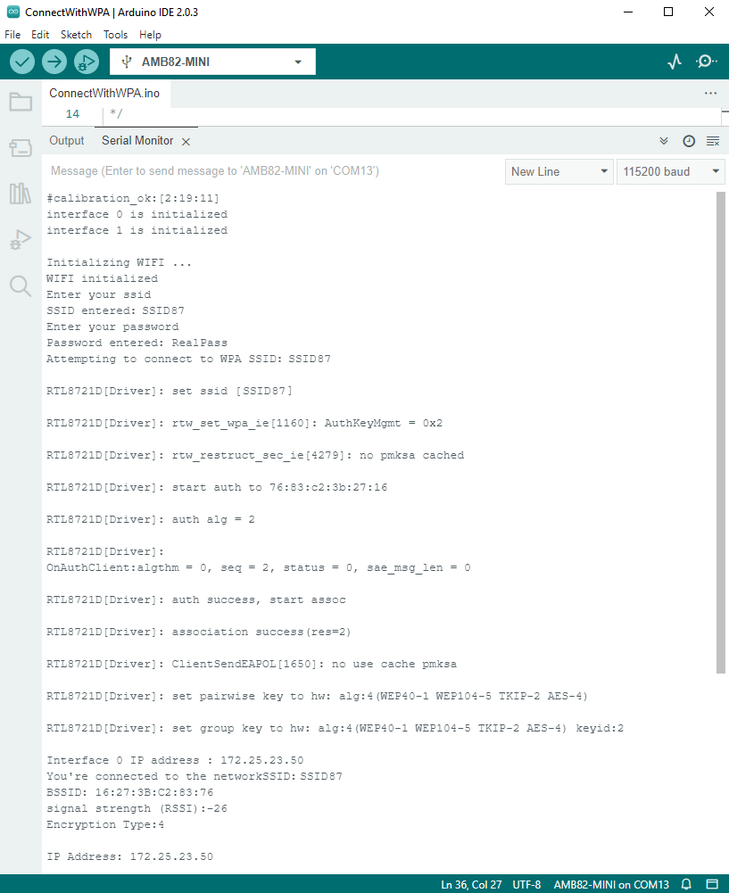
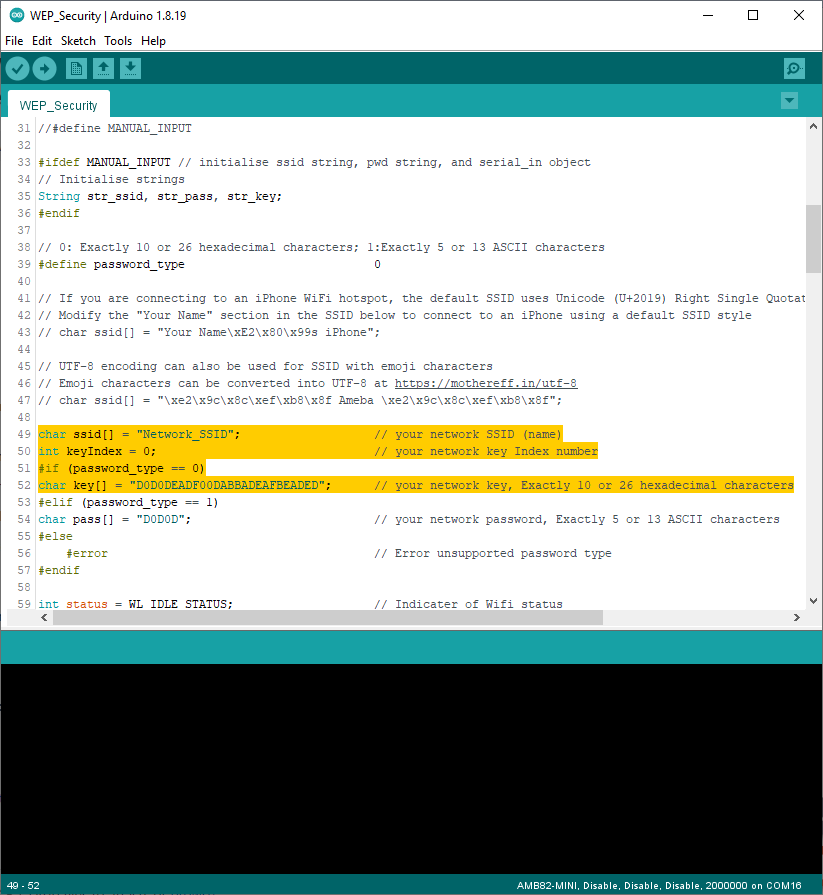
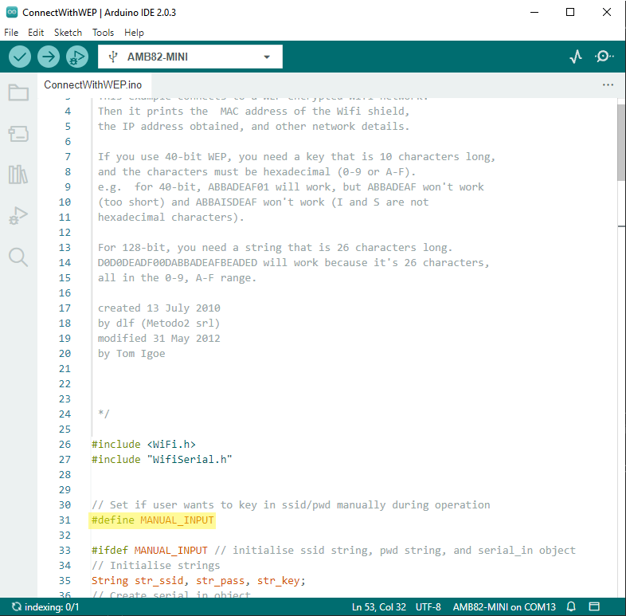
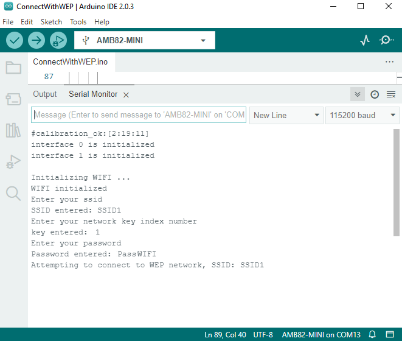

Connect to WiFi
===============

.. contents::
  :local:
  :depth: 2

Materials
---------

-  `AMB82-mini <https://www.amebaiot.com/en/where-to-buy-link/#buy_amb82_mini>`_ x 1

Example
-------

Introduction
~~~~~~~~~~~~

There are 4 encryption types of WiFi connection in this guide.

- "OPEN", which means there is no password needed to connect to this network.

- "WPA", which requires the correct password to access.

- "WEP", which requires a hexadecimal password and a keyindex.

- "WPA2-EAP", which IA a Wi-Fi WPA2-EAP connection (also known as WPA2-Enterprise) is a secure wireless network authentication method typically used in organizations, universities, and enterprises. Instead of a shared password, it uses the Extensible Authentication Protocol (EAP) to authenticate users individually through a RADIUS server. Each user logs in with a unique username and password (or digital certificate), ensuring stronger security and better access control compared to personal WPA2 networks. TLS, PEAP, and TTLS are different EAP (Extensible Authentication Protocol) methods used in WPA2-Enterprise Wi-Fi connections to securely authenticate users.

    - EAP-TLS (Transport Layer Security): Uses digital certificates on both the server and client sides for mutual authentication. It’s highly secure but requires certificate management.

    - PEAP (Protected EAP): Creates a TLS-encrypted tunnel between the client and the authentication server, then sends user credentials (like username/password) inside the tunnel. Commonly used with MSCHAPv2 for password-based logins.

    - EAP-TTLS (Tunneled TLS): Similar to PEAP but more flexible. It also establishes a TLS tunnel, but allows various inner authentication methods (e.g., PAP, CHAP, MSCHAPv2) without requiring a client certificate.

In the following, we will give a brief introduction on how to establish WiFi connection with all above types of encryptions on Ameba.

First, make sure the correct Ameba development board is selected in
"Tools" -> "Board".

Open (WiFi connection without password)
~~~~~~~~~~~~~~~~~~~~~~~~~~~~~~~~~~~~~~~

Open example in "File" -> "Examples" -> "WiFi" -> "ConnectToWiFi" -> "NoEncryption"

|image01|

In the sample code, modify "ssid" to be the same as the WiFi SSID to be
connected to.

Next, upload the sample code, and press the reset button on Ameba. Then
you will see a message "You're connected to the networkSSID: XXXXX", and
the information of this WiFi connection is printed in the serial monitor
every 10 seconds.

|image02|

WiFi connection with WPA encryption
~~~~~~~~~~~~~~~~~~~~~~~~~~~~~~~~~~~

Open example in "File" -> "Examples" -> "WiFi" -> "ConnectToWiFi" ->
"WPA_Security"

|image03|

In the sample code, modify "ssid" to the WiFi SSID to be connected to
and "pass" to the network password.

If you prefer to enter your SSID & password in the Serial monitor while
the program is running, uncomment ``#define MANUAL_INPUT`` at the top of the
file.

|image04|

Next, upload the sample code, and press the reset button on Ameba. Then
you will see a message "You're connected to the networkSSID: XXXXX", and
the information of this WiFi connection is printed in the serial monitor
every 10 seconds.

Note: If you enabled MANUAL_INPUT, after uploading the sample code and
pressing the reset button on Ameba, input your SSID in the Serial
monitor and press enter. Next, input your password, and press enter.
Then you will see a message "You're connected to the networkSSID:
XXXXX", and the information of this WiFi connection is printed in the
serial monitor every 10 seconds.

|image05|

WiFi connection with WEP encryption
~~~~~~~~~~~~~~~~~~~~~~~~~~~~~~~~~~~

Open example in "File" -> "Examples" -> "WiFi" -> "ConnectToWiFi" ->
"WEP_Security"

|image06|

In the sample code, modify "ssid" to the SSID to be connected, "key" to
the hexadecimal password, "keyIndex" to your key index number.

If you prefer to enter your SSID & password in the Serial monitor while
the program is running, uncomment ``#define MANUAL_INPUT`` at the top of the
file.

|image07|

Next, upload the sample code, and press the reset button on Ameba. Then
you will see a message "You're connected to the networkSSID: XXXXX", and
the information of this WiFi connection is printed in the IDE every 10
seconds.

Note: If you enabled MANUAL_INPUT, after uploading the sample code and
pressing the reset button on Ameba, input your SSID in the Serial
monitor and press enter. Next, input your key and press enter. Finally
enter your password and press enter. Then you will see a message "You're
connected to the networkSSID: XXXXX", and the information of this WiFi
connection is printed in the serial monitor every 10 seconds.

|image08|

WiFi connection with WPA2-Enterprise
~~~~~~~~~~~~~~~~~~~~~~~~~~~~~~~~~~~~

This example requires setting up both the server and the Wi-Fi network for WPA2-EAP. Using the provided credentials with different EAP methods, the user can establish a WPA2-EAP connection by using Ameba.

.. note :: This example only demonstrates how to use credentials to connect to a WPA2-EAP network. It does not cover setting up the EAP server or configuring the network

Open example in "File" -> "Examples" -> "WiFi" -> "ConnectToWiFi" -> "WPA2_Enterprise"

In the sample code,

- eap_methord: EAP connection methord "tls", "peap", "ttls".

- ssid: The network SSID (WiFi name).

- identity: The network identity.

- pass: The network password.

- client_cert: Client certificate from EAP server.

- client_key: Client key from EAP server.

- ca_cert: CA certificate from EAP server.

Next, upload the sample code, and press the reset button on Ameba. Then you will see a message "Attempting to connect to WPA2 EAP SSID: XXXXX", and the information of this WiFi connection.

Code Reference
--------------

| https://www.arduino.cc/en/Reference/WiFiBegin

| To get the information of a WiFi connection:
| Use WiFi.SSID() to get SSID of the current connected network.
| https://www.arduino.cc/en/Reference/WiFiSSID

| Use WiFi.RSSI() to get the signal strength of the connection.
| https://www.arduino.cc/en/Reference/WiFiRSSI

| Use WiFi.encryptionType() to get the encryption type of the WiFi
  connection.
| https://www.arduino.cc/en/Reference/WiFiEncryptionType

| Use WiFi.BSSID() to get the MAC address of the router you are
  connected to.
| https://www.arduino.cc/en/Reference/WiFiBSSID

| To get the information of Ameba:
| Use WiFi.macAddress() to get the MAC address of Ameba.
| https://www.arduino.cc/en/Reference/WiFiMACAddress

| Use WiFi.localIP() to get the IP address of Ameba.
| https://www.arduino.cc/en/Reference/WiFiLocalIP

| Use WiFi.subnetMask() to get the subnet mask.
| https://www.arduino.cc/en/Reference/WiFiSubnetMask

| Use WiFi.gatewayIP() to get the WiFi shield's gateway IP address.
| https://www.arduino.cc/en/Reference/WiFiGatewayIP

Comparison with Arduino
-----------------------

| In the Arduino platform, we need to add an extra WiFi shield to be the
  WiFi module to realize the WiFi connection. And we must ``#include`` to
  use SPI to communicate with WiFi module.

| However, Ameba is already equipped with WiFi module. Therefore, ``#include`` is not needed.

