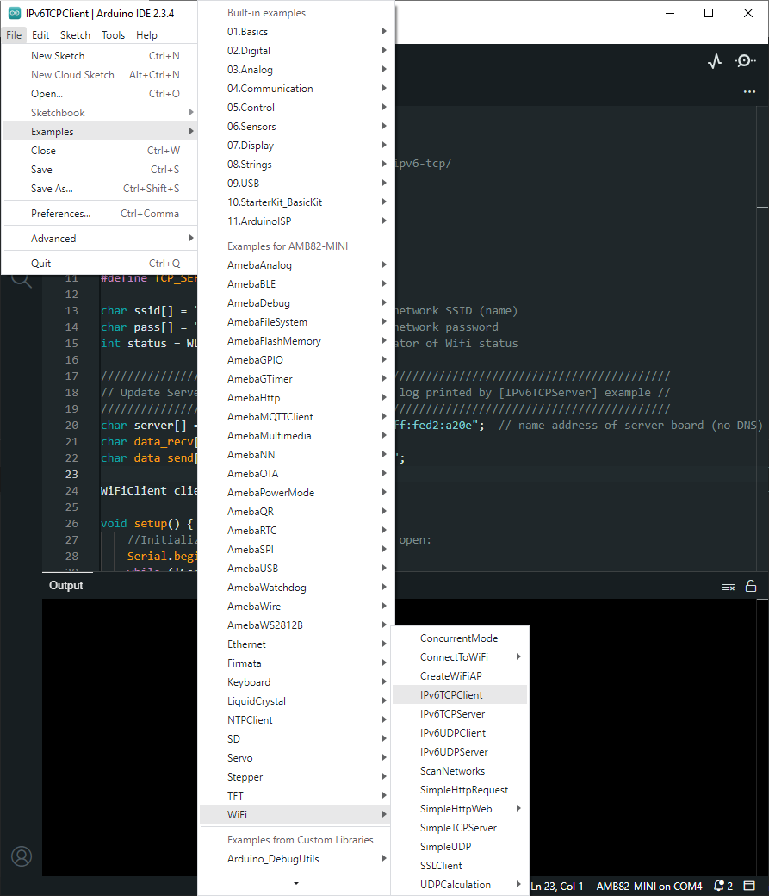

IPv6 - Ameba as IPv6 Server/Client over TCP
=============================================

Materials
---------

-  `AMB82-mini <https://www.amebaiot.com/en/where-to-buy-link/#buy_amb82_mini>`__ x 1

Example
-------

Introduction
~~~~~~~~~~~~

This example shows how Ameba can communicate on the local network using Internet Protocol version 6 over TCP.

.. note ::  This example only works after you have set up the server and then configure the client accordingly.

Procedure
~~~~~~~~~~

Step 1. IPv6TCPServer

Open the example, "Files" → "Examples" → "WiFi" → "IPv6TCPServer".

|image01|

In the sample code, modify this section to enter the information required (ssid, password) to connect to your WiFi network.

|image02|

Upload the code, then reset the Ameba by pressing its reset button.

Open Serial Monitor and copy the IPv6 address of the Server for later use,

|image03|

Step 2. IPv6TCPClient

Now take the second AMB82 Mini and open another example, "Files" → "Examples" → "WiFi" → "IPv6TCPClient".

|image04|

In the sample code, modify this section to enter the information required (ssid, password) to connect to your WiFi network.

|image05|

From the previous step, we obtained the server's IPv6 address. Now, copy this address into the "IPv6TCPClient" example.

|image06|

Upload the code, then reset the Ameba by pressing its reset button.

Open Serial Monitor on the port to the second AMB82 Mini, you should see server and client are sending text message to each other at the same time.

|image07|

|image08|

