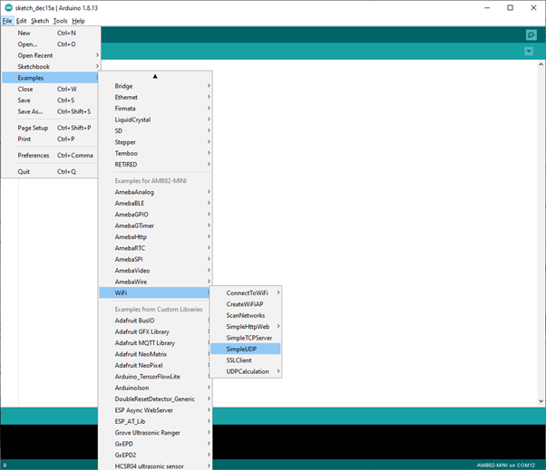

Simple UDP
==========

.. contents::
  :local:
  :depth: 2

Materials
---------

-  `AMB82-mini <https://www.amebaiot.com/en/where-to-buy-link/#buy_amb82_mini>`_ x 1

Example
-------

In this example, we connect Ameba to WiFi and use Ameba to be an UDP
server. When Ameba receives a message from UDP client, it replies
"acknowledged" message to client.

Open the example. "File" -> "Examples" -> "WiFi" -> "SimpleUDP"

|image01|

Modify the highlighted code section (ssid, password, keyindex) to
connect to your WiFi network.

|image02|

Compile the code and upload it to Ameba. After pressing the Reset
button, Ameba connects to WiFi and starts the UDP server with port 2390.
After the UDP server starts service, Ameba prints the "Starting
connection to server" message and waits for client connection.

|image03|

As to the UDP client, we use "sokit" program in the computer to connect
to UDP server.

Choose client mode and fill in the IP of UDP server (which is the IP of
Ameba) and port 2390, then click "UDP Connect".

After the connection is established, fill in "Hello World" in the Buf 0
field in sokit and click "Send". Then you can see the Ameba UDP server
replies "acknowledged".

|image04|

Code Reference
--------------

| Refer to the Arduino tutorial for detailed information about this
  example.
| https://www.arduino.cc/en/Tutorial/WiFiSendReceiveUDPString

| First, use ``begin()`` to open an UDP port on Ameba.
| https://www.arduino.cc/en/Reference/WiFiUDPBegin

| Use ``parsePacket()`` to wait for data from client.
| https://www.arduino.cc/en/Reference/WiFiUDPParsePacket

| When a connection is established, use ``remoteIP()`` and ``remotePort()`` to
  get the IP and port of the client.
| https://www.arduino.cc/en/Reference/WiFiUDPRemoteIP

| Then use ``read()`` to read the data sent by client.
| https://www.arduino.cc/en/Reference/WiFiUDPRead

| To send reply, use ``beginPacket()``, ``write()``, ``end()``.
| https://www.arduino.cc/en/Reference/WiFiUDPBeginPacket
| https://www.arduino.cc/en/Reference/WiFiUDPWrite
| https://www.arduino.cc/en/Reference/WiFiUDPEndPacket

