Ameba Over-the-Air Firmware Update via HTTP
===========================================

.. contents::
  :local:
  :depth: 2

Materials
---------

- AmebaD [AMB21 / AMB22 / AMB23 / AMB26 / BW16] x 1
- Set up of Web UI in a PC

Example
-------

Compile and Upload OTA Example
~~~~~~~~~~~~~~~~~~~~~~~~~~~~~~

In this example, we use a web UI to upload firmware to one or more AmebaD boards. 

For the instructions to set up web UI for AmebaD OTA: Web UI, please click into the link below and perform the steps as shown in the ``README.md``. [https://github.com/Ameba-AioT/ameba-OTA-UI]

If Ameba OTA Web UI is set up successfully in your PC, you will see the webpage on [http://localhost:3000/], figure below shows the rendering of webpage with no device connected:

|image01|

To begin, open the OTA example in Arduino IDE. “File” -> “Examples” -> “AmebaOTA” -> “OTA_Http”.

|image02|

Edit the port and server field according to your HTTP server. Usually, you will only need to change the server IP address to your PC's IP address. Do not change the port here unless you change the port in the Web UI too.
Please also modify the SSID and password according to your AP.

|image03|

Now, compile and upload this example into each and every board that you have. It can be one board or multiple boards (we will be using two AmebaD boards in this example guide). 

This set up must be done at least once to allow the OTA thread API to be called for the first time. For subsequent firmware updates, as long as ``OTA.h`` is included and ``start_ota_threads`` API is called in the setup function, you do not need to re-upload the code manually.

Once uploaded, press reset button and get the IP address of the individual AmebaD board on serial monitor.

**Board 1 IP address: 192.168.3.78**

|image04|

**Board 2 IP address: 192.168.3.88**

|image05|

Then, go to Ameba OTA Web UI [http://localhost:3000/] to view the connected device(s). 

|image06|

If you can see the IP address(es) of your AmebaD board(s) on the OTA webpage, it shows that the connection is successful. 

For the steps below, you may disconnect AmebaD from your PC and power up the board with any stable 5V DC power source. The overall connection map of this example guide is shown in the figure below.

|image07|

In this tutorial, we will be uploading a NTPClient sketch via OTA.  Open the NTPClient example. "File" -> "Examples" -> "NTPClient" -> "Basic". Include the header file ``OTA.h`` and at the end of setup function, add in the API ``start_OTA_threads();``. Also modify the SSID and password according to your AP. Your PC and AMB82 Mini should be connecting to the same local network. Refer to the picture below for the modified NTPClient sketch. 

|image08|

Compile the modified NTPClient sketch, DO NOT upload after compilation. 

Priority matters:  Kindly take note that AmebaD will only boot with the latest compiled firmware.

Once compilation is done, follow the steps below to generate OTA image.

Generate OTA Image
~~~~~~~~~~~~~~~~~~

|image09|

1. Look for ``km0_km4_image2.bin file`` in C:\\Users\\<username>\\AppData\\Local\\Arduino15\\packages\\realtek\\tools\\ameba_d_tools\\x.x.x. This file will be used as the source binary to be converted to an OTA binary later.

2. Download the ``ImageTool.exe`` from GitHub: https://github.com/Ameba-AIoT/ameba-rtos-d/tree/main/tools/AmebaD/Image_Tool, double click to open it.

3. Select "OTA_All" as Generate Target type (in red box).

4. Input Image Version, the default value is "0xFFFFFFFF".

5. Click Browse button to select target images to be converted to an OTA binary. The address can be ignored. The Memory Layout bar will show the relative positions of the two images. If they overlap, the overlapped area is in red colour for warning.

6. Click Generate button to specify the name and path of the output file. After the operation is done, the OTA image ``OTA_All.bin`` is generated at your specified folder. 

.. note :: We recommend placing it in the default tools folder for Arduino Ameba. When navigating to the designated tools folder on your target operating system, create a new folder called "misc" and put the OTA image ``OTA_All.bin`` within it.

    * *a. Windows*
        C:\\Users\\username\\AppData\\Local\\Arduino15\\packages\\realtek\\tools\\ameba_d_tools\\x.x.x\\misc
    * *b. Linux*
        /home/username/.arduino15/packages/Realtek/tools/ameba_d_tools/x.x.x/misc
    * *c. MacOS*
        /Users/username/Library/Arduino15/packages/Realtek/tools/ameba_d_tools/x.x.x/misc

Upload and Transfer OTA Image
~~~~~~~~~~~~~~~~~~~~~~~~~~~~~

Upload ``OTA_All.bin`` (or renamed ``OTA_All.bin``) to the webpage UI for OTA transfer to AmebaD, as shown in the figure below:

|image10|

Once uploaded, select the device(s) to perform OTA transfer:

|image11|

Click Start OTA to begin OTA transfer. You will see the change of OTA state while the firmware is being updated on the board(s), as shown in the figure below.

|image12|

The board will automatically reboot with the OTA transferred firmware (i.e. modified NTPClient in this example) once download progress is completed. 

You will see the output generated on serial monitor after reboot.

Board 1:

|image13|

Board 2:

|image14|

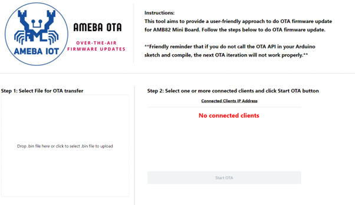
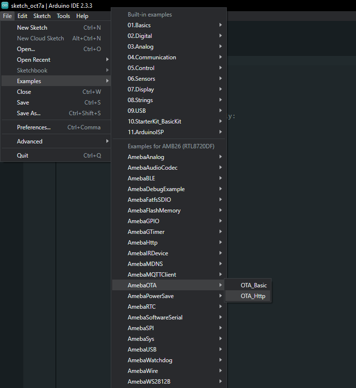
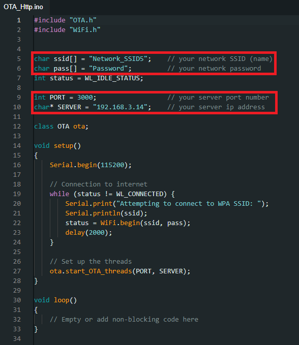
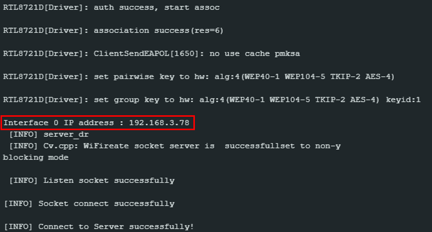
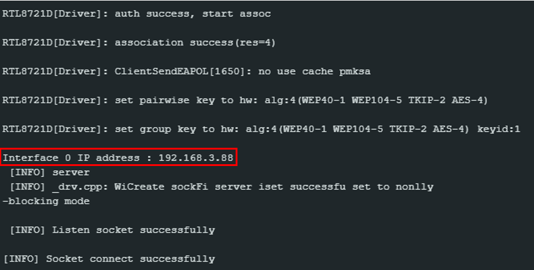
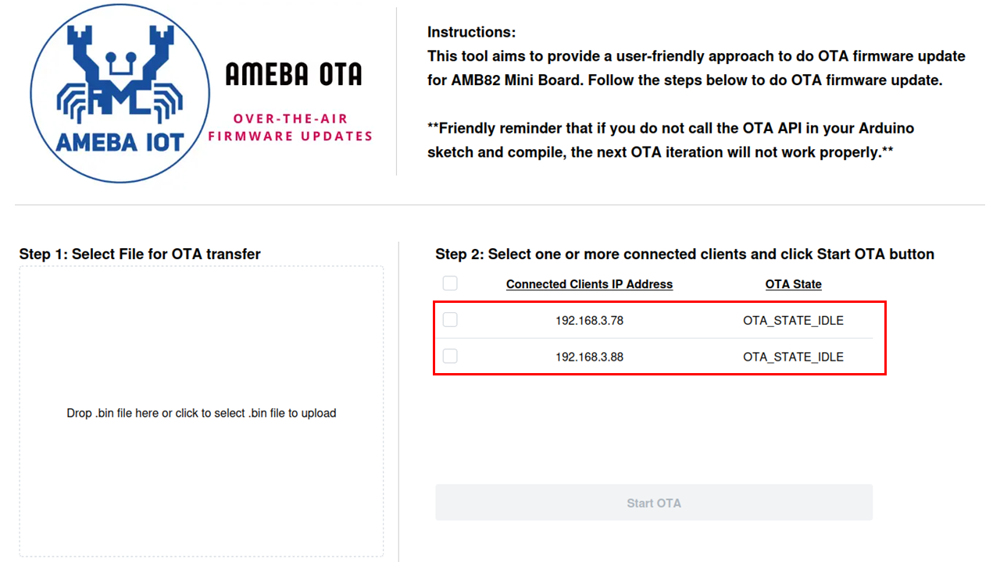
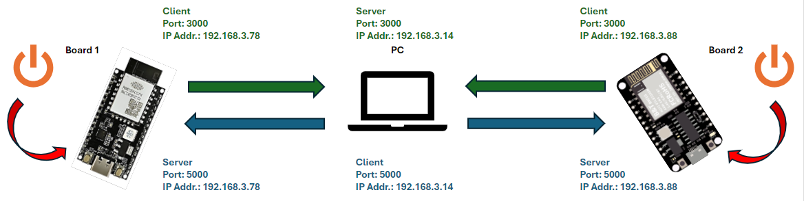
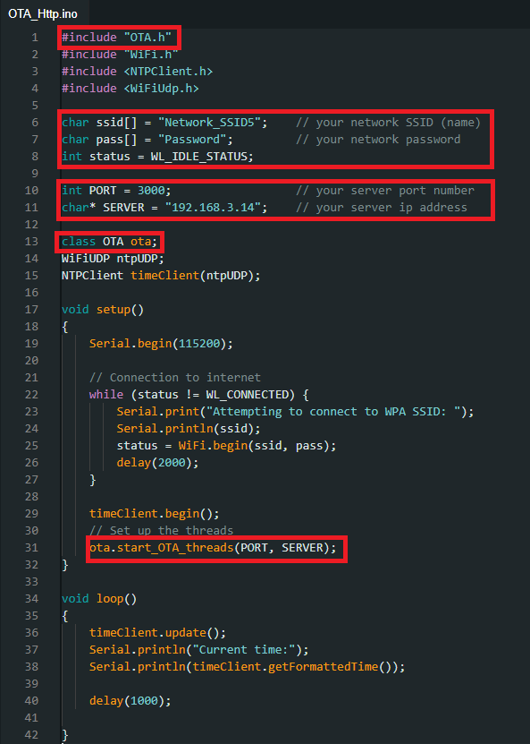
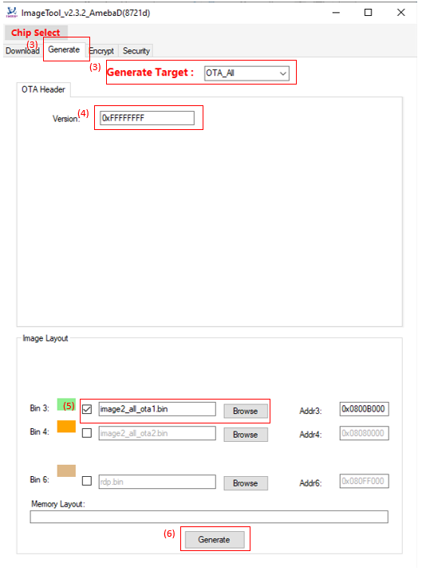
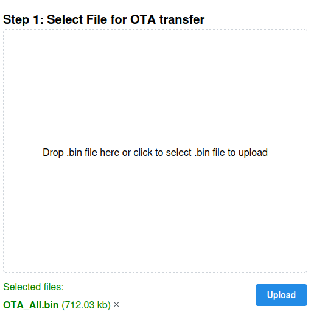
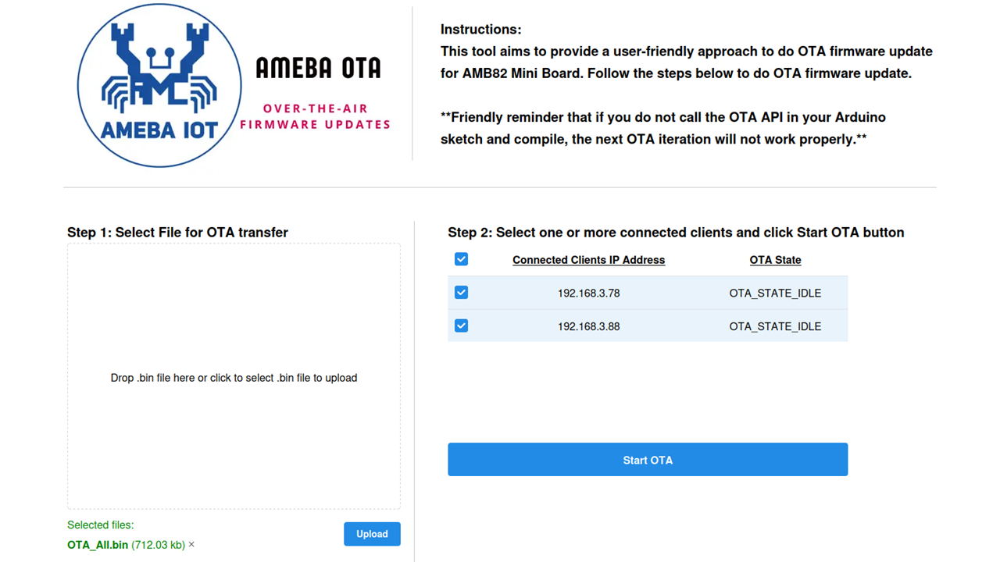
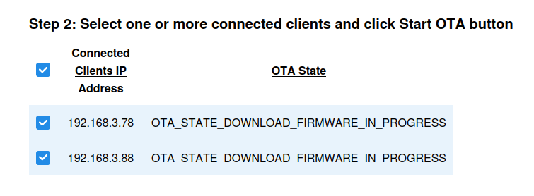
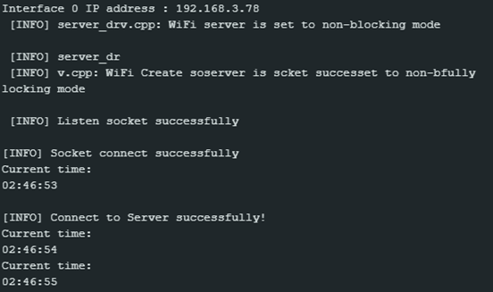
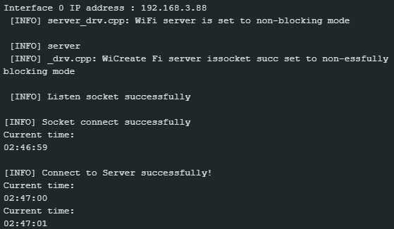

Code Reference
--------------

**Multithreading:**

Two threads are written in ``start_OTA_threads()`` to ensure successful OTA update.

Thread 1: For the purpose of connectivity check, the OTA state is sent to the server from AMB82 Mini board. Once received, the OTA state of the board will be shown on the Web UI.

.. code-block:: c++

  thread1_id = os_thread_create_arduino(thread1_task, NULL, priority1, stack_size1);

  // First thread is to do keep alive connectivity check (post requests every 5s)
  if (thread1_id) {
      Serial.println("[OTA] Keep-alive connectivity thread created success-fully.");
  } else {
      Serial.println("[OTA] Failed to create keep-alive connectivity thread.");
  }

Thread 2: To listen for the OTA begin signal from server, once ``start_ota`` signal is received, AMB82 Mini will request for the firmware to be downloaded via OTA.

.. code-block:: c++

  thread2_id = os_thread_create_arduino(thread2_task, NULL, priority1, stack_size2);

  // Second thread is to get the signal to start OTA process.
  if (thread2_id) {
      Serial.println("[OTA] Start OTA process thread created successfully.");
  } else {
      Serial.println("[OTA] Failed to create Start OTA process thread.");
  }