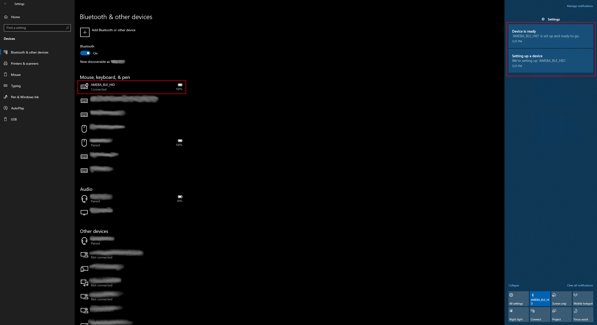
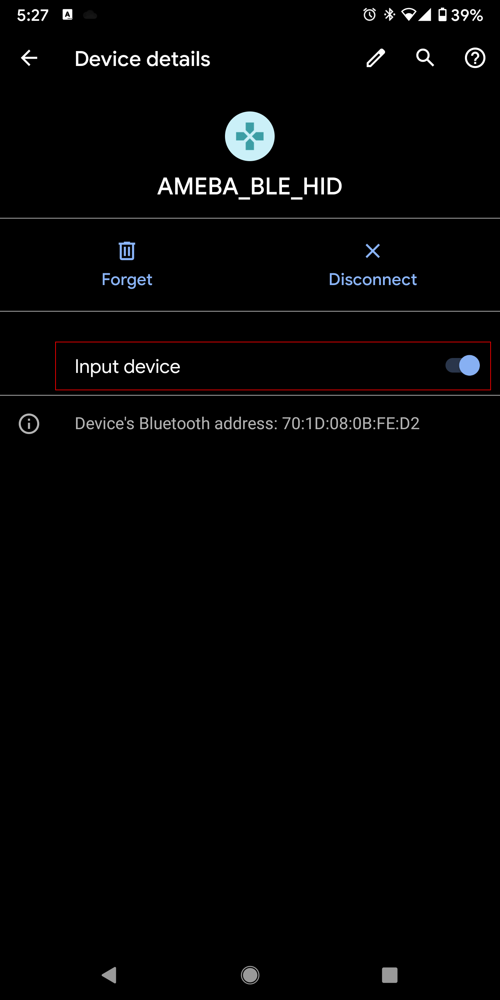

HID Keyboard
============

.. contents::
  :local:
  :depth: 2

Materials
---------

-  `AMB82-mini <https://www.amebaiot.com/en/where-to-buy-link/#buy_amb82_mini>`_ x 1

-  BLE capable host device [Windows / Linux / MacOS / Android]

Example
-------

Introduction
~~~~~~~~~~~~

In this example, the AMB82 MINI board emulates a HID keyboard connected
using BLE.

Procedure
~~~~~~~~~

Open the example, "Files" -> "Examples" -> "AmebaBLE" -> "BLEHIDKeyboard".

|image01|

Upload the code and press the reset button once the upload is finished.

Immediately after reset, the board will begin BLE advertising as
"AMEBA_BLE_HID". On your host device, go to the Bluetooth settings menu,
scan, and connect to the board.

You should ensure that the connection process is completed before
proceeding.

On Windows, ensure that any driver installation is finished, and the
board shows up in the Bluetooth menu under the "Mouse, keyboard & pen"
category.

|image02|

On Android, ensure that "Input device" is enabled for the board.

|image03|

After the Bluetooth connection process is completed, the board is ready
to send keyboard input to the host device. Select a text input field,
such as in the Serial Monitor or a text document. Connect digital pin 8
to 3.3V to start sending keystrokes, connect to GND to stop.

You should see the text "Hello World !" typed out and deleted repeatedly.

|image04|

