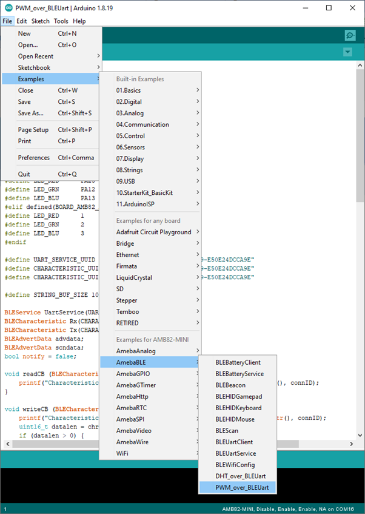
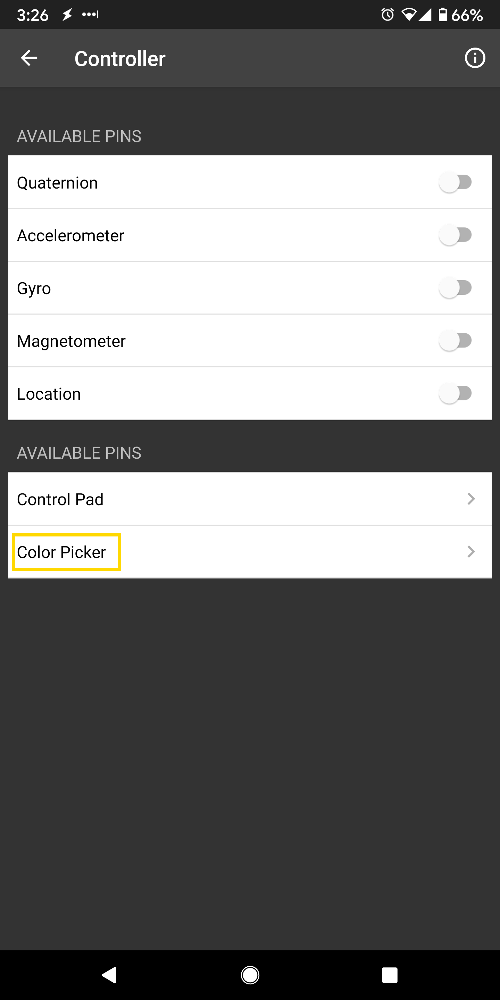

PWM over BLE UART
=================

.. contents::
  :local:
  :depth: 2

Materials
---------

-  `AMB82-mini <https://www.amebaiot.com/en/where-to-buy-link/#buy_amb82_mini>`_ x 1

-  RGB LED

-  Android / iOS smartphone

Example
-------

Introduction
~~~~~~~~~~~~

In this example, a smartphone app is used to transmit commands over BLE
UART to control the PWM outputs and change the color of a RGB LED. Refer
to the other example guides for detailed explanations of the BLE UART
service.

Procedure
~~~~~~~~~

Connect the RGB LED to the AmebaPro2 board following the diagram, the
common LED pin may need to connect to 3.3V or GND depending on the type
of LED (common anode / common cathode).

**AMB82 MINI:**

|image01|

Ensure that the required app is installed on your smartphone, it is
available at:

-  Google Play Store:
   https://play.google.com/store/apps/details?id=com.adafruit.bluefruit.le.connect

-  Apple App Store:
   https://apps.apple.com/us/app/bluefruit-connect/id830125974

Open the example, "Files" -> "Examples" -> "AmebaBLE" -> "PWM_over_BLEUart".

Upload the code and press the reset button on Ameba once the upload is
finished.

|image01|

Open the app on your smartphone, scan and connect to the board shown as
"AMEBA_BLE_DEV" and choose the controller -> color picker function in
the app.

|image02|

|image03|

|image04|

Using the color selection wheel, saturation, and brightness sliders,
choose a desired color and click select to send the RGB values to the
board. You should see the RGB LED change to the matching color.

|image05|

Code Reference
--------------

The RGB values are sent as three consecutive bytes prefixed by "!C"
characters. The "!" exclamation mark is used to indicate that the
following data is a command, and the "C" character is used to indicate
that the data is RGB values. The received UART message is checked in the
callback function for "!C" first, otherwise it is treated as a regular
message and printed to the serial terminal.

.. |image01| image:: ../../../_static/amebapro2/Example_Guides/BLE/PWM_over_BLE_UART/image01.png
   :width: 1160 px
   :height: 829 px
   :scale: 60%

.. |image03| image:: ../../../_static/amebapro2/Example_Guides/BLE/PWM_over_BLE_UART/image03.png
   :width: 1440 px
   :height: 2880 px
   :scale: 30%
.. |image04| image:: ../../../_static/amebapro2/Example_Guides/BLE/PWM_over_BLE_UART/image04.png
   :width: 1440 px
   :height: 2880 px
   :scale: 30%

.. |image06| image:: ../../../_static/amebapro2/Example_Guides/BLE/PWM_over_BLE_UART/image06.png
   :width: 1440 px
   :height: 2880 px
   :scale: 30%
