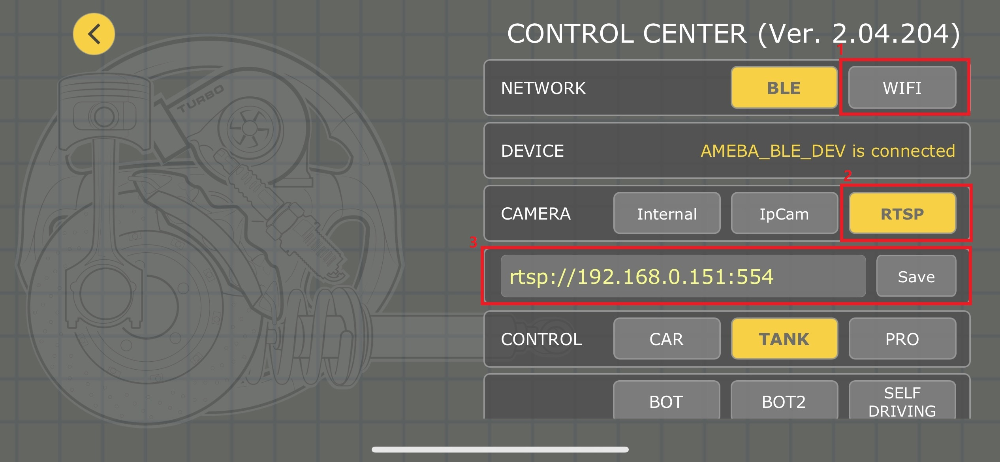

V7RC Car With Video Streaming
=============================

.. contents::
  :local:
  :depth: 2

.. note ::
   |image_3rd_party| "V7RC Car With Video Streaming" is a 3rd-party example source provided and maintained by `Kevin's Lab <https://github.com/cold63>`_

   |image_3rd_party| V7RC APP is a 3rd-party phone application provided and maintained by `V7RC.io <https://github.com/v7rc>`_

   |image_ameba_iot| Special thanks and credits to the efforts and contributions for all developers.

Materials
---------

-  `AMB82-mini <https://www.amebaiot.com/en/where-to-buy-link/#buy_amb82_mini>`_ x 1

-  Android / iOS mobile phone x1

-  L9110S Servo Motor Controller x1

-  TT Motor x2

Example
-------

Introduction
~~~~~~~~~~~~

In this example, we will use Ameba Pro2 as the BLE Peripheral device and
the servo motor controller to communicate with the V7RC mobile app.
Besides, video will be streamed from the on-board camera sensor (JXF37P)
to V7RC mobile app via RTSP (Real Time Streaming Protocol). V7RC is a
remote controller APP that provides two kinds of control UI: one is 2
channels for RC cars, and the other is 4 channels for tanks and
bulldozers.

Procedure
~~~~~~~~~

1. Setup RTSP Streaming

Open the example, "Files" -> "Examples" -> "AmebaBLE" -> "BLEV7RC_CAR_VIDEO":

|image01|

Since the video receiving end is mobile devices, in the highlighted code
snippet, instead of using the default video settings, we will set the
video resolution to VIDEO_D1 (720x480) to limit the video receiving
latency.

|image02|

In the highlighted code snippet, fill in the "ssid" with your WiFi
network SSID and "pass" with the network password. Since the video
streaming receiving end is mobile phone, we suggested to use 5G network
since it features lower latency, higher capacity, and increased
bandwidth to provide a better video streaming quality.

|image03|

Compile the code and upload it to Ameba. After pressing the Reset
button, wait for the board to connect to the Wi-Fi network. The board's
IP address and network port number for RTSP will be shown in the Serial
Monitor.

|image04|

You may download V7RC APP from the links provided below.

-  Android Users:
   https://play.google.com/store/apps/details?id=com.v7idea.v7rcliteandroidsdkversion&hl=en_US

-  iPhone Users:
   https://apps.apple.com/nz/app/v7rc/id1390983964

Upon the completion of the APP installation, make sure your smart phone
is connected to the same network as the Ameba Pro2 board for streaming.
Open V7RC APP and select "Control Centre":

|image05|

Under NETWORK section, select "WIFI". Under CAMERA section select
"RTSP". Since RTSP is used as the streaming protocol, key in
"rtsp://{IPaddress}:{port}" as the Network URL in V7RC in the text box
below CAMERA section, replacing {IPaddress} with the IP address of your
Ameba Pro2 board, and {port} with the RTSP port shown in Serial Monitor.
The default RTSP port number is 554. In the case of two simultaneous
RTSP streams, the second port number defaults to 555. Lastly, click the
"Save" button and return to the home page:

|image06|

Back to the V7RC home page, you can check the Wi-Fi connection status on
the top of the APP. Click video button (orange) to monitor the video
streaming in real-time.

|image07|

The video stream from the camera will be shown in V7RC APP. Meanwhile,
in your Serial Monitor, the message "rtp started (UDP)" will appear:

|image08|

|image09|

2. Establish BLE Connection

Open V7RC APP and select "Control Centre":

|image10|

Under NETWORK section, select "BLE":

|image11|

Click DEVICE, and select AMEBA_BLE_DEV and click "LINK" button to
connect to your Ameba board:

|image12|

Open the Arduino serial monitor, and you should see log of Ameba board
is successfully connected to mobile phone:

|image13|

Back to the V7RC home page, you can monitor the log printed data
received when moving the two controller buttons indicated in the image
below. Successfully data receiving indicating the BLE connection has
been established:

|image14|

3. Setup Servo Motors

We will use two sets of servo motor to control the movement of the car
upon the BLE connection has been established. The two servo motors will
be connected to L9110S servo controller first using predefined MotoA_1A,
MotoA_1B, MotoA_1B, and MotoA_1B pins.

-  1A pins are connected to GPIO pins, used for controlling the motor
   directions.

-  1B pins are connected to PWM pins, used for controlling the motor
   speed.

.. code:: c++

   #define MotoA_1A 16 // Control MotorA moving Forward(HIGH)/Backward(LOW)
   #define MotoA_1B 7 // Control MotorA’s from speed 0~255, or stop (LOW)
   #define MotoB_1A 17 // Control MotorB moving Forward(HIGH)/Backward(LOW)
   #define MotoB_1B 8 // Control MotorB’s speed from 0~255, or stop (LOW)

In this example, we will use AMB82 MINI as a demonstration. A detailed
connection pin map can be found below. Upon the connection being
established, the user can remotely control the servo motors via the V7RC
App BLE.

|image15|

Code Reference
--------------

1. ``ParseCMDString(String cmd)`` is a customized function will take a
   string "cmd" as input and process it. Currently, there are 6
   available commands from V7RC App, which are: "SS2","SS4","SRT","SR2",
   and "SRV".

2. The settings below have been tested for better V7RC RTSP streaming
   quality:

.. code:: c++

   VideoSetting config(VIDEO_HD, CAM_FPS, VIDEO_H264, 0); // 1280x720
   VideoSetting config(VIDEO_D1, CAM_FPS, VIDEO_H264, 0); // 720x480

.. |image04| image:: ../../../_static/amebapro2/Example_Guides/BLE/V7RC_Car_With_Video_Streaming/image04.png
   :width: 562 px
   :height: 357 px

.. |image05| image:: ../../../_static/amebapro2/Example_Guides/BLE/V7RC_Car_With_Video_Streaming/image05.png
   :width: 1218 px
   :height: 563 px
   :scale: 60%

.. |image07| image:: ../../../_static/amebapro2/Example_Guides/BLE/V7RC_Car_With_Video_Streaming/image07.png
   :width: 2532 px
   :height: 1170 px
   :scale: 30%

.. |image08| image:: ../../../_static/amebapro2/Example_Guides/BLE/V7RC_Car_With_Video_Streaming/image08.png
   :width: 2532 px
   :height: 1170 px
   :scale: 30%

.. |image09| image:: ../../../_static/amebapro2/Example_Guides/BLE/V7RC_Car_With_Video_Streaming/image09.png
   :width: 529 px
   :height: 343 px

.. |image10| image:: ../../../_static/amebapro2/Example_Guides/BLE/V7RC_Car_With_Video_Streaming/image10.png
   :width: 1218 px
   :height: 563 px
   :scale: 60%

.. |image11| image:: ../../../_static/amebapro2/Example_Guides/BLE/V7RC_Car_With_Video_Streaming/image11.png
   :width: 1219 px
   :height: 563 px
   :scale: 60%

.. |image12| image:: ../../../_static/amebapro2/Example_Guides/BLE/V7RC_Car_With_Video_Streaming/image12.png
   :width: 1218 px
   :height: 563 px
   :scale: 60%

.. |image_ameba_iot| image:: ../../../_static/ameba_iot_logo.png
   :scale: 40%

.. |image_3rd_party| image:: ../../../_static/3rd_party_logo.png
   :scale: 10%