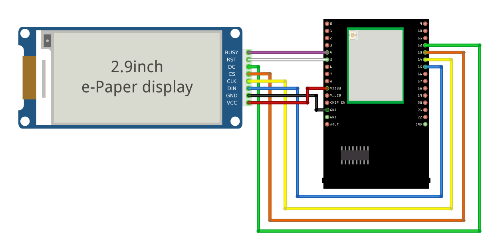

Display Text
==============

.. contents::
  :local:
  :depth: 2

Materials
---------

-  `AMB82-mini <https://www.amebaiot.com/en/where-to-buy-link/#buy_amb82_mini>`_ x 1

-  Waveshare E-Paper [2.9inch E-Paper HAT (D)/ 2.9inch E-Paper V2/
   2.9inch e-Paper Module (B)/ 4.2inch e-Paper Module/ 7.5-inch E-Ink
   display HAT] x1

Example
-------

Introduction
------------

In this example, Ameba Pro2 board will be used to connect to a Waveshare
e-Paper module (2.9inch/ 4.2inch/ 7.5inch) to display texts. The display
uses the flexible substrate as base plate, with an interface and a
reference system design. You may refer to the
official `datasheet <https://www.waveshare.net/w/upload/b/b5/2.9inch_e-Paper_(D)_Specification.pdf>`__ to
know more information about these modules.

Procedure
---------

**AMB82-Mini wiring diagram:**

2.9inch HAT (D) e-Paper Module

|image01|

2.9inch E-Paper V2 e-Paper Module/ 2.9inch e-Paper Module (B)

|image02|

4.2inch e-Paper Module

|image03|

7.5-inch e-Paper Module

Do note that Display Config should be set to B and Interface Config
should be set to 0.

|image04|

Next, download the Eink zip library, AmebaEink.zip,
at `https://github.com/ambiot/ambpro2_arduino/tree/dev/Arduino_zip_libraries <https://github.com/ambiot/ambpro2_arduino/tree/dev/Arduino_zip_libraries>`_
Then install the AmebaEink.zip by navigating to “Sketch” -> “Include
Library” -> “Add .ZIP Library…”.

Eink examples are categorised based on the size and modules of the
e-Paper display.

|image05|

Open one of the “EinkDisplayText” examples. For example, “File” →
“Examples” → “AmebaEink” → “EPD_2in9v2”-> “EinkDisplayText”:

|image06|

You may choose any GPIO pins for Busy, Reset and DC pin. You can refer
to for AMB82-Mini's `pinmap <https://www.amebaiot.com/en/amebapro2-amb82-mini-arduino-getting-started>`_.

|image07|

Upload the code to the board and press the reset button after uploading
is done. You will find these texts displayed on the boards:

The 2.9-inch e-Paper Module (B) supports three colours—red, black, and
white. Therefore, it can display red on the e-Paper display shown on the
most left.

|image08|

|image09|

|image10|

.. |image02| image:: ../../../_static/amebapro2/Example_Guides/E-Paper/Display_Text/image02.png
   :width: 1214 px
   :height: 554 px
.. |image03| image:: ../../../_static/amebapro2/Example_Guides/E-Paper/Display_Text/image03.png
   :width: 1194 px
   :height: 690 px

