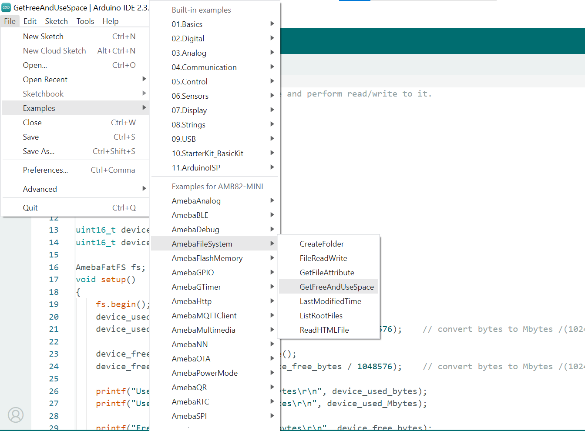
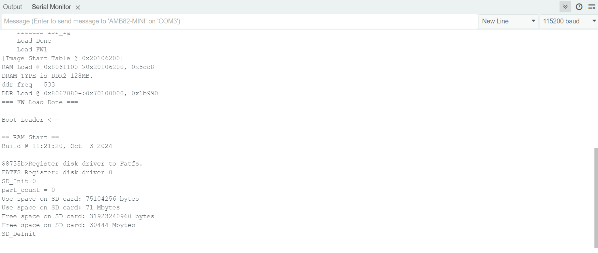

Display Free and Use space of SD card
=====================================

.. contents::
  :local:
  :depth: 2

Materials
---------

-  `AMB82-mini <https://www.amebaiot.com/en/where-to-buy-link/#buy_amb82_mini>`_ x 1

-  MicroSD card

Example
-------

In this example, we will be using Ameba Pro2 development board to retrieve free and use space of SD card.

Procedure
~~~~~~~~~

Insert a MicroSD card into the SD card slot of the AMB82 MINI board.

Open the example, "Files" -> "Examples" -> "AmebaFileSystem" -> "GetFreeAndUseSpace".

|image01|

Upload the code and press the reset button on the board once the upload is finished.

The sample code will print out the used space and free space of the SD card to the serial monitor.

|image02|

   