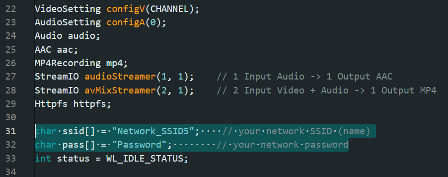
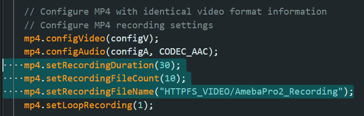
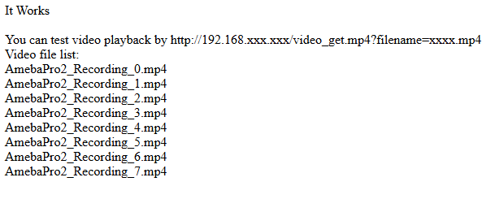

HTTP File Server and MP4
========================

.. contents::
  :local:
  :depth: 2

Materials
---------

- `AMB82-mini <https://www.amebaiot.com/en/where-to-buy-link/#buy_amb82_mini>`_ x 1

-  MicroSD card x1

Example
-------

In this example, we will use AmebaPro2 development board to establish a file server for mp4 recordings access.

Open “File” -> “Examples” -> “AmebaHttp” -> “Httpfs_mp4”.

|image01|

In the highlighted section, kindly modify it according to your WiFi SSID and password.

|image02|

You may also change the mp4 recording duration (in seconds) and filecount. Please do not change the filename ("folder"/"file").

|image03|

Then, compile and upload the code to AMB82 Mini.

.. note :: Kindly insert SD card before pressing the reset button

Open the serial monitor to view the logs. Please copy down the IP address and paste it on a web browser to view the file server page created.

|image04|

You may follow the instruction shown to download the mp4 recordings from AMB82 Mini over HTTP.

.. note :: Kindly refresh the page to view the latest update on the file server

.. |image01| image:: ../../../_static/amebapro2/Example_Guides/HTTP/HTTPFS_MP4/image01.png
   :width: 800 px
   :height: 817 px
   

   
