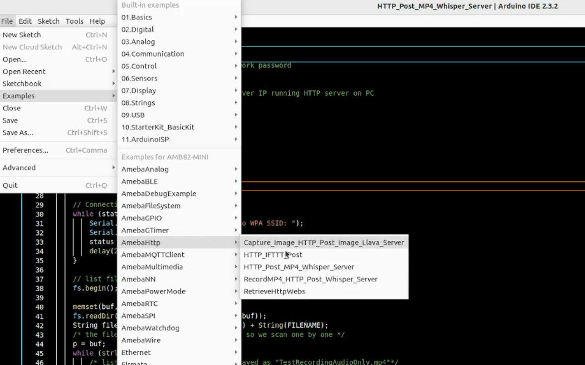

HTTP Post Image and MP4
=======================

.. contents::
  :local:
  :depth: 2

Materials
---------

- `AMB82-mini <https://www.amebaiot.com/en/where-to-buy-link/#buy_amb82_mini>`_ x 1

-  PushButton x1

-  220 ohm resistor x1

Example
-------

In this example, we are doing a Post request with image and recorded audio file together to LLM Server. This example does not contain integration to the LLM server but integration to the HTTP server.

Then open “File” -> “Examples” -> “AmebaHttp” -> “Capture_Image_HTTP_Post_Image_Llava_Server”

|image01|

Connect the pushbutton and resistor to AMB82 Mini as shown below.

|image02|

Compile and run the example.

Set up the HTTP server by locating the python script called whisper_server_test_2_endpoints.py. Go to command prompt and go to the src folder. Execute this command python3 whisper_server_test_2_endpoints.py.

Please note that this server can only be run on Linux OS. Mac OS and Windows have not been supported yet.

Press button for 2s when you wish to take a snapshot and speak into the mic for the prompt to ask the Visual Language Model (VLM).

If the HTTP Post image and audio file is successful, the image and audio file will be saved at the location where this script is being run at.

   
.. |image02| image:: ../../../_static/amebapro2/Example_Guides/HTTP/HTTP_Post_Image_and_MP4/image02.png
   :width: 988 px
   :height: 802 px
