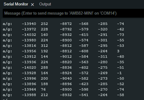

MPU6050 Raw Data
================

.. contents::
  :local:
  :depth: 2

Materials
---------

-  `AMB82-mini <https://www.amebaiot.com/en/where-to-buy-link/#buy_amb82_mini>`_ x 1

-  MPU6050 x 1

Example
-------

Introduction
~~~~~~~~~~~~

This example will demonstrate getting the raw data from MPU6050.

Procedure
~~~~~~~~~

Connect the MPU6050 to I2C_SDA and I2C_SCL of the board as shown in the diagram below.

|image01|

Open the example in "File" -> "Examples" -> "AmebaWire" -> "MPU6050"-> "MPU6050_raw".

|image02|

Compile and run the example. In the Serial Monitor, you should be able to see the raw data from MPU6050.

|image03|

If you see that the values are all 0, press reset until you can get values from MPU6050. If the first initialisation is done properly, the
values will be sent continuously over the I2C interface and will not cause any hanging issues.

You may choose to uncomment ``#define OUTPUT_BINARY_ACCELGYRO`` and comment
``#define OUTPUT_READABLE_ACCELGYRO`` to transmit the raw data faster.

|image04|

Code Reference
--------------

| [1] MPU6050 library and examples by ElectronicCats:
| https://github.com/ElectronicCats/mpu6050

.. |image01| image:: ../../../_static/amebapro2/Example_Guides/I2C/MPU6050_Raw_Data/image01.png
   :width: 1186 px
   :height: 860 px
   :scale: 70%

