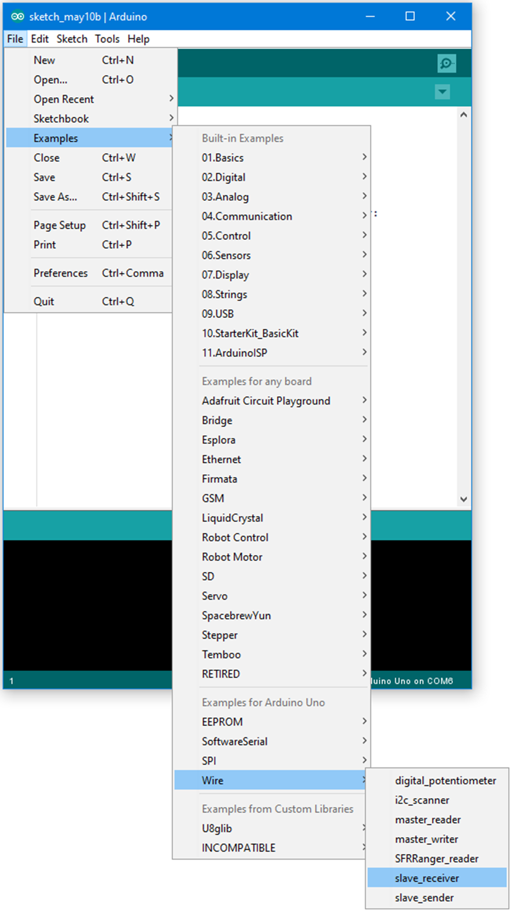
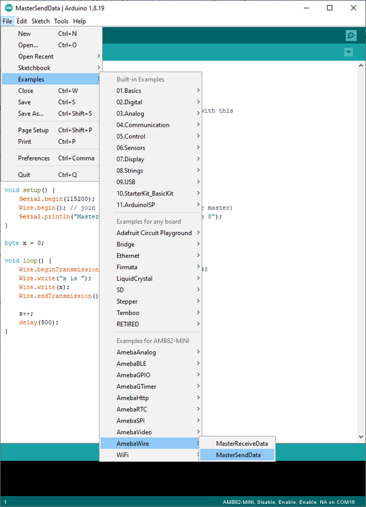
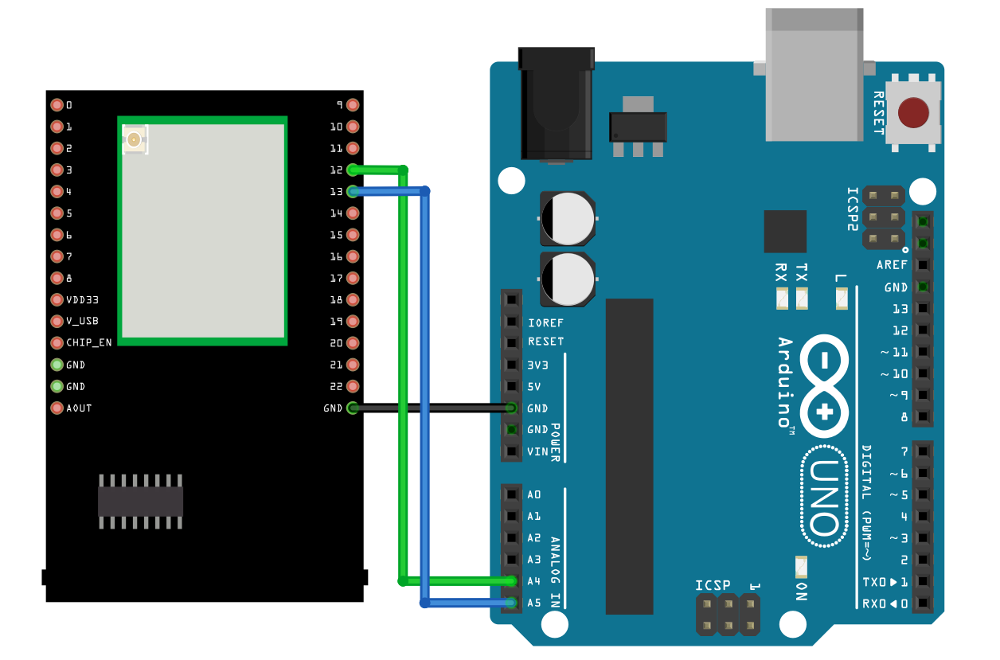

Master Send Data to Arduino UNO
===============================

.. contents::
  :local:
  :depth: 2

Materials
---------

-  `AMB82-mini <https://www.amebaiot.com/en/where-to-buy-link/#buy_amb82_mini>`_ x 1

-  Arduino UNO x 1

Example
-------

I2C Introduction
~~~~~~~~~~~~~~~~

There are two roles in the operation of I2C, one is "master", the other
is "slave". Only one master is allowed and can be connected to many
slaves. Each slave has its unique address, which is used in the
communication between master and the slave. I2C uses two pins, one is
for data transmission (SDA), the other is for the clock (SCL). Master
uses the SCL to inform slave of the upcoming data transmission, and the
data is transmitted through SDA. The I2C example was named "Wire" in the
Arduino example.

Introduction
~~~~~~~~~~~~

In this example, we use Ameba as the I2C master writer, and use Arduino
as the I2C slave receiver.

When the I2C slave receives string sent from I2C master, it prints the
received string.

Procedure
~~~~~~~~~

-  **Setting up Arduino Uno to be I2C Slave**

| First, select Arduino in the Arduino IDE in "Tools" -> "Board" -> "Arduino Uno"
| Open the "Slave Receiver" example in "Examples" -> "Wire" -> "slave_receiver":

|image01|

Then click "Sketch" -> "Upload" to compile and upload the example to Arduino Uno.

-  **Setting up Ameba to be I2C Master**

| Next, open another window of Arduino IDE, make sure to choose your Ameba development board in the IDE: "Tools" -> "Board"
| Then open the "Master Writer" example in "File" -> "Examples" -> "AmebaWire" -> "MasterSendData"

|image02|

-  **Wiring**

| The Arduino example uses A4 as the I2C SDA and A5 as the I2C SCL.
| Another important thing is that the GND pins of Arduino and Ameba should be connected to each other.

**AMB82 MINI** wiring diagram:

|image03|

| Open the Arduino IDE of the Arduino Uno and open the serial monitor ("Tools" -> "Serial Monitor").
| In the Serial Monitor, you can see the messages printed from Arduino Uno.
| Next, press the reset button on Arduino Uno. Now the Arduino Uno is waiting for the connection from I2C Master.
| We press the reset button on Ameba to start to send messages. Then observe the serial monitor, you can see the messages show up every half second.

|image04|

Code Reference
--------------

| You can find detailed information of this example in the documentation of Arduino:
| https://www.arduino.cc/en/Tutorial/MasterWriter

| First use ``Wire.begin()`` / ``Wire.begin(address)`` to join the I2C bus as a master or slave, in the Master case the address is not required.
| https://www.arduino.cc/en/Reference/WireBegin

| Next, the Master uses ``Wire.beginTransmission(address)`` to begin a transmission to the I2C slave with the given address:
| https://www.arduino.cc/en/Reference/WireBeginTransmission

| Uses ``Wire.write()`` to send data, and finally use ``Wire.endTransmission()`` to end a transmission to a Slave and transmits the bytes that were queued:
| https://www.arduino.cc/en/Reference/WireEndTransmission

.. |image04| image:: ../../../_static/amebapro2/Example_Guides/I2C/Master_Send_Data_to_Arduino_UNO/image04.png
   :width: 649 px
   :height: 410 px
