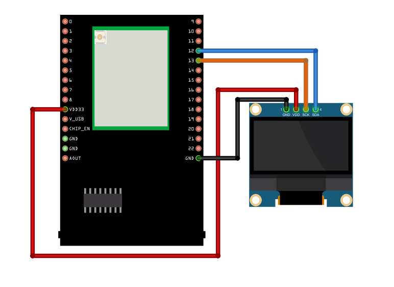
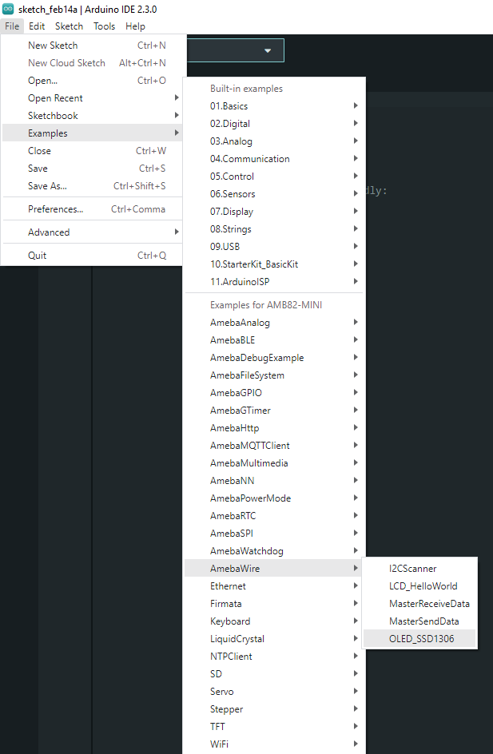
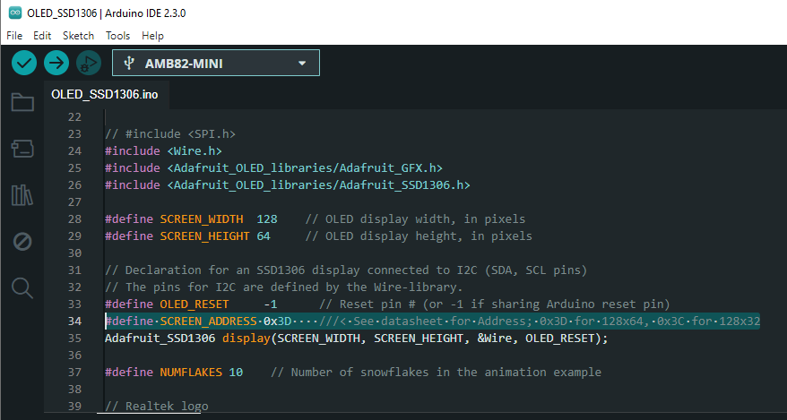
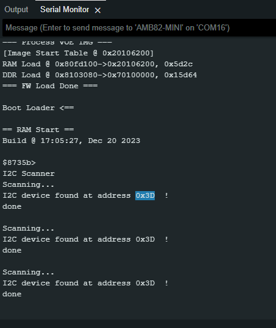
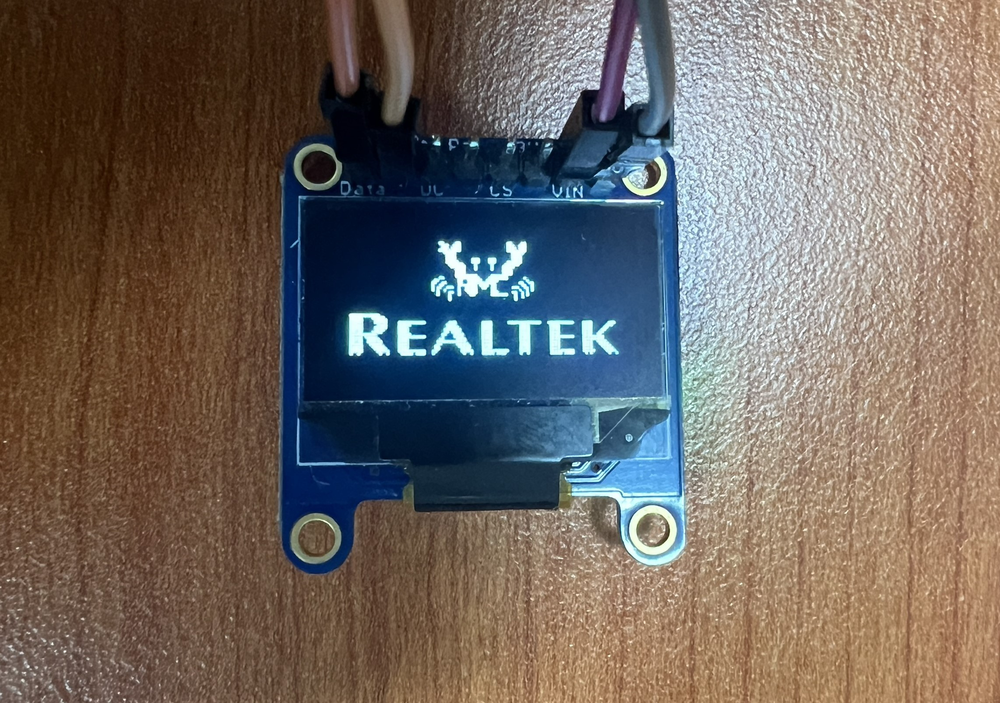
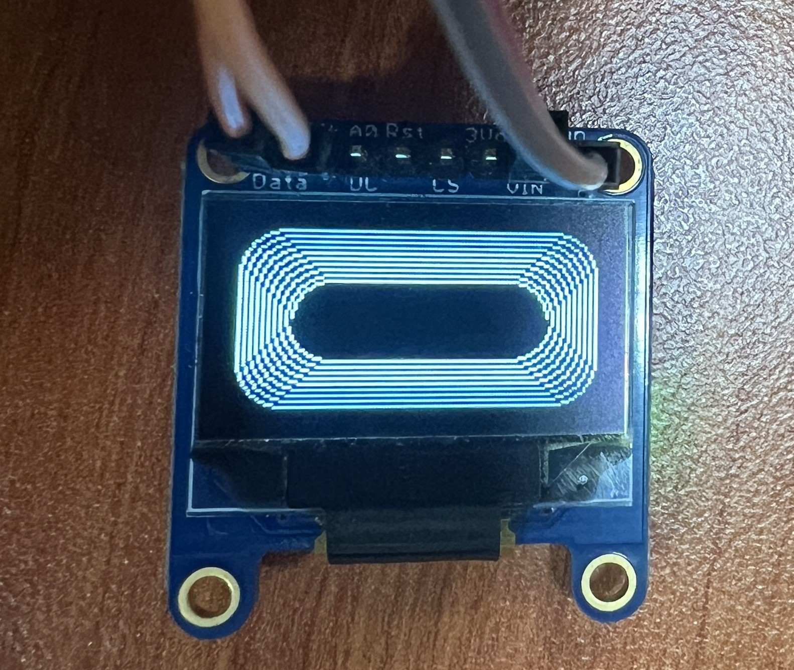
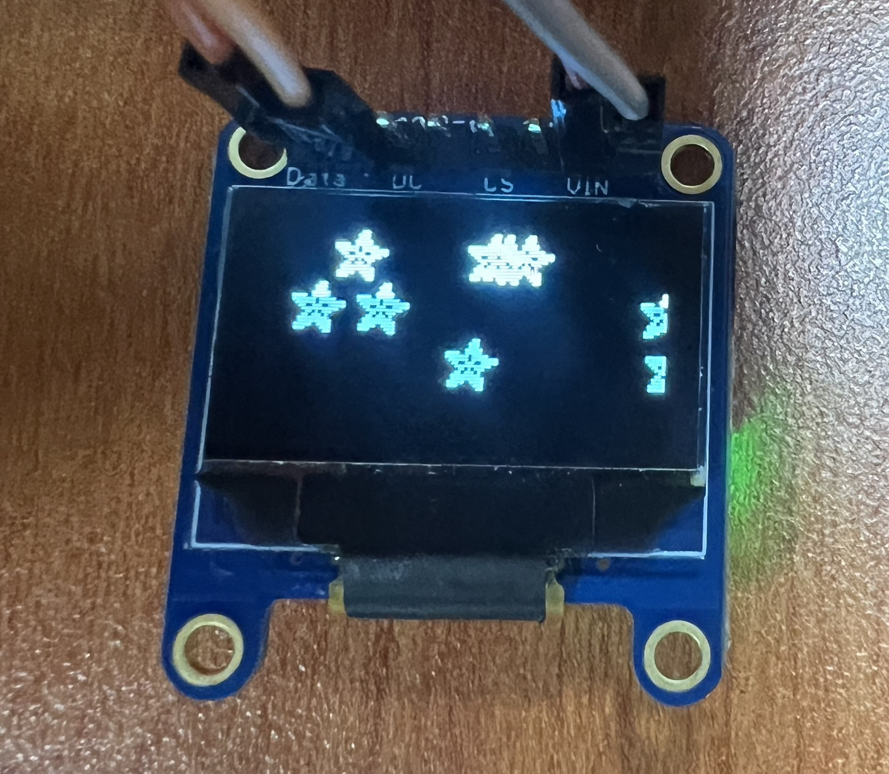

OLED Display
============

.. contents::
  :local:
  :depth: 2

Materials
---------

-  `AMB82-mini <https://www.amebaiot.com/en/where-to-buy-link/#buy_amb82_mini>`_ x 1

-  0.96 inch OLED Display 128x64 (SSD1306) x 1

Example
-------

Introduction
~~~~~~~~~~~~

The example will showcase texts, shapes, and bitmap images on an OLED
display using the I2C communication protocol alongside Adafruit
libraries.

Procedure
~~~~~~~~~

Connect the 0.96-inch OLED display to I2C_SDA and I2C_SCL of the board.

|image01|

Open the example in "File" -> "Examples" -> "AmebaWire" -> "OLED_SSD1306".

|image02|

For this example, we will be using 0x3D as the address. 

|image03|

If the address doesn't work for you, you can run I2CScanner to find the
OLED address by navigating to "File" -> "Examples" -> "AmebaWire" ->
"I2CScanner".

|image04|

Compile and upload to Ameba, then press the reset button.

First, Realtek logo will be shown, followed by shapes, text, and
animations. Some examples are shown below.

|image05| 

|image06| 

|image07|

If you would like to change the Bitmap image shown on the OLED display,
you can prepare a picture/photo and resize the image based on the OLED
display that you are using. You can look for a photo resizing tool
online, for example, https://resizeimage.net/.

Next, you may use online tools such as https://javl.github.io/image2cpp/
to convert image into an array.

Code Reference
--------------

| [1] Adafruit_SSD1306 library and example obtained from:
| https://github.com/adafruit/Adafruit_SSD1306

| [2] Adafruit_GFX library obtained from:
| https://github.com/adafruit/Adafruit-GFX-Library/tree/master

