Object Detection results save on SD Card
=========================================

.. contents::
  :local:
  :depth: 2

Materials
---------

- `AMB82-mini <https://www.amebaiot.com/en/where-to-buy-link/#buy_amb82_mini>`_ x 1

- SD Card x 1

Example 
-------

In this example, we will be using Ameba Pro2 development board to detect 80 different kinds of objects such as person, bicycle, car, laptop etc using on-board camera sensor (JX-F37P).

The following examples show how Object Detection and On-Screen Display is used as well as saving the results as JPEG or MP4 files. 

1. SaveAsJPEG

2. SaveAsMP4File

To save as JPEG files, open one of the Object Detection examples in “File” -> “Examples” -> “AmebaNN” -> "ObjectDetectionSaveSDCard" -> "SaveAsJPEG".

|image01|

To save as MP4 files, 
Open one of the Object Detection examples in “File” -> “Examples” -> “AmebaNN” -> "ObjectDetectionSaveSDCard" -> "SaveAsMP4File".

|image02|

In the highlighted code snippet, fill in the “ssid” with your WiFi network SSID and “pass” with the network password.

|image03|

Select Neural Network (NN) task and models using modelSelect() function highlighted in yellow. This function takes 4 arguments: Neural Network task, Object Detection model, Face Detection model and Face Recognition model. Replace with “NA_MODEL” if they are not necessary for your selected Neural Network task. Note that it is mandatory to call modelSelect() function before calling the begin() function.

Valid Neural Network task: OBJECT_DETECTION, FACE_DETECTION, FACE_RECOGNITION

Valid Object Detection model:

YOLOv3 model: DEFAULT_YOLOV3TINY, CUSTOMIZED_YOLOV3TINY

YOLOv4 model: DEFAULT_YOLOV4TINY, CUSTOMIZED_YOLOV4TINY

YOLOv7 model: DEFAULT_YOLOV7TINY, CUSTOMIZED_YOLOV7TINY

Valid Face Detection model: DEFAULT_SCRFD, CUSTOMIZED_SCRFD

Valid Face Recognition model: DEFAULT_MOBILEFACENET, CUSTOMIZED_MOBILEFACENET

Choose the customized option (e.g., CUSTOMIZED_YOLOV4TINY/ CUSTOMIZED_SCRFD/ CUSTOMIZED_MOBILEFACENET) if you would like to use your own NN model. To learn about the process of converting an AI model, refer to https://www.amebaiot.com/en/amebapro2-ai-convert-model/ . Additionally, refer to https://www.amebaiot.com/en/amebapro2-apply-ai-model-docs/ to understand how to install and use the converted model.

|image04|

Note that for Yolov7 object detection training from pytorch, you will need to perform an additional step for reparameterization. For this reparameterization step, Realtek has provided two scripts in the folder Yolov7_reparam_scripts, under ~/NeuralNetwork/Yolov7_reparam_scripts.

Command to run is:

python reparam_yolov7-tiny.py --weights weights/best.pt --custom_yaml custom/yolov7-tiny-deploy.yaml --output best_reparam.pt

Compile the code and upload it to Ameba. After pressing the Reset button, wait for the Ameba Pro 2 board to connect to the WiFi network. The board’s IP address and network port number for RTSP will be shown in the Serial Monitor.

The result of detected objects can be validated using VLC. You may download VLC media player from the link `here <https://vlc-media-player.en.softonic.com/?utm_source=SEM&utm_medium=paid&utm_campaign=EN_UK_DSA&gclid=Cj0KCQjw1vSZBhDuARIsAKZlijTRUgX93pTAjakY9p0Vw6tr04-k-4K-OvoDdnPTl89ggsxDttC2JycaAoYhEALw_wcB>`__.

Upon the completion of the software installation, open VLC media player, and go to “Media” -> “Open Network Stream”.

|image05|

Make sure your PC is connected to the same network as the Ameba Pro2 board for streaming. Since RTSP is used as the streaming protocol, key in `“rtsp://{IPaddress}:{port}”` as the Network URL in VLC media player, replacing {IPaddress} with the IP address of your Ameba Pro2 board, and {port} with the RTSP port shown in Serial Monitor `(e.g., “rtsp://192.168.3.26:554”)`. The default RTSP port number is 554.

Next, click “Play” to start RTSP streaming to see the result. The video stream from the camera will be shown in VLC media player.

|image06|

|image07|

A bounding box with its object name and confidence score will be drawn on the RTSP video stream to highlight the recognised objects.

|image08|

When there is objected, the results will be saved as JPEG (Single Image) or MP4 file, depending on your preference.

**MP4 file**

|image09|

**JPEG (Single Image)**

|image10|

|image11|

The pretrained model can recognise 80 different types of objects in total. The objects can be found in ObjectClassList.h. The index number for each object is fixed and should not be changed. To deactivate the detection of certain objects, set the filter value to 0. For example, set the filter value to 0 to exclude the detection of bicycles.

|image12|

Code Reference
--------------

You may adjust the video bitrate based on your WiFi network quality, by uncommenting the highlighted code below.

|image13|

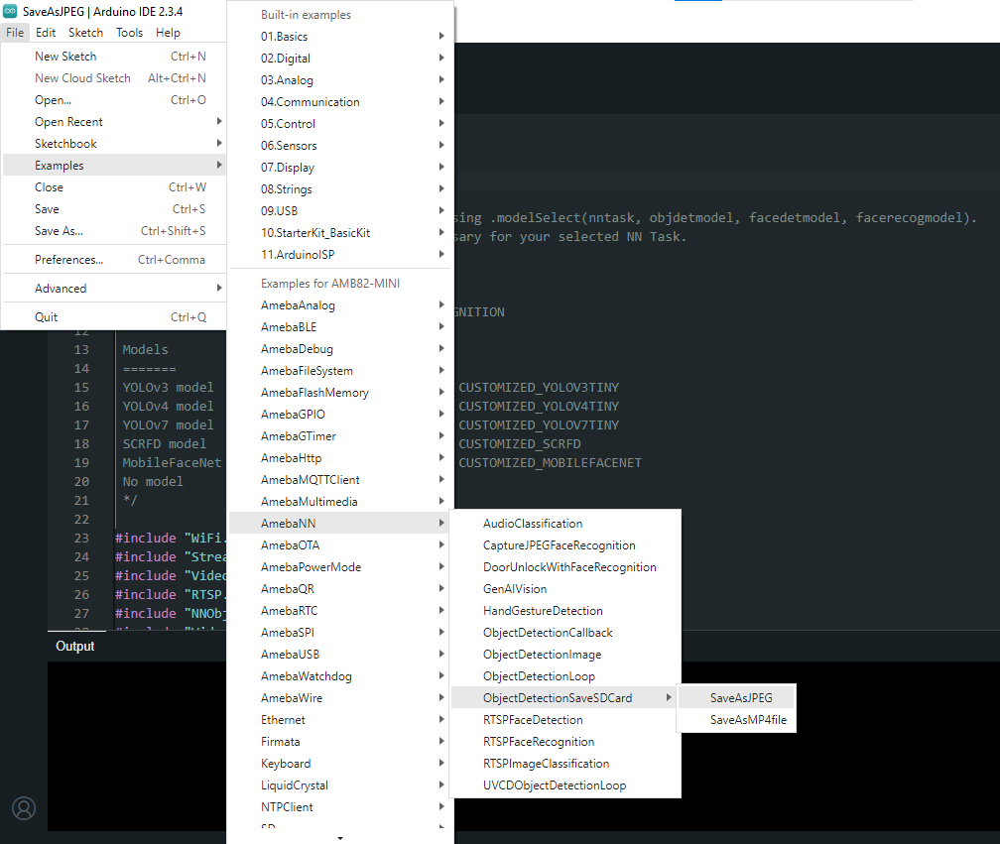

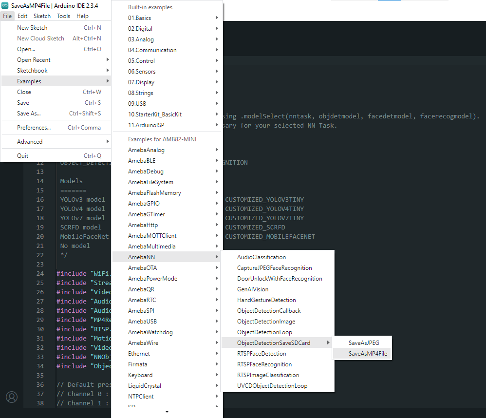

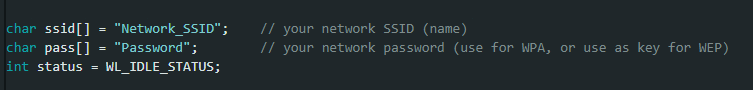

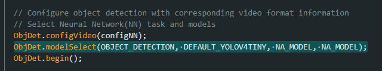

.. |image05| image:: ../../../_static/amebapro2/Example_Guides/Neural_Network/Neural_Network_-_Object_Detection_Results_Save_On_SD_Card/image05.png
   :width:  432 px
   :height:  482 px

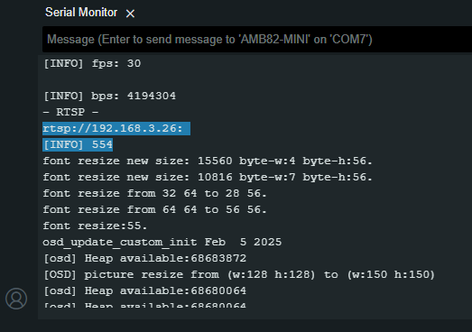

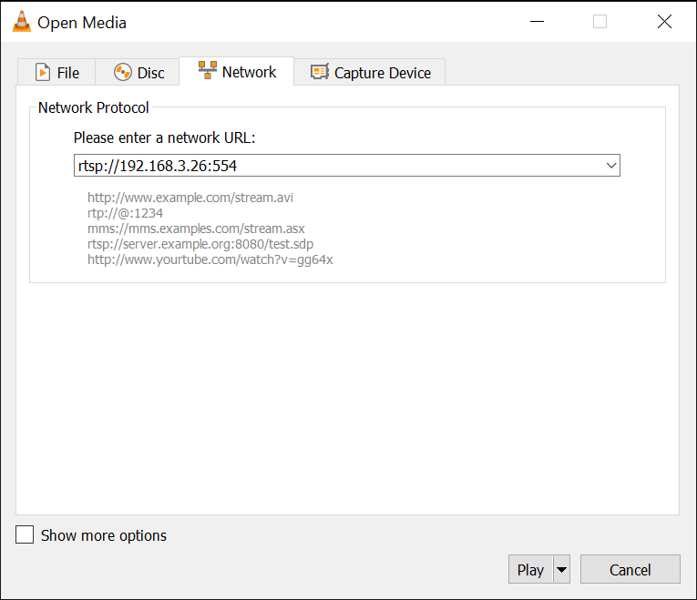

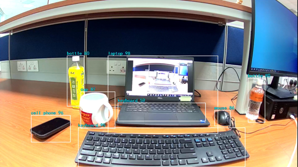

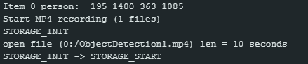

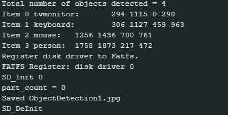

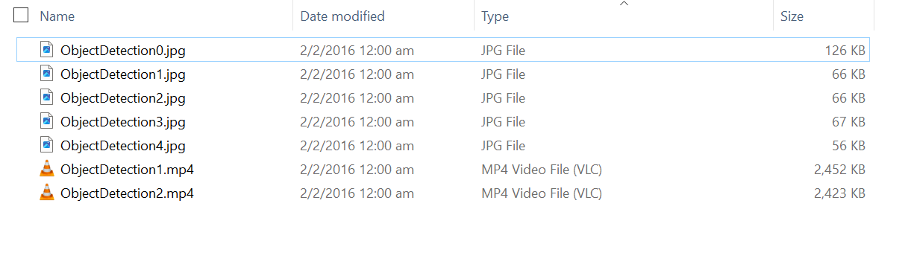

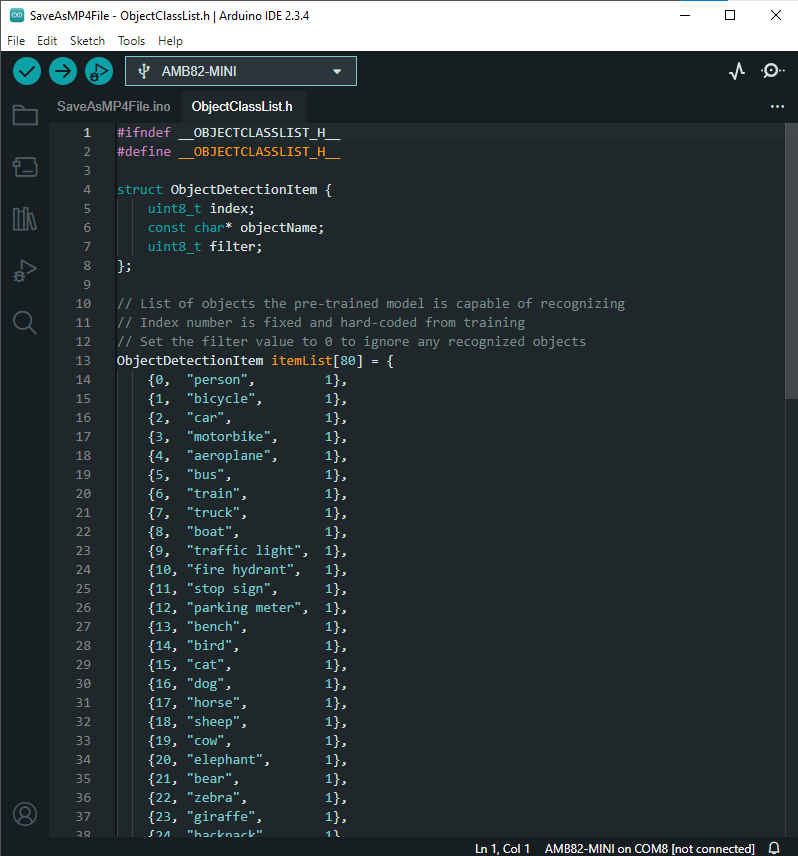

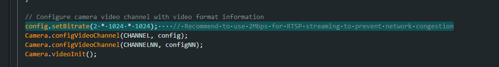
